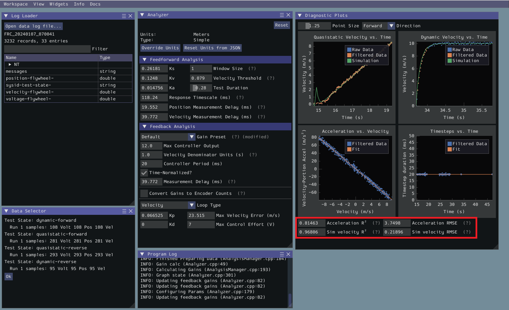
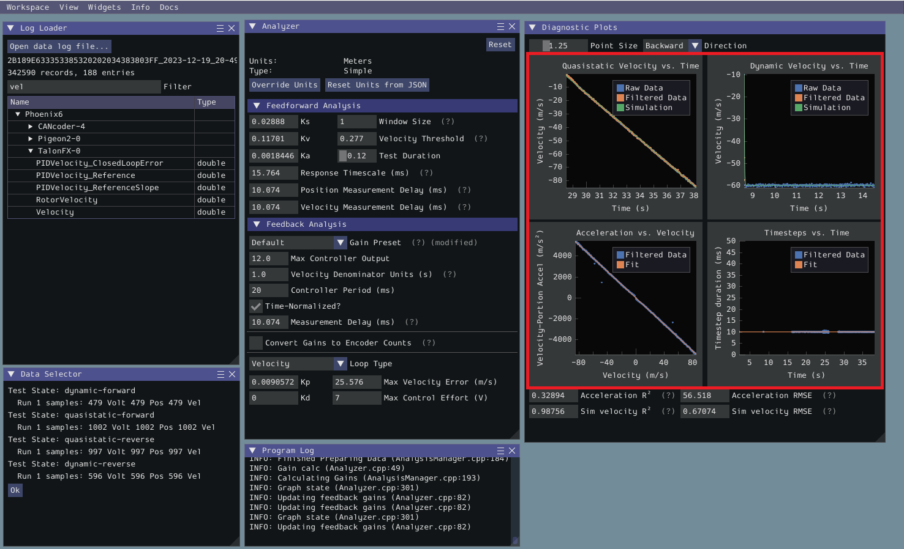
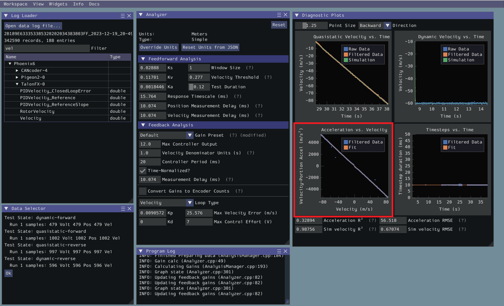
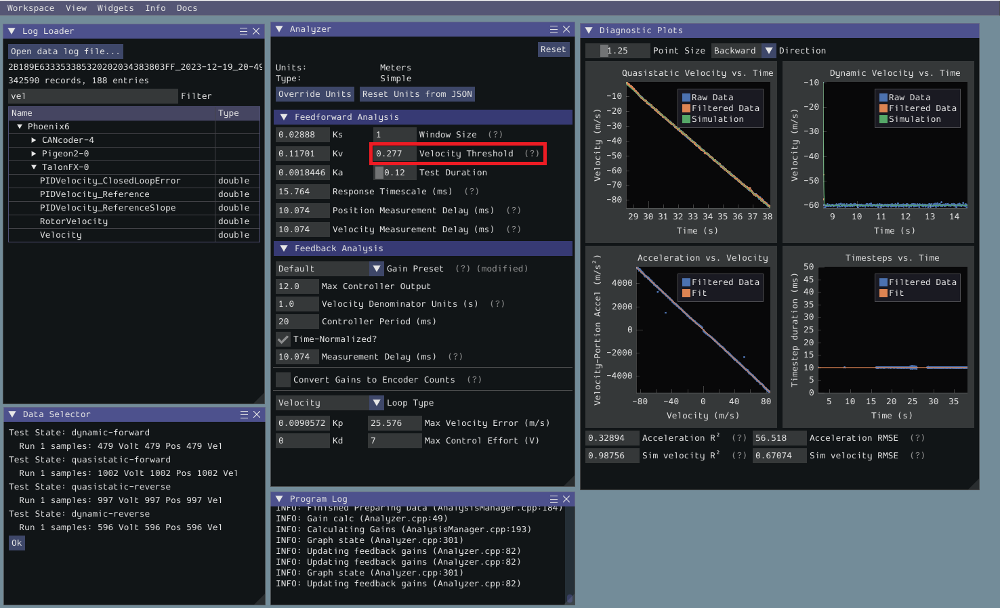
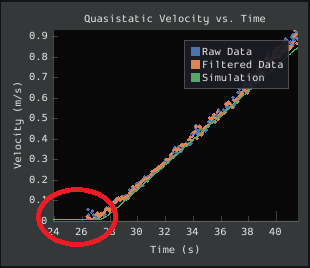
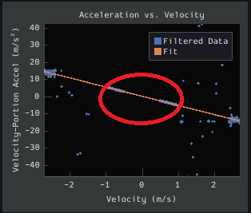
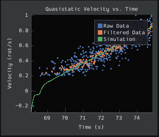

Viewing Diagnostics
===================

Goodness-of-Fit Metrics
-----------------------

There are three numerical accuracy metrics that are computed with this tool: acceleration :term:`r-squared`, simulated velocity r-squared, and the simulated velocity :term:`RMSE`.

The acceleration r-squared is the fraction of the variance in measured acceleration (used as the independent variable in the SysId regression) explained by the linear model.  This can be quite variable, because acceleration is very susceptible to system noise.  Assuming the other fit metrics are acceptable, values near ``1`` indicate an "ideal" mechanism with few disturbances, while values near ``0`` indicate a noisy mechanism with substantial physical vibrations/losses.

The simulated velocity r-squared is the fraction of the variance in measured velocity explained by a noiseless simulation of the motor movement stepped forward with the constants determined from the regression.  A value north of ``.9`` indicates a good fit.

The simulated velocity RMSE is the standard deviation of the velocity error from the simulated model.  This is a good estimation of the amount of process noise present during the test routine, and can be used as a low-end estimate for the model noise term in :ref:`state-space control <docs/software/advanced-controls/state-space/state-space-intro:Introduction to State-Space Control>`.

Diagnostic Plots
----------------

SysId also produces several diagnostic plots to help users evaluate the quality of their model fit.

Time-Domain Plots
^^^^^^^^^^^^^^^^^

.. note:: To improve plot quality, the diagnostic plots are separated by direction.  Be sure to view both the forward *and* backward plots when troubleshooting!

The Time-Domain Diagnostics plots display velocity versus time over the course of the analyzed tests. These should look something like this:

The velocity time domain plots contain three sets of data: Raw Data, Filtered Data, and Simulation. The Raw Data is the recorded data from your robot, the Filtered Data is the data after a median filter has been applied to the data, and the Simulation represents the velocity predictions of a model based off of the feedforward gains from the tool (these are used to calculate the "sim" error metrics mentioned above).

A successful quasistatic graph will be very nearly linear, while a successful dynamic graph will be an approximately exponential approach of the steady-speed.

Deviation from this behavior is a sign of an :ref:`error <docs/software/pathplanning/system-identification/viewing-diagnostics:Common Failure Modes>`, either in your robot setup, analysis settings, or your test procedure.

Acceleration-Velocity Plot
^^^^^^^^^^^^^^^^^^^^^^^^^^

The acceleration-versus-velocity plot displays the mechanism velocity versus the portion of acceleration corresponding to factors other than friction (ideally, this would leave only back-EMF) and applied voltage across *all* of the tests.

This plot should be quite linear, with patches of relatively noiseless quasistatic data intermixed with quite-noisy dynamic data. The noise on the dynamic sections of the plot may be reduced by increasing the :guilabel:`Window Size` setting.

However, if your robot or mechanism has low mass compared to the motor power, this may "eat" what little meaningful acceleration data you have.  In these cases ``kA`` will tend towards zero and can be ignored for feedforward purposes.  However, if ``kA`` cannot be accurately measured, the calculated feedback gains are likely to be inaccurate, and manual tuning may be required.

Common Failure Modes
--------------------

When something has gone wrong with the identification, diagnostic plots and console output provide crucial clues as to *what* has gone wrong.  This section describes some common failures encountered while running the system identification tool, the identifying features of their diagnostic plots, and the steps that can be taken to fix them.

Improperly Set Motion Threshold
^^^^^^^^^^^^^^^^^^^^^^^^^^^^^^^

One of the most-common errors is an inappropriate value for the motion threshold.

Velocity Threshold Too Low
~~~~~~~~~~~~~~~~~~~~~~~~~~

The presence of a "leading tail" (emphasized by added red circle) in the quasistatic time-domain plot indicates that the :guilabel:`Velocity Threshold` setting is too low, and thus data points from before the robot begins to move are being included.

To solve this, increase the velocity threshold and re-analyze the data.

Motion Threshold Too High
~~~~~~~~~~~~~~~~~~~~~~~~~

While not nearly as problematic as a too-low threshold, a velocity threshold that is too high will result in a large "gap" in the acceleration-versus-velocity plot.

To solve this, decrease the velocity threshold and re-analyze the data.

Noisy Velocity Signals
^^^^^^^^^^^^^^^^^^^^^^

.. note:: There are two types of noise that affect mechanical systems - signal noise and system noise.  Signal noise corresponds to measurement error, while system noise corresponds to actual physical motion that is unaccounted-for by your model (e.g. vibration).  If SysId suggests that your system is noisy, you must figure out which of the two types of noise is at play - signal noise is often easier to eliminate than system noise.

Many FRC setups suffer from poorly-installed encoders - errors in shaft concentricity (for optical encoders) and magnet location (For magnetic encoders) can both contribute to noisy velocity signals, as can inappropriate filtering settings.  Encoder noise will be immediately visible in your diagnostic plots, as can be seen above.  Encoder noise is especially common on the `toughbox mini <https://www.andymark.com/products/toughbox-mini-options>`__ gearboxes provided in the kit of parts.

System parameters can sometimes be accurately determined even from data polluted by encoder noise by increasing the window size setting.  However, this sort of encoder noise is problematic for robot code much the same way it is problematic for the system identification tool.  As the root cause of the noise is not known, it is recommended to try a different encoder setup if this is observed, either by moving the encoders to a different shaft, replacing them with a different type of encoder, or increasing the sample per average in project generation (adds an additional layer of filtering).

