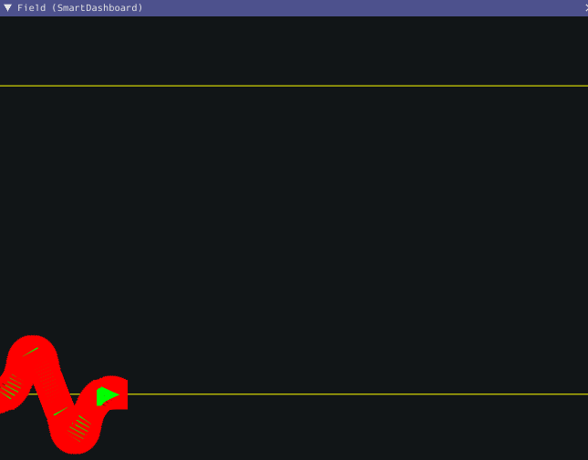

Sending Trajectories to Field2d
===============================

Visualizing your trajectory is a great debugging step for verifying that your trajectories are created as intended. Trajectories can be easily visualized in :ref:`Field2d <docs/software/dashboards/glass/field2d-widget:The Field2d Widget>` using the ``setTrajectory()``/``SetTrajectory()`` functions.

.. tabs::

   .. group-tab:: Java

      .. rli:: https://github.com/wpilibsuite/allwpilib/raw/a610379965680a8f9214d5f0db3a8e1bc20d4712/wpilibjExamples/src/main/java/edu/wpi/first/wpilibj/examples/ramsetecontroller/Robot.java
         :language: java
         :lines: 44-61
         :linenos:
         :lineno-start: 44

   .. group-tab:: C++

      .. rli:: https://raw.githubusercontent.com/wpilibsuite/allwpilib/a610379965680a8f9214d5f0db3a8e1bc20d4712/wpilibcExamples/src/main/cpp/examples/RamseteController/cpp/Robot.cpp
         :language: cpp
         :lines: 18-30
         :linenos:
         :lineno-start: 18

Viewing with Glass
------------------

.. todo:: link to glass document on modifying field2d lines

The sent trajectory can be viewed with :ref:`Glass <docs/software/dashboards/glass/index:Glass>` through the dropdown :guilabel:`NetworkTables` -> :guilabel:`SmartDashboard` -> :guilabel:`Field2d`.

.. note:: The above example which uses the `RamseteController (Java) <https://github.com/wpilibsuite/allwpilib/blob/a610379965680a8f9214d5f0db3a8e1bc20d4712/wpilibjExamples/src/main/java/edu/wpi/first/wpilibj/examples/ramsetecontroller/Robot.java>`__/`RamseteController (C++) <https://github.com/wpilibsuite/allwpilib/blob/a610379965680a8f9214d5f0db3a8e1bc20d4712/wpilibcExamples/src/main/cpp/examples/RamseteController/cpp/Robot.cpp>`__ will not show the sent trajectory until autonomous is enabled at least once.
