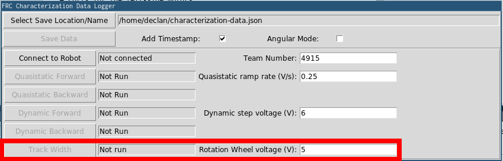

Troubleshooting
===============

Troubleshooting Complete Failures
---------------------------------
There are a number of things that can cause your robot to do completely the wrong thing. The below checklist covers some common mistakes.

* My robot doesn't move.

  - Are you actually outputting to your motors?
  - Is a ``MalformedSplineException`` getting printed to the driver station? If yes, go to the ``MalformedSplineException`` section below.
  - Is your trajectory very short or in the wrong units?

* My robot swings around to drive the trajectory facing the other direction.

  - Are the start and end headings of your trajectory wrong?
  - Is your robot's gyro getting reset to the wrong heading?
  - :ref:`Do you have the reverse flag set incorrectly? <docs/software/advanced-controls/trajectories/trajectory-generation:Creating the trajectory config>`
  - Are your gyro angles clockwise positive? If so, you should negate them.

* My robot just drives in a straight line even though it should turn.

  - Is your gyro set up correctly and returning good data?
  - Are you passing your gyro heading to your odometry object with the correct units?
  - Is your track width correct? Is it in the correct units?

* I get a ``MalformedSplineException`` printout on the driver station and the robot doesn't move.

  - :ref:`Do you have the reverse flag set incorrectly? <docs/software/advanced-controls/trajectories/trajectory-generation:Creating the trajectory config>`
  - Do you have two waypoints very close together with approximately opposite headings?
  - Do you have two waypoints with the same (or nearly the same) coordinates?

* My robot drives way too far.

  - Are your encoder unit conversions set up correctly?
  - Are your encoders connected?

* My robot mostly does the right thing, but it's a little inaccurate.

  - Go to the next section.

Troubleshooting Poor Performance
--------------------------------

.. note:: This section is mostly concerned with troubleshooting poor trajectory tracking performance like a meter of error, not catastrophic failures like compilation errors, robots turning around and going in the wrong direction, or ``MalformedSplineException``\s.

.. note:: This section is designed for differential drive robots, but most of the ideas can be adapted to swerve drive or mecanum.

Poor trajectory tracking performance can be difficult to troubleshoot. Although the trajectory generator and follower are intended to be easy-to-use and performant out of the box, there are situations where your robot doesn't quite end up where it should. The trajectory generator and followers have many knobs to tune and many moving parts, so it can be difficult to know where to start, especially because it is difficult to locate the source of trajectory problems from the robot's general behavior.

Because it can be so hard to locate the layer of the trajectory generator and followers that is misbehaving, a systematic, layer-by-layer approach is recommended for general poor tracking performance (e.g. the robot is off by few feet or more than twenty degrees). The below steps are listed in the order that you should do them in; it is important to follow this order so that you can isolate the effects of different steps from each other.

.. note:: The below examples put diagnostic values onto :term:`NetworkTables`. The easiest way to graph these values is to :ref:`use Shuffleboard's graphing capabilities <docs/software/dashboards/shuffleboard/getting-started/shuffleboard-graphs:Working With Graphs>`.

Verify Odometry
^^^^^^^^^^^^^^^
If your odometry is bad, then your Ramsete controller may misbehave, because it modifies your robot's target velocities based on where your odometry thinks the robot is.

.. note:: :doc:`Sending your robot pose and trajectory to field2d </docs/software/dashboards/glass/field2d-widget>` can help verify that your robot is driving correctly relative to the robot trajectory.

1. Set up your code to record your robot's position after each odometry update:

.. tabs::

   .. code-tab:: java

    NetworkTableEntry m_xEntry = NetworkTableInstance.getDefault().getTable("troubleshooting").getEntry("X");
    NetworkTableEntry m_yEntry = NetworkTableInstance.getDefault().getTable("troubleshooting").getEntry("Y");

    @Override
    public void periodic() {
        // Update the odometry in the periodic block
        m_odometry.update(Rotation2d.fromDegrees(getHeading()), m_leftEncoder.getDistance(),
            m_rightEncoder.getDistance());

        var translation = m_odometry.getPoseMeters().getTranslation();
        m_xEntry.setNumber(translation.getX());
        m_yEntry.setNumber(translation.getY());
    }

   .. code-tab:: c++

    NetworkTableEntry m_xEntry = nt::NetworkTableInstance::GetDefault().GetTable("troubleshooting")->GetEntry("X");
    NetworkTableEntry m_yEntry = nt::NetworkTableInstance::GetDefault().GetTable("troubleshooting")->GetEntry("Y");

    void DriveSubsystem::Periodic() {
        // Implementation of subsystem periodic method goes here.
        m_odometry.Update(frc::Rotation2d(units::degree_t(GetHeading())),
                            units::meter_t(m_leftEncoder.GetDistance()),
                            units::meter_t(m_rightEncoder.GetDistance()));

        auto translation = m_odometry.GetPose().Translation();
        m_xEntry.SetDouble(translation.X().value());
        m_yEntry.SetDouble(translation.Y().value());
    }

2. Lay out a tape measure parallel to your robot and push your robot out about one meter along the tape measure. Lay out a tape measure along the Y axis and start over, pushing your robot one meter along the X axis and one meter along the Y axis in a rough arc.
3. Compare X and Y reported by the robot to actual X and Y. If X is off by more than 5 centimeters in the first test then you should check that you measured your wheel diameter correctly, and that your wheels are not worn down. If the second test is off by more than 5 centimeters in either X or Y then your track width (distance from the center of the left wheel to the center of the right wheel) may be incorrect; if you're sure that you measured the track width correctly with a tape measure then your robot's wheels may be slipping in a way that is not accounted for by track width--if this is the case then you should :ref:`run the track width identification <docs/software/pathplanning/system-identification/identification-routine:Running Tests>` and use that track width instead of the one from your tape measure.

Verify Feedforward
^^^^^^^^^^^^^^^^^^
If your feedforwards are bad then the P controllers for each side of the robot will not track as well, and your ``DifferentialDriveVoltageConstraint`` will not limit your robot's acceleration accurately. We mostly want to turn off the wheel P controllers so that we can isolate and test the feedforwards.

1. First, we must set disable the P controller for each wheel. Set the ``P`` gain to 0 for every controller. In the ``RamseteCommand`` example, you would set ``kPDriveVel`` to 0:

.. tabs::

  .. group-tab:: Java

    .. remoteliteralinclude:: https://raw.githubusercontent.com/wpilibsuite/allwpilib/v2023.1.1-beta-1/wpilibjExamples/src/main/java/edu/wpi/first/wpilibj/examples/ramsetecommand/RobotContainer.java
      :language: java
      :lines: 122-123
      :linenos:
      :lineno-start: 122

  .. group-tab:: C++

    .. remoteliteralinclude:: https://raw.githubusercontent.com/wpilibsuite/allwpilib/v2023.1.1-beta-1/wpilibcExamples/src/main/cpp/examples/RamseteCommand/cpp/RobotContainer.cpp
      :language: c++
      :lines: 81-82
      :linenos:
      :lineno-start: 81

2. Next, we want to disable the Ramsete controller to make it easier to isolate our problematic behavior. To do so, simply call ``setEnabled(false)`` on the ``RamseteController`` passed into your ``RamseteCommand``:

.. tabs::

   .. code-tab:: java

    RamseteController m_disabledRamsete = new RamseteController();
    m_disabledRamsete.setEnabled(false);

    // Be sure to pass your new disabledRamsete variable
    RamseteCommand ramseteCommand = new RamseteCommand(
        exampleTrajectory,
        m_robotDrive::getPose,
        m_disabledRamsete,
        ...
    );

   .. code-tab:: c++

    frc::RamseteController m_disabledRamsete;
    m_disabledRamsete.SetEnabled(false);

    // Be sure to pass your new disabledRamsete variable
    frc2::RamseteCommand ramseteCommand(
      exampleTrajectory,
      [this]() { return m_drive.GetPose(); },
      m_disabledRamsete,
      ...
    );

3. Finally, we need to log desired wheel velocity and actual wheel velocity (you should put actual and desired velocities on the same graph if you're using Shuffleboard, or if your graphing software has that capability):

.. tabs::

   .. code-tab:: java

    var table = NetworkTableInstance.getDefault().getTable("troubleshooting");
    var leftReference = table.getEntry("left_reference");
    var leftMeasurement = table.getEntry("left_measurement");
    var rightReference = table.getEntry("right_reference");
    var rightMeasurement = table.getEntry("right_measurement");

    var leftController = new PIDController(kPDriveVel, 0, 0);
    var rightController = new PIDController(kPDriveVel, 0, 0);
    RamseteCommand ramseteCommand = new RamseteCommand(
        exampleTrajectory,
        m_robotDrive::getPose,
        disabledRamsete, // Pass in disabledRamsete here
        new SimpleMotorFeedforward(ksVolts, kvVoltSecondsPerMeter, kaVoltSecondsSquaredPerMeter),
        kDriveKinematics,
        m_robotDrive::getWheelSpeeds,
        leftController,
        rightController,
        // RamseteCommand passes volts to the callback
        (leftVolts, rightVolts) -> {
            m_robotDrive.tankDriveVolts(leftVolts, rightVolts);

            leftMeasurement.setNumber(m_robotDrive.getWheelSpeeds().leftMetersPerSecond);
            leftReference.setNumber(leftController.getSetpoint());

            rightMeasurement.setNumber(m_robotDrive.getWheelSpeeds().rightMetersPerSecond);
            rightReference.setNumber(rightController.getSetpoint());
        },
        m_robotDrive
    );

   .. code-tab:: c++

    auto table =
        nt::NetworkTableInstance::GetDefault().GetTable("troubleshooting");
    auto leftRef = table->GetEntry("left_reference");
    auto leftMeas = table->GetEntry("left_measurement");
    auto rightRef = table->GetEntry("right_reference");
    auto rightMeas = table->GetEntry("right_measurement");

    frc2::PIDController leftController(DriveConstants::kPDriveVel, 0, 0);
    frc2::PIDController rightController(DriveConstants::kPDriveVel, 0, 0);
    frc2::RamseteCommand ramseteCommand(
        exampleTrajectory, [this]() { return m_drive.GetPose(); },
        frc::RamseteController(AutoConstants::kRamseteB,
                                AutoConstants::kRamseteZeta),
        frc::SimpleMotorFeedforward<units::meters>(
            DriveConstants::ks, DriveConstants::kv, DriveConstants::ka),
        DriveConstants::kDriveKinematics,
        [this] { return m_drive.GetWheelSpeeds(); }, leftController,
        rightController,
        [=](auto left, auto right) {
            auto leftReference = leftRef;
            auto leftMeasurement = leftMeas;
            auto rightReference = rightRef;
            auto rightMeasurement = rightMeas;

            m_drive.TankDriveVolts(left, right);

            leftMeasurement.SetDouble(m_drive.GetWheelSpeeds().left.value());
            leftReference.SetDouble(leftController.GetSetpoint());

            rightMeasurement.SetDouble(m_drive.GetWheelSpeeds().right.value());
            rightReference.SetDouble(rightController.GetSetpoint());
        },
        {&m_drive});

4. Run the robot on a variety of trajectories (curved and straight line), and check to see if the actual velocity tracks the desired velocity by looking at graphs from NetworkTables.
5. If the desired and actual are off by *a lot* then you should check if the wheel diameter and ``encoderEPR`` you used for system identification were correct. If you've verified that your units and conversions are correct, then you should try recharacterizing on the same floor that you're testing on to see if you can get better data.

Verify P Gain
^^^^^^^^^^^^^
If you completed the previous step and the problem went away then your problem can probably be found in one of the next steps. In this step we're going to verify that your wheel P controllers are well-tuned. If you're using Java then we want to turn off Ramsete so that we can just view our PF controllers on their own.

1. You must re-use all the code from the previous step that logs actual vs. desired velocity (and the code that disables Ramsete, if you're using Java), except that **the P gain must be set back to its previous nonzero value.**
2. Run the robot again on a variety of trajectories, and check that your actual vs. desired graphs look good.
3. If the graphs do not look good (i.e. the actual velocity is very different from the desired) then you should try tuning your P gain and rerunning your test trajectories.

Check Constraints
^^^^^^^^^^^^^^^^^
.. note:: Make sure that your P gain is nonzero for this step and that you still have the logging code added in the previous steps. If you're using Java then you should remove the code to disable Ramsete.

If your accuracy issue persisted through all of the previous steps then you might have an issue with your constraints. Below are a list of symptoms that the different available constraints will exhibit when poorly tuned.

Test one constraint at a time! Remove the other constraints, tune your one remaining constraint, and repeat that process for each constraint you want to use. The below checklist assumes that you only use one constraint at a time.

* ``DifferentialDriveVoltageConstraint``:

  - If your robot accelerates very slowly then it's possible that the max voltage for this constraint is too low.
  - If your robot doesn't reach the end of the path then your system identification data may problematic.

* ``DifferentialDriveKinematicsConstraint``:

  - If your robot ends up at the wrong heading then it's possible that the max drivetrain side speed is too low, or that it's too high. The only way to tell is to tune the max speed and to see what happens.

* ``CentripetalAccelerationConstraint``:

  - If your robot ends up at the wrong heading then this could be the culprit. If your robot doesn't seem to turn enough then you should increase the max centripetal acceleration, but if it seems to go around tight turns to quickly then you should decrease the maximum centripetal acceleration.

Check Trajectory Waypoints
^^^^^^^^^^^^^^^^^^^^^^^^^^
It is possible that your trajectory itself is not very driveable. Try moving waypoints (and headings at the waypoints, if applicable) to reduce sharp turns.
