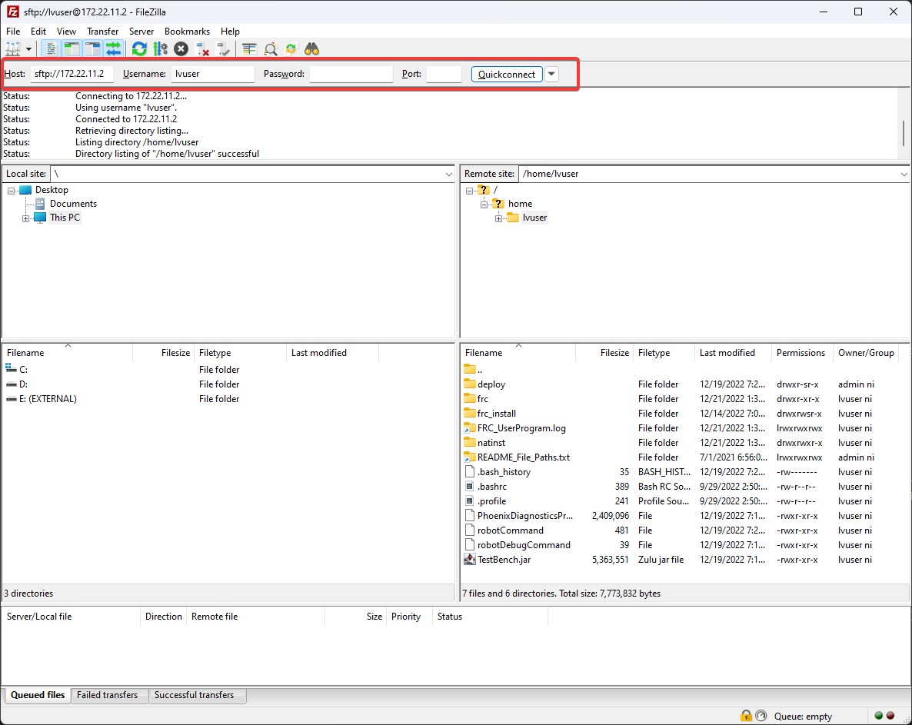

Profiling with VisualVM
=======================

This document is intended to familiarize the reader with the diagnostic tool that is `VisualVM <https://visualvm.github.io/>`__. VisualVM is a tool for profiling JVM based applications, such as viewing why an application is using a large amount of memory. This document assumes the reader is familiar with the *risks* associated with modifying their robot `build.gradle`. This tutorial also assumes that the user knows basic terminal/commandline knowledge.

Unpacking VisualVM
------------------

To begin, `download VisualVM <https://visualvm.github.io/download.html>`__ and unpack it to the WPILib installation folder. The folder is located at ``~/wpilib/`` where ``~`` indicates the users home directory. On Windows, this is ``C:\\users\\public\\wpilib``.

Setting up Gradle
-----------------

GradleRIO supports passing JVM launch arguments, and this is what is necessary to enable remote debugging. Remote debugging is a feature that allows a local machine (such as the user's desktop) to view important information about a remote target (in our case, a roboRIO). To begin, locate the ``frcJava`` code block located in the projects ``build.gradle``. Below is what is looks like.

.. code-block:: groovy

   deploy {
      targets {
         roborio(getTargetTypeClass('RoboRIO')) {
               // Team number is loaded either from the .wpilib/wpilib_preferences.json
               // or from command line. If not found an exception will be thrown.
               // You can use getTeamOrDefault(team) instead of getTeamNumber if you
               // want to store a team number in this file.
               team = project.frc.getTeamNumber()
               debug = project.frc.getDebugOrDefault(false)

               artifacts {
                  // First part is artifact name, 2nd is artifact type
                  // getTargetTypeClass is a shortcut to get the class type using a string

                  frcJava(getArtifactTypeClass('FRCJavaArtifact')) {
                  }

                  // Static files artifact
                  frcStaticFileDeploy(getArtifactTypeClass('FileTreeArtifact')) {
                     files = project.fileTree('src/main/deploy')
                     directory = '/home/lvuser/deploy'
                  }
               }
         }
      }
   }

We will be replacing

.. code-block:: groovy

               frcJava(getArtifactTypeClass('FRCJavaArtifact')) {
               }

with

.. code-block:: groovy

   frcJava(getArtifactTypeClass('FRCJavaArtifact')) {
      // Enable VisualVM connection
      jvmArgs.add("-Dcom.sun.management.jmxremote=true")
      jvmArgs.add("-Dcom.sun.management.jmxremote.port=1198")
      jvmArgs.add("-Dcom.sun.management.jmxremote.local.only=false")
      jvmArgs.add("-Dcom.sun.management.jmxremote.ssl=false")
      jvmArgs.add("-Dcom.sun.management.jmxremote.authenticate=false")
      jvmArgs.add("-Djava.rmi.server.hostname=10.XX.XX.2") // Replace XX.XX with team number
   }

We are adding a few arguments here. In order:

* Enable remote debugging
* Set the remote debugging port to 1198
* Allow listening from remote targets
* Disable SSL authentication being required
* Set the hostname to the roboRIOs team number. Be sure to replace this.

.. important:: The hostname when connected via USB-B should be ``172.22.11.2``.

Running VisualVM
----------------

Launching VisualVM is done via the commandline with a few parameters. First, we navigate to the directory containing VisualVM. Then, launch it with parameters, passing it the WPILib JDK path. On a Windows machine, it looks like the following:

.. code-block:: bash

   cd "C:\Users\Public\wpilib\visualvm_216\bin"
   ./visualvm --jdkhome "C:\Users\Public\wpilib\2023\jdk"

.. important:: The exact path ``visualvm_216`` may vary and depends on the version of VisualVM downloaded.

This should launch VisualVM. Once launched, open the :guilabel:`Add JMX Connection` dialog.

.. image:: images/visualvm/visualvm-addconn.png
   :alt: Add visualvm connection menu option
   :width: 700

Once opened, configure the connection details and ensure that :guilabel:`Do not require SSL connection` is ticked.

.. image:: images/visualvm/visualvm-dialog.png
   :alt: VisualVM connection dialog is ticked
   :width: 700

If correctly done, a new menu option in the left-hand sidebar will appear. Clicking on it will show you a detailed dashboard of the running JVM application.

.. image:: images/visualvm/visualvm-dash.png
   :alt: VisualVM diagnostics dashboard
   :width: 700

Creating a Heap Dump
--------------------

Besides viewing the remote systems CPU and memory usage, VisualVM is most useful by creating a **Heap Dump**. When a Java object is created, it resides in an area of memory called the heap. When the heap is full, a process called `garbage collection <https://www.geeksforgeeks.org/garbage-collection-java/>`__ begins. Garbage collection can be a common cause of loop overruns in a traditional Java robot program.

To begin, ensure you are on the :guilabel:`Monitor` tab and click :guilabel:`Heap Dump`.

.. image:: images/visualvm/visualvm-perform-heapdump.png
   :alt: Location of heap dump button in VisualVM
   :width: 700

This heap dump will be stored on the target system (roboRIO) and must be retrieved using SFTP. For this tutorial, `FileZilla <https://filezilla-project.org/>`__ will be the tool of choice. Open FileZilla and connect to the roboRIO with the following parameters

- Host: ``sftp://172.22.11.2`` or ``sftp://10.TE.AM.2``
- Username: ``lvuser``
- Password: Leave blank
- Port: Leave blank

If connected successfully, you'll see a list of files on the roboRIO.

Navigate to the ``/tmp/`` directory with FileZilla and download it to your machine. Once downloaded, the dump can be analyzed with VisualVM.

Analyzing a Heap Dump
---------------------

Reopen VisualVM if closed using the previous instructions. Then click on :guilabel:`File` and :guilabel:`Load`. Navigate to the retrieved dump file and load it.

.. image:: images/visualvm/visualvm-viewing-dump.png
   :alt: Viewing a dump in VisualVM
   :width: 700

Clicking on :guilabel:`Summary` and selecting :guilabel:`Objects` instead will show a breakdown of objects by quantity. The below screenshot showcases a completely empty robot program, and then one that creates an million large ``ArrayList`` of integers.

Blank robot program:

.. image:: images/visualvm/visualvm-objects1.png
   :alt: List of objects in a blank robot program
   :width: 700

with an ``ArrayList`` of ~10000 integers.

.. image:: images/visualvm/visualvm-objects2.png
   :alt: List of objects in a modified robot program
   :width: 700

For more information on VisualVM, check out the `VisualVM documentation pages <https://visualvm.github.io/documentation.html>`__.
