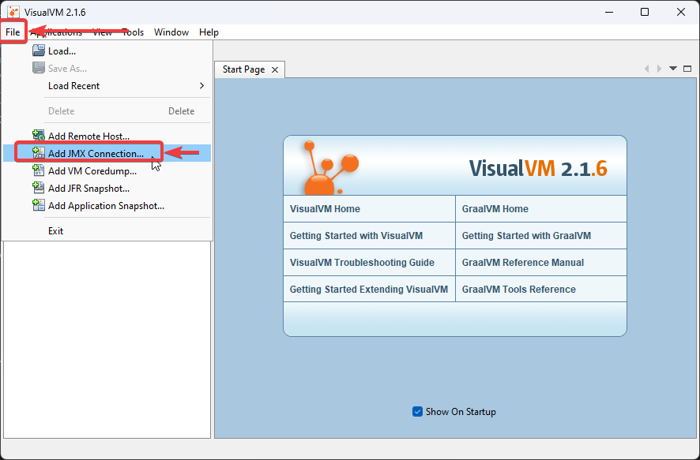
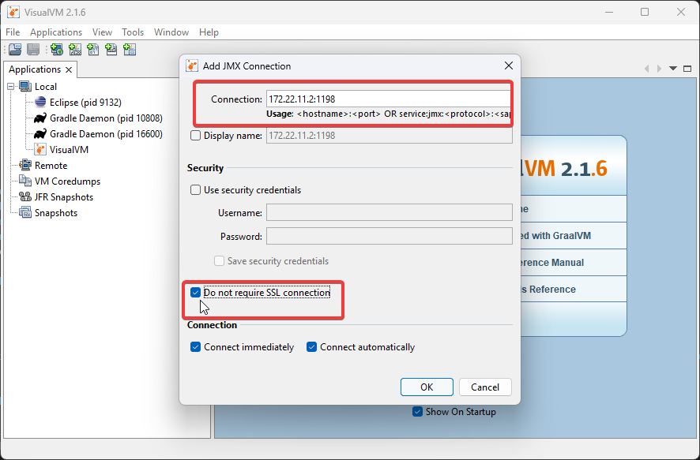
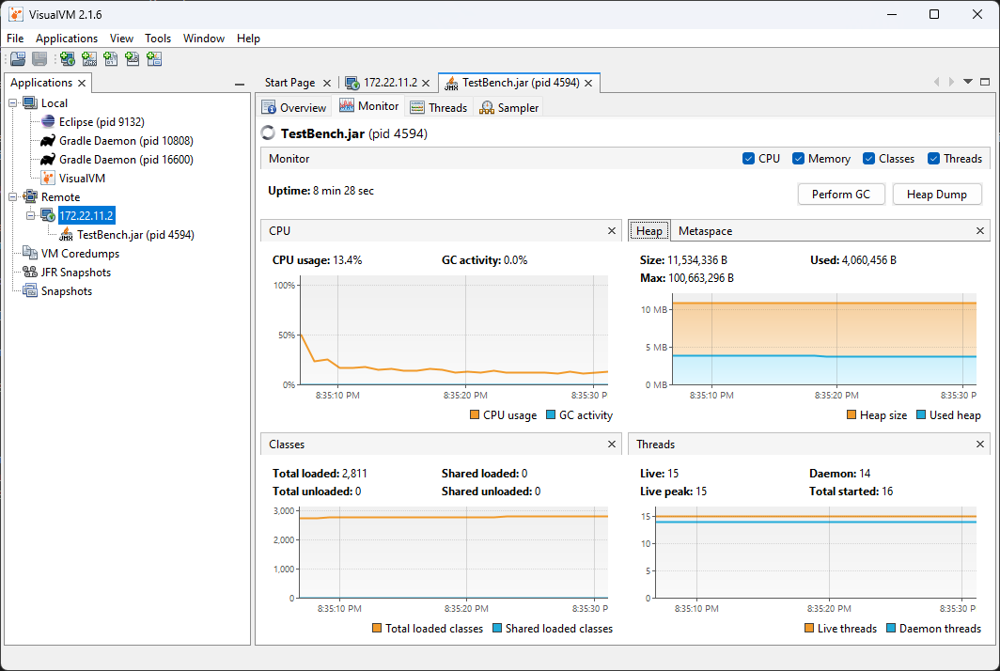
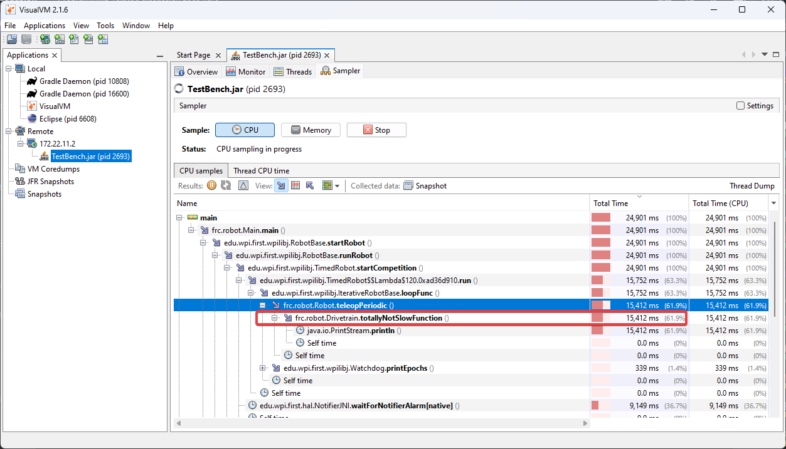
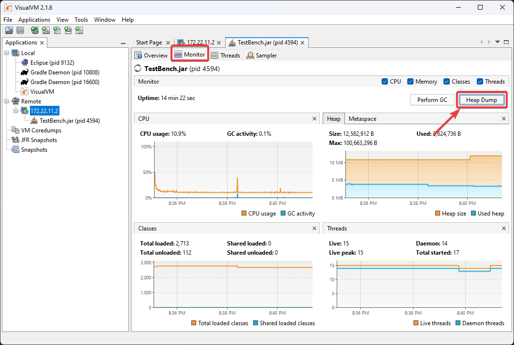
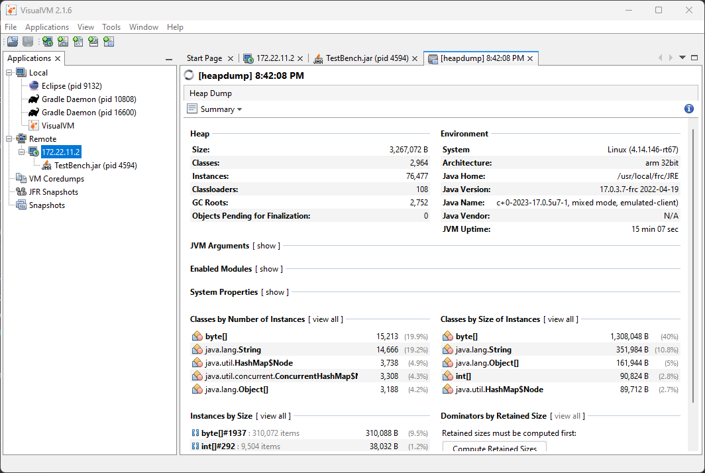
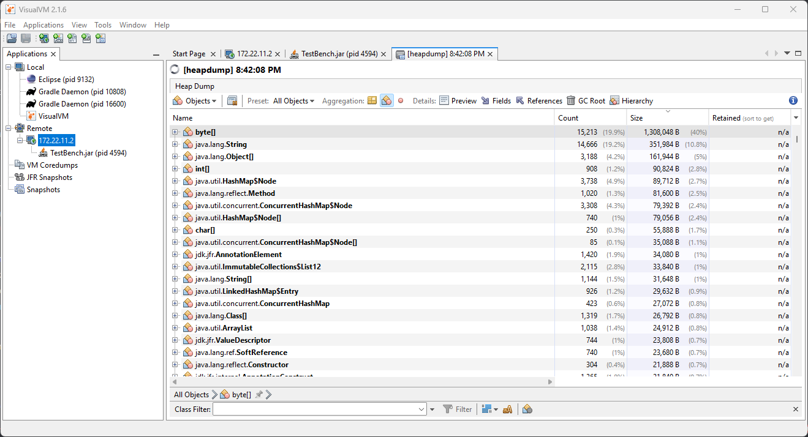
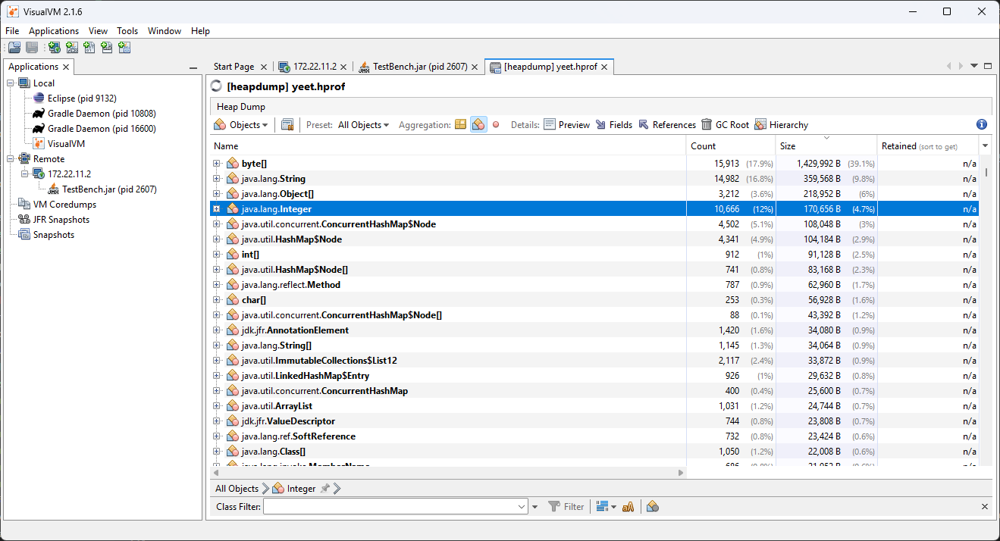

# Profiling with VisualVM

This document is intended to familiarize the reader with the diagnostic tool that is [VisualVM](https://visualvm.github.io/) for debugging Java robot programs. VisualVM is a tool for profiling JVM based applications, such as viewing why an application is using a large amount of memory. This document assumes the reader is familiar with the *risks* associated with modifying their robot ``build.gradle``. This tutorial also assumes that the user knows basic terminal/commandline knowledge.

## Unpacking VisualVM

To begin, [download VisualVM](https://visualvm.github.io/download.html) and unpack it to the WPILib installation folder. The folder is located at ``~/wpilib/`` where ``~`` indicates the users home directory. On Windows, this is ``C:\Users\Public\wpilib``.

## Setting up Gradle

GradleRIO supports passing JVM launch arguments, and this is what is necessary to enable remote debugging. Remote debugging is a feature that allows a local machine (such as the user's desktop) to view important information about a remote target (in our case, a roboRIO). To begin, locate the ``frcJava`` code block located in the projects ``build.gradle``. Below is what is looks like.

.. rli:: https://raw.githubusercontent.com/wpilibsuite/vscode-wpilib/v2026.1.1/vscode-wpilib/resources/gradle/java/build.gradle
   :language: groovy
   :lines: 15-42
   :lineno-match:
   :emphasize-lines: 15-16


We will be replacing the highlighted lines with:

```groovy
frcJava(getArtifactTypeClass('FRCJavaArtifact')) {
   // Enable VisualVM connection
   jvmArgs.add("-Dcom.sun.management.jmxremote=true")
   jvmArgs.add("-Dcom.sun.management.jmxremote.port=1198")
   jvmArgs.add("-Dcom.sun.management.jmxremote.local.only=false")
   jvmArgs.add("-Dcom.sun.management.jmxremote.ssl=false")
   jvmArgs.add("-Dcom.sun.management.jmxremote.authenticate=false")
   jvmArgs.add("-Djava.rmi.server.hostname=10.TE.AM.2") // Replace TE.AM with team number
}
```

We are adding a few arguments here. In order:

* Enable remote debugging
* Set the remote debugging port to 1198
* Allow listening from remote targets
* Disable SSL authentication being required
* Set the hostname to the roboRIOs team number. Be sure to replace this. (:ref:`TE.AM IP Notation <docs/networking/networking-introduction/ip-configurations:TE.AM IP Address Notation>`)

.. important:: The hostname when connected via USB-B should be ``172.22.11.2``.

## Running VisualVM

Launching VisualVM is done via the commandline with a few parameters. First, we navigate to the directory containing VisualVM. Then, launch it with parameters, passing it the WPILib JDK path. On a Windows machine, it looks like the following:

```bash
cd "C:\Users\Public\wpilib\visualvm_2110\bin"
./visualvm --jdkhome "C:\Users\Public\wpilib\2026\jdk"
```

.. important:: The exact path ``visualvm_2110`` may vary and depends on the version of VisualVM downloaded.

This should launch VisualVM. Once launched, open the :guilabel:`Add JMX Connection` dialog.



Once opened, configure the connection details and hostname. Ensure that :guilabel:`Do not require SSL connection` is ticked.



If correctly done, a new menu option in the left-hand sidebar will appear. Clicking on it will show you a detailed dashboard of the running JVM application.



## Analyzing Function Timings

An important feature of VisualVM is the ability to view how much time a specific function is taking up. This is *without* having a code debugger attached. To begin, click on the :guilabel:`Sampler` tab and then click on :guilabel:`CPU`. This will immediately give a breakdown of what functions are taking CPU time.



The above screenshot shows a breakdown of the total time a specific function takes. You can see that ``totallyNotSlowFunction()`` accounts for ``61.9%`` of the robot program CPU time. We can then correlate this to our robot program. In ``totallyNotSlowFunction()``, we have the following code.

```Java
public static void totallyNotSlowFunction() {
   for (int i = 0; i < 2000; i++) {
      System.out.println("HAHAHAHA");
   }
}
```

In this code snippet, we can identify 2 major causes of concern. A long running ``for`` loop blocks the rest of the robot program from running. Additionally, ``System.out.println()`` calls on the roboRIO are typically quite expensive. We found this information by profiling the Java application on the roboRIO!

## Creating a Heap Dump

Besides viewing the remote systems CPU and memory usage, VisualVM is most useful by creating a **Heap Dump**. When a Java object is created, it resides in an area of memory called the heap. When the heap is full, a process called [garbage collection](https://www.geeksforgeeks.org/garbage-collection-java/) begins. Garbage collection can be a common cause of loop overruns in a traditional Java robot program.

To begin, ensure you are on the :guilabel:`Monitor` tab and click :guilabel:`Heap Dump`.



This heap dump will be stored on the target system (roboRIO) and must be retrieved using SFTP. See :doc:`this article </docs/software/roborio-info/roborio-ftp>` for information on retrieving the dump from the roboRIO.

Once downloaded, the dump can be analyzed with VisualVM.

.. tip:: You can also :ref:`configure the JVM to take a heap dump automatically when your robot code runs out of memory <docs/software/basic-programming/java-gc:Diagnosing Out of Memory Errors with Heap Dumps>`.

## Analyzing a Heap Dump

Reopen VisualVM if closed using the previous instructions. Then click on :guilabel:`File` and :guilabel:`Load`. Navigate to the retrieved dump file and load it.



Clicking on :guilabel:`Summary` and selecting :guilabel:`Objects` instead will show a breakdown of objects by quantity. The below screenshot showcases a completely empty robot program, and then one that creates an million large ``ArrayList`` of integers.

Blank robot program:



with an ``ArrayList`` of ~10000 integers.



## Additional Info

For more information on VisualVM, check out the [VisualVM documentation pages](https://visualvm.github.io/documentation.html).
