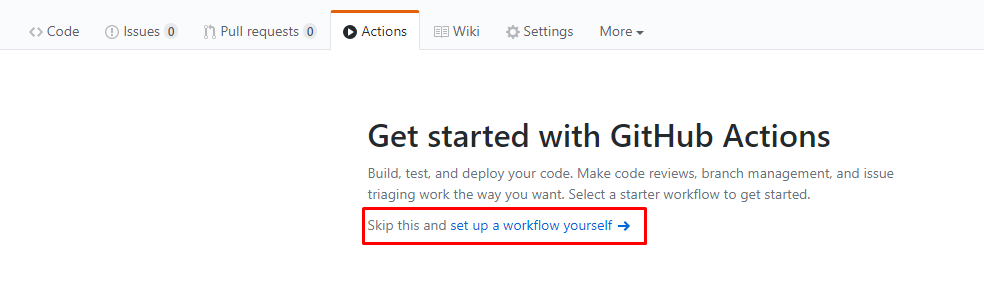
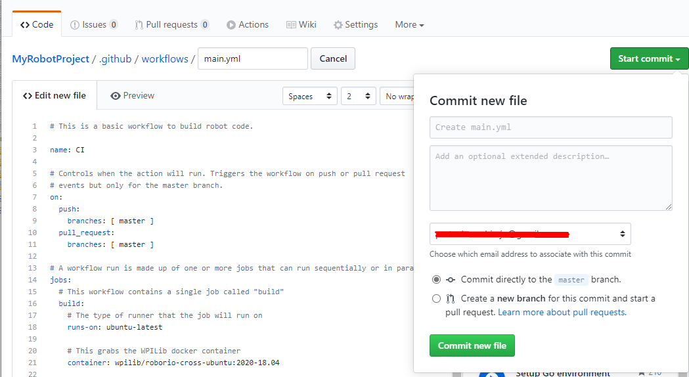
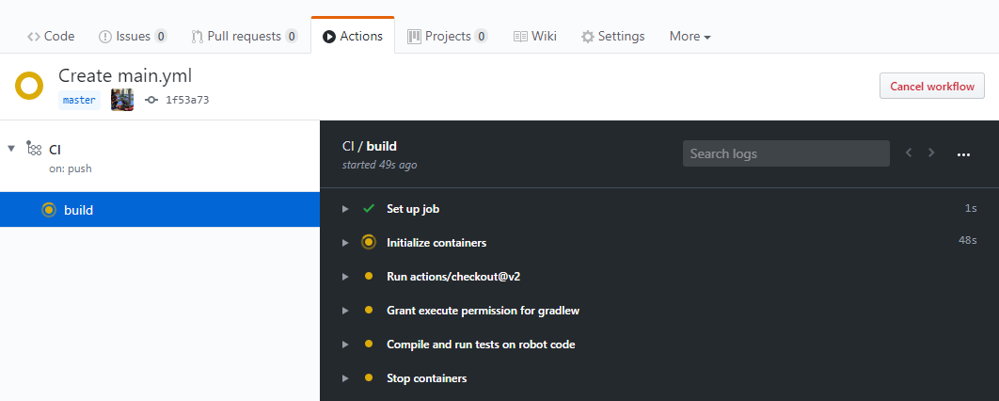
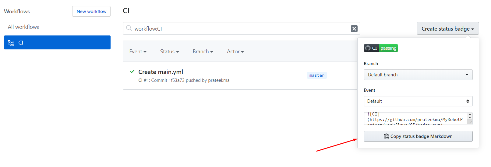
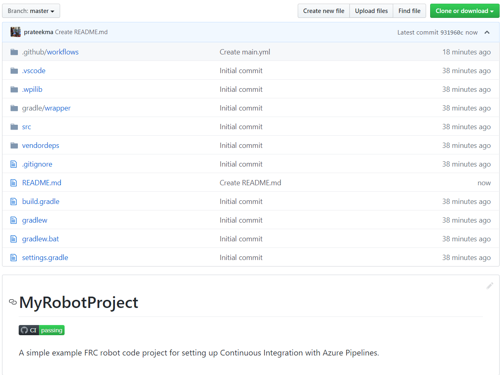

Setting up CI for Robot Code using GitHub Actions
=================================================

An important aspect of working in a team environment is being able to test code that is pushed to a central repository such as GitHub. For example, a project manager or lead developer might want to run a set of unit tests before merging a pull request or might want to ensure that all code on the main branch of a repository is in working order.

`GitHub Actions <https://github.com/features/actions>`_ is a service that allows for teams and individuals to build and run unit tests on code on various branches and on pull requests. These types of services are more commonly known as "Continuous Integration" services. This tutorial will show you how to setup GitHub Actions on robot code projects.

.. note:: This tutorial assumes that your team's robot code is being hosted on GitHub. For an introduction to Git and GitHub, please see this :doc:`introduction guide </docs/software/basic-programming/git-getting-started>`.

Creating the Action
-------------------
The instructions for carrying out the CI process are stored in a YAML file. To create this, click on the "Actions" tab at the top of your repository. Then click on the "set up a workflow yourself" hyperlink.

You will now be greeted with a text editor. Replace all the default text with the following:

.. code-block:: yaml

    # This is a basic workflow to build robot code.

    name: CI

    # Controls when the action will run. Triggers the workflow on push or pull request
    # events but only for the main branch.
    on:
      push:
        branches: [ main ]
      pull_request:
        branches: [ main ]

    # A workflow run is made up of one or more jobs that can run sequentially or in parallel
    jobs:
      # This workflow contains a single job called "build"
      build:
        # The type of runner that the job will run on
        runs-on: ubuntu-latest

        # This grabs the WPILib docker container
        container: wpilib/roborio-cross-ubuntu:2022-20.04

        # Steps represent a sequence of tasks that will be executed as part of the job
        steps:
        # Checks-out your repository under $GITHUB_WORKSPACE, so your job can access it
        - uses: actions/checkout@v2

        # Grant execute permission for gradlew
        - name: Grant execute permission for gradlew
          run: chmod +x gradlew

        # Runs a single command using the runners shell
        - name: Compile and run tests on robot code
          run: ./gradlew build

Then, save changes by clicking the "Start commit" button on the top-right corner of the screen. You can amend the default commit message if you wish to do so. Then, click the green "Commit new file" button.

GitHub will now automatically run a build whenever a commit is pushed to main or a pull request is opened. To monitor the status of any build, you can click on the "Actions" tab on the top of the screen.

A Breakdown of the Actions YAML File
------------------------------------
Here is a breakdown of the YAML file above. Although a strict understanding of each line is not required, some level of understanding will help you add more features and debug potential issues that may arise.

.. code-block:: yaml

    # Controls when the action will run. Triggers the workflow on push or pull request
    # events but only for the main branch.
    on:
      push:
        branches: [ main ]
      pull_request:
        branches: [ main ]

This block of code dictates when the Action will run. Currently, the action will run when commits are pushed to main or when pull requests are opened against main.

.. code-block:: yaml

    # A workflow run is made up of one or more jobs that can run sequentially or in parallel
    jobs:
      # This workflow contains a single job called "build"
      build:
        # The type of runner that the job will run on
        runs-on: ubuntu-latest

        # This grabs the WPILib docker container
        container: wpilib/roborio-cross-ubuntu:2022-20.04

Each Action workflow is made of a one or more jobs that run either sequentially (one after another) or in parallel (at the same time). In our workflow, there is only one "build" job.

We specify that we want the job to run on an Ubuntu virtual machine and in a virtualized `Docker container <https://www.docker.com/resources/what-container>`_ that contains the JDK, C++ compiler and roboRIO toolchains.

.. code-block:: yaml

        # Steps represent a sequence of tasks that will be executed as part of the job
        steps:
        # Checks-out your repository under $GITHUB_WORKSPACE, so your job can access it
        - uses: actions/checkout@v2

        # Grant execute permission for gradlew
        - name: Grant execute permission for gradlew
          run: chmod +x gradlew

        # Runs a single command using the runners shell
        - name: Compile and run tests on robot code
          run: ./gradlew build

Each job has certain steps that will be executed. This job has three steps. The first step involves checking out the repository to access the robot code. The second step involves giving the virtual machine permission to execute gradle tasks using ``./gradlew``. The final step runs ``./gradlew build`` to compile robot code and run any unit tests.

Adding a Build Status Badge to a README.md File
-----------------------------------------------
It is helpful to add a CI status badge to the top of your repository's README file to quickly check the status of the latest build on main. To do this, click on the "Actions" tab at the top of the screen and select the "CI" tab on the left side of the screen. Then, click on the "Create status badge" button on the top right and copy the status badge Markdown code.

Finally, paste the Markdown code you copied at the top of your README file, commit, and push your changes. Now, you should see the GitHub Actions status badge on your main repository page.

