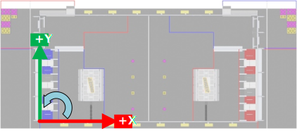

Coordinate System
=================

Coordinate systems are used in FRC programming in several places. A few of the common places are: robot movement, joystick input, :term:`pose` estimation, AprilTags, and path planning.

It is important to understand the basics of the coordinate system used throughout WPILib and other common tools for programming an FRC robot, such as PathPlanner. Many teams intuitively  think of a coordinate system that is different from what is used in WPILib, and this leads to problems that need to be tracked down throughout the season. It is worthwhile to take a few minutes to understand the coordinate system, and come back here as a reference when programming. It's not very difficult to get robot movement with a joystick working without getting the coordinate system right, but it will be much more difficult to build on code using a different coordinate system to add :term:`pose estimation` with :term:`AprilTags` and path planning for autonomous.

WPILib coordinate system
------------------------

In most cases, WPILib uses the NWU axes convention (North-West-Up as external reference in the world frame.) In the NWU axes convention, where the positive X axis points ahead, the positive Y axis points left, and the positive Z axis points up referenced from the floor. When viewed with each positive axis pointing toward you, counter-clockwise (CCW) is a positive value and clockwise (CW) is a negative value.

.. figure:: images/coordinate-system/robot-3d.svg
   :scale: 200
   :alt: NWU axes convention in three dimensions

   Robot coordinate system in three dimensions

The figure above shows the coordinate system in relation to an FRC robot. The figure below shows this same coordinate system when viewed from the top (with the Z axis pointing toward you.) This is how you can think of the robot's coordinates in 2D.

.. figure:: images/coordinate-system/robot-2d.svg
   :scale: 200
   :alt: NWU axes convention in two dimensions

   Robot coordinate system in two dimensions

Rotation conventions
--------------------

In most cases in WPILib programming, 0° is aligned with the positive X axis, and 180° is aligned with the negative X axis. CCW rotation is positive, so 90° is aligned with the positive Y axis, and -90° is aligned with the negative Y axis.

.. figure:: images/coordinate-system/rotation.svg
   :scale: 200
   :alt: Unit circle

   Unit circle with common angles

The figure above shows the unit circle with common angles labeled in degrees (°) and radians (rad). Notice that rotation to the right is negative, and the range for the whole unit circle is -180° to 180° (-Pi radians to Pi radians).

.. note:: The range is (-180, 180], meaning it is exclusive of -180° and inclusive of 180°.

There are some places you may choose to use a different range, such as 0° to 360° or 0 to 1 rotation, but be aware that many core WPILib classes and FRC tools are built with the unit circle above.

.. warning:: Some :term:`gyroscope` and :term:`IMU` models use CW positive rotation, such as the NavX IMU. Care must be taken to handle rotation properly, sensor values may need to be inverted. Read the documentation and verify that rotation is CCW positive.

.. warning:: Many sensors that read rotation around an axis, such as encoders and IMU's, read continuously. This means they read more than one rotation, so when rotating past 180° they read 181°, not -179°. Some sensors have configuration settings where you can choose their wrapping behavior and range, while others need to be handled in your code. Careful attention should be paid to make sure sensor readings are consistent and your control loop handles wrapping in the same way as your sensor.

Joystick and controller coordinate system
-----------------------------------------

Joysticks, including the sticks on controllers, don't use the same NWU coordinate system. They use the NED (North-East-Down) convention, where the positive X axis points ahead, the positive Y axis points right, and the positive Z axis points down. When viewed with each positive axis pointing toward you, counter-clockwise (CCW) is a positive value and clockwise (CW) is a negative value.

.. figure:: images/coordinate-system/joystick-3d.svg
   :scale: 200
   :alt: NED axes convention

   Joystick coordinate system

It's important to note that joystick input values are rotations around an axis, not translations. In practical terms, this means:

- pushing forward on the joystick (toward the positive X axis) is a CW rotation around the Y axis, so you get a negative Y value.
- pushing to the right (toward the positive Y axis) is a CCW rotation around the X axis, so you get a positive X value.
- twisting the joystick CW (toward the positive Y axis) is a CCW rotation around the Z axis, so you get a positive Z value.

Using Joystick and controller input to drive a robot
---------------------------------------------------------

You may have noticed, the coordinate system used by WPILib for the robot is not the same as the coordinate system used for joysticks and controllers. Care needs to be taken to understand the difference, and properly pass driver input to the drive subsystem.

Differential drivetrain example
^^^^^^^^^^^^^^^^^^^^^^^^^^^^^^^^

Differential drivetrains are non-holonomic, which means the robot drivetrain cannot move side-to-side (strafe). This type of drivetrain can move forward and backward along the X axis, and rotate around the Z axis. Consider a common arcade drive scheme using a single joystick where the driver pushes the joystick forward/backward for forward/backward robot movement, and push the joystick left/right to rotate the robot left/right.

The code snippet below uses the ``DifferentialDrive`` and ``Joystick`` classes to drive the robot with the arcade scheme described above. ``DifferentialDrive`` uses the robot coordinate system defined above, and ``Joystick`` uses the joystick coordinate system.

.. tab-set-code::

    .. code-block:: java

        public void teleopPeriodic() {
            // Arcade drive with a given forward and turn rate
            myDrive.arcadeDrive(-driveStick.getY(), -driveStick.getX());
        }

    .. code-block:: c++

        void TeleopPeriodic() override {
            // Arcade drive with a given forward and turn rate
            myDrive.ArcadeDrive(-driveStick.GetY(), -driveStick.GetX());
        }

    .. code-block:: python

       def teleopPeriodic(self):
           # Arcade drive with a given forward and turn rate
           self.myDrive.arcadeDrive(-self.driveStick.getY(), -self.driveStick.getX())

The code calls the ``DifferentialDrive.arcadeDrive(xSpeed, zRotation)`` method, with values it gets from the ``Joystick`` class:

- The first argument is ``xSpeed``

    - Robot: ``xSpeed`` is the speed along the robot's X axis, which is forward/backward.
    - Joystick: The driver sets forward/backward speed by rotating the joystick along its Y axis, which is pushing the joystick forward/backward.
    - Code: Moving the joystick forward is negative Y rotation, whereas moving the robot forward is along the positive X axis. This means the joystick value needs to be inverted by placing a - (minus sign) in front of the value.

- The second argument is ``zRotation``

    - Robot: ``zRotation`` is the speed of rotation along the robot's Z axis, which is rotating left/right.
    - Joystick: The driver sets rotation speed by rotating the joystick along its X axis, which is pushing the joystick left/right.
    - Code: Moving the joystick to the right is positive X rotation, whereas robot rotation is CCW positive. This means the joystick value needs to be inverted by placing a - (minus sign) in front of the value.

Mecanum drivetrain example
^^^^^^^^^^^^^^^^^^^^^^^^^^

Mecanum drivetrains are holonomic, meaning they have the ability to move side-to-side. This type of drivetrain can move forward/backward and rotate around the Z axis like differential drivetrains, but it can also move side-to-side along the robot's Y axis. Consider a common arcade drive scheme using a single joystick where the driver pushes the joystick forward/backward for forward/backward robot movement, pushes the joystick left/right to move side-to-side, and twists the joystick to rotate the robot.

.. tab-set-code::

    .. code-block:: java

        public void teleopPeriodic() {
            // Drive using the X, Y, and Z axes of the joystick.
            m_robotDrive.driveCartesian(-m_stick.getY(), -m_stick.getX(), -m_stick.getZ());
        }

    .. code-block:: c++

        void TeleopPeriodic() override {
            // Drive using the X, Y, and Z axes of the joystick.
            m_robotDrive.driveCartesian(-m_stick.GetY(), -m_stick.GetX(), -m_stick.GetZ());
        }

    .. code-block:: python

       def teleopPeriodic(self):
           // Drive using the X, Y, and Z axes of the joystick.
           self.robotDrive.driveCartesian(-self.stick.getY(), -self.stick.getX(), -self.stick.getZ())

The code calls the ``MecanumDrive.driveCartesian(xSpeed, ySpeed, zRotation)`` method, with values it gets from the ``Joystick`` class:

- The first argument is ``xSpeed``

    - Robot: ``xSpeed`` is the speed along the robot's X axis, which is forward/backward.
    - Joystick: The driver sets forward/backward speed by rotating the joystick along its Y axis, which is pushing the joystick forward/backward.
    - Code: Moving the joystick forward is negative Y rotation, whereas robot forward is along the positive X axis. This means the joystick value needs to be inverted by placing a - (minus sign) in front of the value.

- The second argument is ``ySpeed``

    - Robot: ``ySpeed`` is the speed along the robot's Y axis, which is left/right.
    - Joystick: The driver sets left/right speed by rotating the joystick along its X axis, which is pushing the joystick left/right.
    - Code: Moving the joystick to the right is positive X rotation, whereas robot right is along the negative Y axis. This means the joystick value needs to be inverted by placing a - (minus sign) in front of the value.

- The third argument is ``zRotation``

    - Robot: ``zRotation`` is the speed of rotation along the robot's Z axis, which is rotating left/right.
    - Joystick: The driver sets rotation speed by twisting the joystick along its Z axis, which is twisting the joystick left/right.
    - Code: Twisting the joystick to the right is positive Z rotation, whereas robot rotation is CCW positive. This means the joystick value needs to be inverted by placing a - (minus sign) in front of the value.

Swerve drivetrain example
^^^^^^^^^^^^^^^^^^^^^^^^^^

Like mecanum drivetrains, swerve drivetrains are holonomic and have the ability to move side-to-side. Joystick control can be handled the same way for all holonomic drivetrains, but WPILib doesn't have a built-in robot drive class for swerve. Swerve coding is described in other sections of this documentation, but an example of using joystick input to set ``ChassisSpeeds`` values is included below. Consider the same common arcade drive scheme described in the mecanum section above. The scheme uses a single joystick where the driver pushes the joystick forward/backward for forward/backward robot movement, pushes the joystick left/right to move side-to-side, and twists the joystick to rotate the robot.

.. tab-set-code::

   .. code-block:: java

      // Drive using the X, Y, and Z axes of the joystick.
      var speeds = new ChassisSpeeds(-m_stick.getY(), -m_stick.getX(), -m_stick.getZ());

   .. code-block:: c++

      // Drive using the X, Y, and Z axes of the joystick.
      frc::ChassisSpeeds speeds{-m_stick.GetY(), -m_stick.GetX(), -m_stick.GetZ()};

   .. code-block:: python

      # Drive using the X, Y, and Z axes of the joystick.
      speeds = ChassisSpeeds(-self.stick.getY(), -self.stick.getX(), -self.stick.getZ())

The three arguments to the ``ChassisSpeeds`` constructor are the same as ``driveCartesian`` in the mecanum section above; ``xSpeed``, ``ySpeed``, and ``zRotation``. See the description of the arguments, and their joystick input in the section above.

Robot drive kinematics
----------------------

:doc:`Kinematics is a topic that is covered in a different section </docs/software/kinematics-and-odometry/intro-and-chassis-speeds>`, but it's worth discussing here in relation to the coordinate system. It is critically important that kinematics is configured using the coordinate system described above. Kinematics is a common starting point for coordinate system errors that then cascade to basic drivetrain control, field oriented driving, pose estimation, and path planning.

When you construct a ``SwerveDriveKinematics`` or ``MecanumDriveKinematics`` object, you specify a translation from the center of your robot to each wheel. These translations use the coordinate system above, with the origin in the center of your robot.

   Kinematics with translation signs

For the robot in the diagram above, let's assume the distance between the front and rear wheels (wheelbase) is 2'. Let's also assume the distance between the left and right wheels (trackwidth) is also 2'. Our translations (x, y) would be like this:

- Front left: (1', 1')
- Front right: (1', -1')
- Rear left: (-1', 1')
- Rear right: (-1', -1')

.. warning:: A common error is to use an incorrect coordinate system where the positive Y axis points forward on the robot. The correct coordinate system has the positive X axis pointing forward.

Field coordinate systems
------------------------

The field coordinate system (or global coordinate system) is an absolute coordinate system where a point on the field is designated as the origin. Two common uses of the field coordinate system will be explored in this document:

- Field oriented driving is a drive scheme for holonomic drivetrains, where the driver moves the controls relative to their perspective of the field, and the robot moves in that direction regardless of where the front of the robot is facing. For example, a driver on the red alliance pushes the joystick forward, the robot will move downfield toward the blue alliance wall, even if the robot's front is facing the driver.
- Pose estimation with odometry and/or AprilTags are used to estimate the robot's pose on the field.

Mirrored field vs. rotated field
^^^^^^^^^^^^^^^^^^^^^^^^^^^^^^^^

Historically, FRC has used two types of field layouts in relation to the red and blue alliance.

Games such as Rapid React in 2022 used a rotated layout. A rotated layout means that, from your perspective from behind your alliance wall, your field elements and your opponent's elements are in the same location. Notice in the Rapid React field layout diagram below, whether you are on the red or blue alliance, your human player station is on your right and your hanger is on your left.

   Rotated field from RAPID REACT in 2022 [#]_

Games such as CHARGED UP in 2023 and CRESCENDO in 2024 used a mirrored layout. A mirrored layout means that the red and blue alliance layout are mirrored across the centerpoint of the field. Refer to the CHARGED UP field diagram below. When you are standing behind the blue alliance wall, the charge station is on the right side of the field from your perspective. However, standing behind the red alliance wall, the charge station is on the left side of the field from your perspective.

   Mirrored field from CHARGED UP in 2023 [#]_

Dealing with red or blue alliance
^^^^^^^^^^^^^^^^^^^^^^^^^^^^^^^^^

There are two primary ways many teams choose to define the field coordinate system. In both methods, positive rotation (theta) is in the counter-clockwise (CCW) direction.

.. warning:: There are cases where your alliance may change (or appear to change) after the code is initialized. When you are not connected to the :term:`FMS` at a competition, you can change your alliance station in the Driver Station application at any time. Even when you are at a competition, your robot will usually initialize before connecting to the FMS so you will not have alliance information.

.. note:: At competition events, the FMS will automatically report your Team Station and alliance color. When you are not connected to an FMS, you can choose your Team Station and alliance color on the Driver Station :ref:`docs/software/driverstation/driver-station:operation tab`.

Always blue origin
~~~~~~~~~~~~~~~~~~

You may choose to define the origin of the field on the blue side, and keep it there regardless of your alliance color. With this solution, positive x-axis points away from the blue alliance wall.

   CHARGED UP with blue origin

Some advantages to this approach are:

- Pose estimation with AprilTags is simplified. AprilTags throughout the field are unique. If you keep the coordinate system the same regardless of alliance, there is no need for special logic to deal with the location of AprilTags on the field relative to your alliance.
- Many of the tools and libraries used in FRC follow this convention. Some of the tools include: PathPlanner, Choreo, and the ShuffleBoard and Glass Field2d widget.

In order to use this approach for field oriented driving, driver input needs to consider the alliance color. When your alliance is red and the driver is standing behind the red alliance wall, they will want the robot to move downfield toward the blue alliance wall. However, when your alliance is blue, the driver will want the robot to go downfield toward the red alliance wall.

A simple way to deal with field oriented driving is to check the alliance color reported by the `DriverStation` class, and invert the driver's controls based on the alliance. As noted above, your alliance color can change so it needs to be checked on every robot iteration.

.. tab-set-code::

   .. code-block:: java

      // The origin is always blue. When our alliance is red, X and Y need to be inverted
      var alliance = DriverStation.getAlliance();
      var invert = 1;
      if (alliance.isPresent() && alliance.get() == Alliance.Red) {
          invert = -1;
      }

      // Create field relative ChassisSpeeds for controlling Swerve
      var chassisSpeeds = ChassisSpeeds
              .fromFieldRelativeSpeeds(xSpeed * invert, ySpeed * invert, zRotation, imu.getRotation2d());

      // Control a mecanum drivetrain
      m_robotDrive.driveCartesian(xSpeed * invert, ySpeed * invert, zRotation, imu.getRotation2d());

   .. code-block:: c++

      // The origin is always blue. When our alliance is red, X and Y need to be inverted
      int invert = 1;
      if (frc::DriverStation::GetAlliance() == frc::DriverStation::Alliance::kRed) {
          invert = -1;
      }

      // Create field relative ChassisSpeeds for controlling Swerve
      frc::ChassisSpeeds chassisSpeeds =
              frc::ChassisSpeeds::FromFieldRelativeSpeeds(xSpeed * invert, ySpeed * invert, zRotation, imu.GetRotation2d());

      // Control a mecanum drivetrain
      m_robotDrive.driveCartesian(xSpeed * invert, ySpeed * invert, zRotation, imu.GetRotation2d());

   .. code-block:: python

       # The origin is always blue. When our alliance is red, X and Y need to be inverted
       invert = 1
       if wpilib.DriverStation.getAlliance() == wpilib.DriverStation.Alliance.kRed:
           invert = -1

       # Create field relative ChassisSpeeds for controlling Swerve
       chassis_speeds = wpilib.ChassisSpeeds.FromFieldRelativeSpeeds(
           xSpeed * invert, ySpeed * invert, zRotation, self.imu.GetAngle()
       )

       # Control a mecanum drivetrain
       self.robotDrive.driveCartesian(xSpeed * invert, ySpeed * invert, zRotation, self.imu.GetAngle())

Origin follows your alliance
~~~~~~~~~~~~~~~~~~~~~~~~~~~~

You may choose to define the origin of the field based on the alliance you are one. With this approach, the positive x-axis always points away from your alliance wall.

When you are on the blue alliance, your origin looks like this:

   CHARGED UP field with blue alliance as origin

When you are on the red alliance, your origin looks like this:

   CHARGED UP field with red alliance as origin

This approach has a few more complications than the previous approach, especially in years when the field layout is mirrored between alliances.

In years when the field layout is rotated, this is a simple approach if you are not using AprilTags for pose estimation or doing other advanced techniques. When the field layout is rotated, the field elements appear at the same coordinates regardless of your alliance.

Some things you need to consider when using this approach are:

- As warned above, your alliance color can change after initialization. If you are not using AprilTags, you may not have anything to adjust when the alliance changes. However, if you are using AprilTags and your robot has seen a tag and used it for pose estimation, you will need to adjust your origin and reset your estimated pose.
- The field image in the ShuffleBoard and Glass Field2d widget follows the *Always blue origin* approach. Special handling is needed to display your robot pose correctly when your alliance is red. You will need to change the origin for your estimated pose to the blue alliance coordinate system before sending it to the dashboard.

.. [#] Rapid React field image from MikLast on Chiefdelphi `<https://www.chiefdelphi.com/t/2022-top-down-field-renders/399031>`__
.. [#] CHARGED UP field image from MikLast on Chiefdelphi `<https://www.chiefdelphi.com/t/2023-top-down-field-renders/421365>`__
