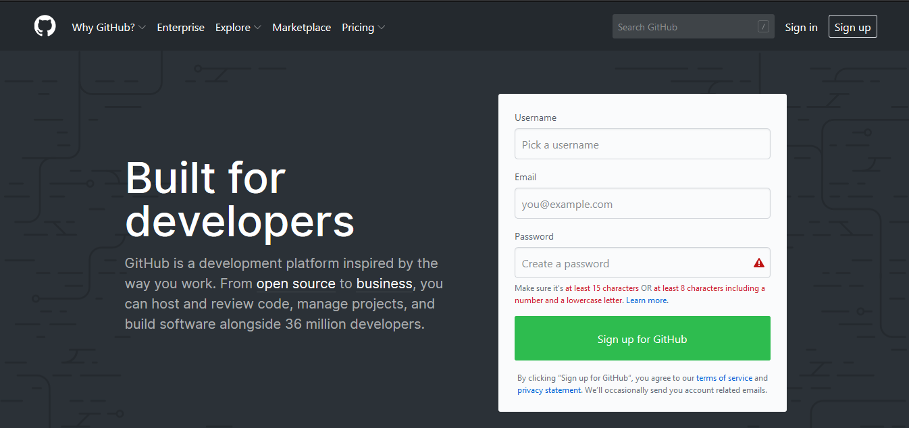
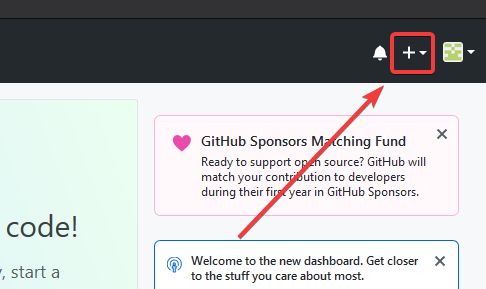
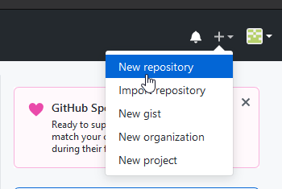
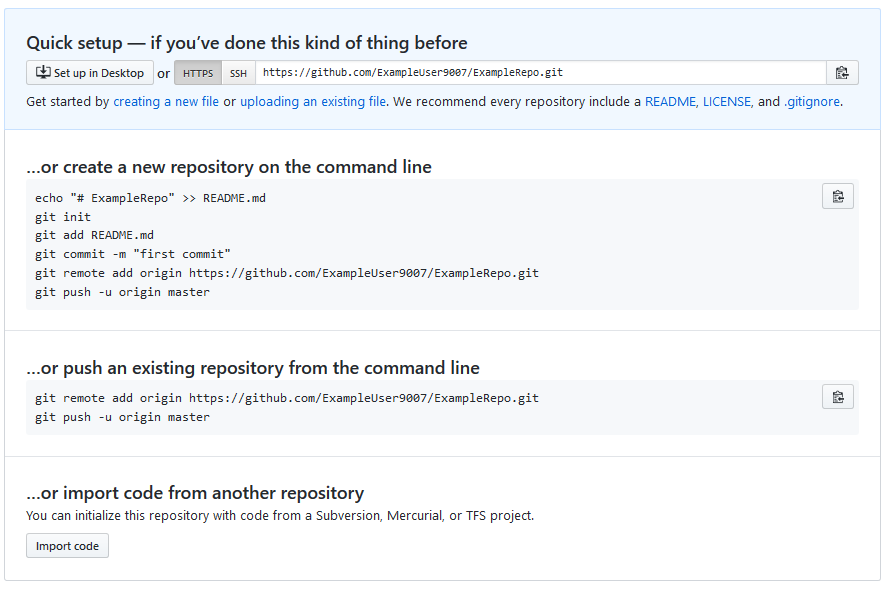
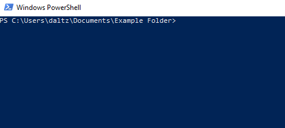
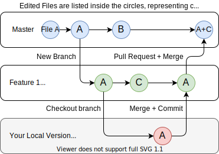
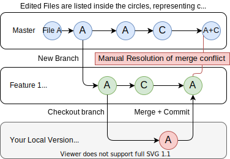

.. include:: <isonum.txt>

Git Version Control Introduction
================================

.. important:: A more in-depth guide on Git is available on the `Git website <https://git-scm.com/book/en/v2>`__.

`Git <https://git-scm.com/about>`_ is a Distributed Version Control System (VCS) created by Linus Torvalds, also known for creating and maintaining the Linux kernel. Version Control is a system for tracking changes of code for developers. The advantages of Git Version Control are:

- Separation of testing environments into *branches*
- Ability to navigate to a particular *commit* without removing history
- Ability to manage *commits* in various ways, including combining them
- Various other features, see `here <https://git-scm.com/about>`__

Prerequisites
-------------

.. important:: This tutorial uses the Windows operating system

You have to download and install Git from the following links:

- `Windows <https://git-scm.com/download/win>`_
- `macOS <https://git-scm.com/download/mac>`_
- `Linux <https://git-scm.com/download/linux>`_

.. note:: You may need to add Git to your `path <https://www.google.com/search?q=adding+git+to+path>`__

Git Vocabulary
--------------

Git revolves around several core data structures and commands:

- **Repository:** the data structure of your code, including a ``.git`` folder in the root directory
- **Commit:** a particular saved state of the repository, which includes all files and additions
- **Branch:** a means of grouping a set of commits. Each branch has a unique history. This is primarily used for separating development and stable branches.
- **Push:** update the remote repository with your local changes
- **Pull:** update your local repository with the remote changes
- **Clone:** retrieve a local copy of a repository to modify
- **Fork:** duplicate a pre-existing repository to modify, and to compare against the original
- **Merge:** combine various changes from different branches/commits/forks into a single history

Repository
----------

A Git repository is a data structure containing the structure, history, and files of a project.

Git repositories usually consist of:

- A ``.git`` folder. This folder contains the various information about the repository.
- A ``.gitignore`` file. This file contains the files or directories that you do *not* want included when you commit.
- Files and folders. This is the main content of the repository.

Creating the repository
^^^^^^^^^^^^^^^^^^^^^^^

You can store the repository locally, or through a remote -- a remote being the cloud, or possibly another storage medium or server that hosts your repository. `GitHub <https://github.com/>`_ is a popular free hosting service. Numerous developers use it, and that's what this tutorial will use.

.. note:: There are various providers that can host repositories. `Gitlab <https://about.gitlab.com>`_ and `Bitbucket <https://bitbucket.org/>`_ are a few alternatives to Github.

Creating a GitHub Account
~~~~~~~~~~~~~~~~~~~~~~~~~

Go ahead and create a GitHub account by visiting the `website <https://github.com>`_ and following the on-screen prompts.

Local Creation
~~~~~~~~~~~~~~

After creating and verifying your account, you'll want to visit the homepage. It'll look similar to the shown image.

Click the plus icon in the top right.

Then click *"New Repository"*

Fill out the appropriate information, and then click *"Create repository"*

You should see a screen similar to this

.. note:: The keyboard shortcut :kbd:`Ctrl+~` can be used to open a terminal in Visual Studio Code for Windows.

Now you'll want to open a PowerShell window and navigate to your project directory. An excellent tutorial on PowerShell can be found `here <https://programminghistorian.org/en/lessons/intro-to-powershell>`__. Please consult your search engine on how to open a terminal on alternative operating systems.

If a directory is empty, a file needs to be created in order for git to have something to track. In the below Empty Directory example, we created a file called ``README.md`` with the contents of ``# Example Repo``. For FRC\ |reg| Robot projects, the below Existing Project commands should be run in the root of a project :ref:`created by the VS Code WPILib Project Creator <docs/zero-to-robot/step-4/creating-benchtop-test-program-cpp-java:Creating a New WPILib Project>`. More details on the various commands can be found in the subsequent sections.

.. note:: Replace the filepath ``"C:\Users\ExampleUser9007\Documents\Example Folder"`` with the one you want to create the repo in, and replace the remote URL ``https://github.com/ExampleUser9007/ExampleRepo.git`` with the URL for the repo you created in the previous steps.

.. tabs::

   .. tab:: Empty Directory

      .. code-block:: console

         > cd "C:\Users\ExampleUser9007\Documents\Example Folder"
         > git init
         Initialized empty Git repository in C:/Users/ExampleUser9007/Documents/Example Folder/.git/
         > echo "# ExampleRepo" >> README.md
         > git add README.md
         > git commit -m "First commit"
         [main (root-commit) fafafa] First commit
          1 file changed, 1 insertions(+), 0 deletions(-)
          create mode 100644 README.md
         > git remote add origin https://github.com/ExampleUser9007/ExampleRepo.git
         > git push -u origin main

   .. tab:: Existing Project

      .. code-block:: console

         > cd "C:\Users\ExampleUser9007\Documents\Example Folder"
         > git init
         Initialized empty Git repository in C:/Users/ExampleUser9007/Documents/Example Folder/.git/
         > git add .
         > git commit -m "First commit"
         [main (root-commit) fafafa] First commit
          1 file changed, 1 insertions(+), 0 deletions(-)
          create mode 100644 README.md
         > git remote add origin https://github.com/ExampleUser9007/ExampleRepo.git
         > git push -u origin main

Commits
-------

Repositories are primarily composed of commits. Commits are saved states or *versions* of code.

In the previous example, we created a file called README.md. Open that file in your favorite text editor and edit a few lines. After tinkering with the file for a bit, simply save and close. Navigate to PowerShell and type the following commands.

.. code-block:: console

    > git add README.md
    > git commit -m "Adds a description to the repository"
    [main bcbcbc] Adds a description to the repository
     1 file changed, 2 insertions(+), 0 deletions(-)
    > git push

.. note:: Writing good commit messages is a key part of a maintainable project. A guide on writing commit messages can be found `here <https://cbea.ms/git-commit/>`_.

Git Pull
^^^^^^^^

.. note:: ``git fetch`` can be used when the user does not wish to automatically merge into the current working branch

This command retrieves the history or commits from the remote repository. When the remote contains work you do not have, it will attempt to automatically merge. See :ref:`docs/software/basic-programming/git-getting-started:Merging`.

Run: ``git pull``

Git Add
^^^^^^^

This command "stages" the specified file(s) so that they will be included in the next commit.

For a single file, run ``git add FILENAME.txt`` where FILENAME.txt is the name and extension of the file to add.
To add every file/folder that isn't excluded via *gitignore*,
run ``git add .``.  When run in the root of the repository this command will stage every untracked, unexcluded file.

Git Commit
^^^^^^^^^^

This command creates the commit and stores it locally. This saves the state and adds it to the repository's history.
The commit will consist of whatever changes ("diffs") were made to the staged files since the last commit.
It is required to specify a "commit message" explaining why you changed this set of files or what the change accomplishes.

Run: ``git commit -m "type message here"``

Git Push
^^^^^^^^

Upload (Push) your local changes to the remote (Cloud)

Run: ``git push``

Branches
--------

Branches in Git are similar to parallel worlds. They start off the same, and then they can "branch" out into different varying paths. Consider the Git control flow to look similar to this.

In the above example, main was branched (or duplicated) into the branch Feature 1 and someone checked out the branch, creating a local copy. Then, someone committed (or uploaded) their changes, merging them into the branch Feature 1. You are "merging" the changes from one branch into another.

Creating a Branch
^^^^^^^^^^^^^^^^^

Run: ``git branch branch-name`` where branch-name is the name of the branch to create. The new branch history will be created from the current active branch.

Entering a Branch
^^^^^^^^^^^^^^^^^

Once a branch is created, you have to then enter the branch.

Run: ``git checkout branch-name`` where branch-name is the branch that was previously created.

Merging
-------

In scenarios where you want to copy one branches history into another, you can merge them. A merge is done by calling ``git merge branch-name`` with branch-name being the name of the branch to merge from. It is automatically merged into the current active branch.

It's common for a remote repository to contain work (history) that you do not have. Whenever you run ``git pull``, it will attempt to automatically merge those commits into your local copy. That merge may look like the below.

However, in the above example, what if File A was modified by both branch Feature1 and Feature2? This is called a **merge conflict**. A merge conflict can be resolved by editing the conflicting file. In the example, we would need to edit File A to keep the history or changes that we want. After that has been done, simply re-add, re-commit, and then push your changes.

Resets
------

Sometimes history needs to be reset, or a commit needs to be undone. This can be done multiple ways.

Reverting the Commit
^^^^^^^^^^^^^^^^^^^^

.. note:: You cannot revert a merge, as git does not know which branch or origin it should choose.

To revert history leading up to a commit run ``git revert commit-id``. The commit IDs can be shown using the ``git log`` command.

Resetting the Head
^^^^^^^^^^^^^^^^^^

.. warning:: Forcibly resetting the head is a dangerous command. It permanently erases all history past the target. You have been warned!

Run: ``git reset --hard commit-id``.

Forks
-----

Forks can be treated similarly to branches. You can merge the upstream (original repository) into the origin (forked repository).

Cloning an Existing Repo
^^^^^^^^^^^^^^^^^^^^^^^^

In the situation that a repository is already created and stored on a remote, you can clone it using

.. code-block:: console

   git clone https://github.com/myrepo.git

where ``myrepo.git`` is replaced with your git repo. If you follow this, you can skip to :ref:`commits <docs/software/basic-programming/git-getting-started:Commits>`.

Updating a Fork
^^^^^^^^^^^^^^^

1. Add the upstream: ``git remote add upstream https://github.com/ORIGINAL_OWNER/ORIGINAL_REPOSITORY.git``
2. Confirm it was added via: ``git remote -v``
3. Pull changes from upstream: ``git fetch upstream``
4. Merge the changes into head: ``git merge upstream/upstream-branch-name``

Gitignore
---------

.. important:: It is extremely important that teams **do not** modify the ``.gitignore`` file that is included with their robot project. This can lead to offline deployment not working.

A ``.gitignore`` file is commonly used as a list of files to not automatically commit with ``git add``. Any files or directory listed in this file will **not** be committed. They will also not show up with `git status <https://git-scm.com/docs/git-status>`_.

Additional Information can be found `here <https://www.atlassian.com/git/tutorials/saving-changes/gitignore>`__.

Hiding a Folder
^^^^^^^^^^^^^^^

Simply add a new line containing the folder to hide, with a forward slash at the end

EX: ``directory-to-exclude/``

Hiding a File
^^^^^^^^^^^^^

Add a new line with the name of the file to hide, including any prepending directory relative to the root of the repository.

EX: ``directory/file-to-hide.txt``

EX: ``file-to-hide2.txt``

Additional Information
----------------------

A much more in-depth tutorial can be found at the official `git <https://git-scm.com/docs/gittutorial>`__ website.

A guide for correcting common mistakes can be found at the git `flight rules <https://github.com/k88hudson/git-flight-rules/blob/master/README.md>`_ repository.
