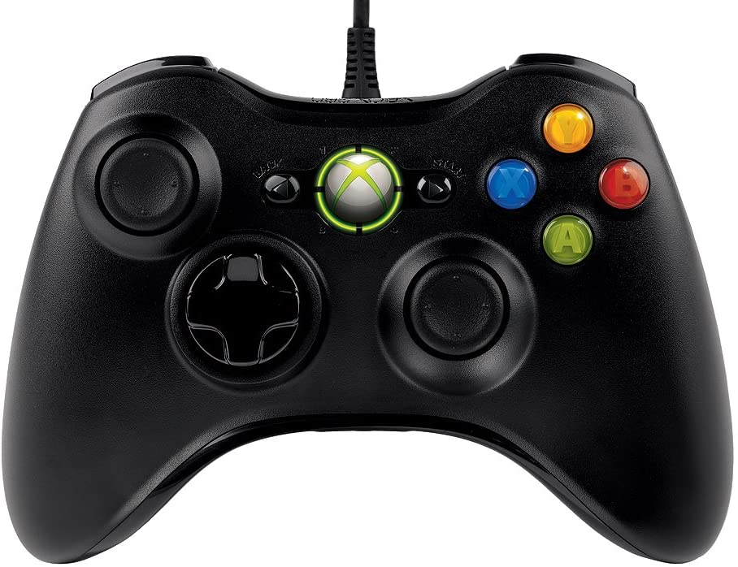

.. include:: <isonum.txt>

Joysticks
=========

In FRC\ |reg|, almost any "controller" that can be recognized by Windows can be used as a joystick.  Joysticks are accessed using the ``GenericHID`` class.  This class has two relevant subclasses for preconfigured joysticks, but if not listed you could implement your own.  The first is ``Joystick`` which is useful for standard flight joysticks.  The second is ``XboxController`` which works for the Xbox 360, Xbox One, or Logitech F310 (in XInput mode).  Each axis of the controller ranges from -1 to 1.

The command based way to use the these classes is detailed in the section: :ref:`docs/software/commandbased/binding-commands-to-triggers:Binding Commands to Triggers`

Driver Station Joysticks
------------------------

.. image:: /docs/software/driverstation/images/driver-station/ds-usb-tab.png
   :alt: The 4th tab down on the left hand side is the USB devices tab.

A joystick can be used with the Driver Station program to control the robot.  The startup routine will read whatever position the joysticks are in as the center position, therefore, when the computer is turned on (or when the joystick is plugged in) the joysticks must be at their center position. The Driver Station software will try to preserve the ordering of devices between runs.  It is a good idea to note what order your devices should be in and check each time you start the Driver Station software that they are correct.  The :ref:`USB Devices Tab <docs/software/driverstation/driver-station:USB Devices Tab>` of the Driver Station is used to setup and configure the joystick for use with the robot.  Pressing a button on a joystick will cause its entry in the table to light up blue and have asterisks appear after the name. To reorder the joysticks simply click and drag.

When the Driver Station is in disabled mode it is routinely looking for status changes on the joystick devices.  Unplugged devices are removed from the list and new devices are opened and added. When not connected to the FMS, unplugging a joystick will force the Driver Station into disabled mode. To start using the joystick again plug the joystick in, check that it shows up in the right spot, then re-enable the robot. While the Driver Station is in enabled mode it will not scan for new devices.  This is a time consuming operation and timely update of signals from attached devices takes priority.

When the robot is connected to the Field Management System at competition, the Driver Station mode is dictated by the :term:`FMS`. This means that you cannot disable your robot and the DS cannot disable itself in order to detect joystick changes. A manual complete refresh of the joysticks can be initiated by pressing the F1 key on the keyboard. Note that this will close and re-open all devices, so all devices should be in their center position as noted above.

The USB Devices Tab contains indicators of the values of axes buttons and the POV that can be used to determine the mapping between physical joystick features and axis or button numbers. Simply click the joystick in the list to select it and the indicators will begin responding to the joystick input.

``Joystick`` Class
------------------

.. tabs::

   .. code-tab:: java

      Joystick exampleJoystick = new Joystick(0); // 0 is the USB Port to be used as indicated on the Driver Station

   .. code-tab:: c++

      Joystick exampleJoystick{0}; // 0 is the USB Port to be used as indicated on the Driver Station

The ``Joystick`` class is designed to make using a flight joystick to operate the robot significantly easier.  Depending on the flight joystick, the user may need to set the specific X, Y, Z, and Throttle channels that your flight joystick uses.  This class offers special methods for accessing the angle and magnitude of the flight joystick.

``XboxController`` Class
------------------------

.. tabs::

   .. code-tab:: java

      XboxController exampleXbox = new XboxController(0); // 0 is the USB Port to be used as indicated on the Driver Station

   .. code-tab:: c++

      XboxController exampleXbox{0}; // 0 is the USB Port to be used as indicated on the Driver Station

The ``XboxController`` class provides named indicies for each of the buttons that you can access with ``XboxController.Button.kX.value``.  The rumble feature of the controller can be controlled by using ``XboxController.setRumble(GenericHID.RumbleType.kRightRumble, value)``.  Many users do a split stick arcade drive that uses the left stick for just forwards / backwards and the right stick for left / right turning.

POV
---

.. image:: images/joystick/dpadangles.png
   :alt: The angles used by the code of the POV/D-pad with 0 at the top and continuing clockwise.

On joysticks the POV is directional hat that can select one of 8 different angles or read -1 for unpressed.  The XboxController D-pad works the same as a POV.  Be careful when using a POV with exact angle requirements as it is hard for the user to ensure they select exactly the angle desired.

``GenericHID`` Usage
--------------------

An axis can be used with ``.getRawAxis(0)`` (if not using either of the classes above) that returns the current value.  Zero in this example is the index of axis as found in the Drive Station mentioned above.

.. tabs::

   .. code-tab:: java

      private final PWMSparkMax m_leftMotor = new PWMSparkMax(0);
      private final PWMSparkMax m_rightMotor = new PWMSparkMax(1);
      private final DifferentialDrive m_robotDrive = new DifferentialDrive(m_leftMotor, m_rightMotor);
      private final GenericHID m_stick = new GenericHID(0);

      m_robotDrive.arcadeDrive(-m_stick.getY(), m_stick.getX());

   .. code-tab:: c++

      frc::PWMVictorSPX m_leftMotor{0};
      frc::PWMVictorSPX m_rightMotor{1};
      frc::DifferentialDrive m_robotDrive{m_leftMotor, m_rightMotor};
      frc::GenericHID m_stick{0};

      m_robotDrive.ArcadeDrive(-m_stick.GetY(), m_stick.GetX());

Button Usage
------------

Unlike an axis you will usually want to use the ``pressed`` and ``released`` methods to respond to button input.  These will return true if the button has been activated since the last check.  This is helpful for taking an action once when the event occurs but not having to continuously do it while the button is held down.

.. tabs::

   .. code-tab:: java

      if (joystick.getRawButtonPressed(0)) {
         turnIntakeOn(); // While held intake stays on
      }
      if (joystick.getRawButtonReleased(0)) {
         turnIntakeOff(); // When released it turns off
      }

   .. code-tab:: c++

      if (joystick.GetRawButtonPressed(0)) {
         turnIntakeOn(); // While held intake stays on
      }
      if (joystick.GetRawButtonReleased(0)) {
         turnIntakeOff(); // When released it turns off
      }

A common request is to toggle something on and off with the press of a button.  Toggles should be used with caution, as they require the user to keep track of the robot state.

.. tabs::

   .. code-tab:: java

      boolean toggle = false;

      if (joystick.getRawButtonPressed(0)) {
         if (toggle) {
            // Current state is true so turn off
            retractIntake();
            toggle = false;
         } else {
            // Current state is false so turn on
            deployIntake();
            toggle = true;
         }
      }

   .. code-tab:: c++

      bool toggle{false};

      if (joystick.GetRawButtonPressed(0)) {
         if (toggle) {
            // Current state is true so turn off
            retractIntake();
            toggle = false;
         } else {
            // Current state is false so turn on
            deployIntake();
            toggle = true;
         }
      }
