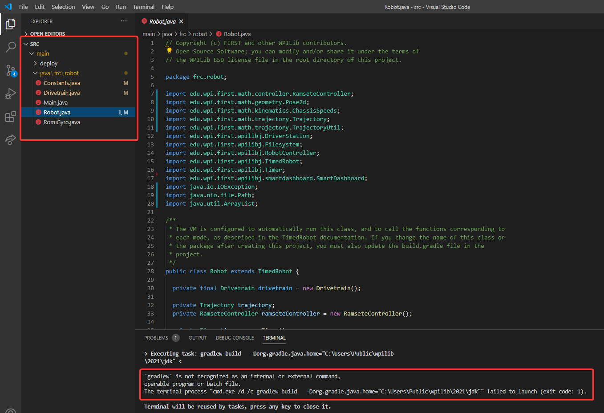

Reading Stacktraces
===================

``An unexpected error has occurred.``

When your robot code hits an unexpected error, you will see this message show up in some console output (Driver Station or RioLog). You'll probably also notice your robot abruptly stop, or possibly never move. These unexpected errors are called *unhandled exceptions*.

When an unhandled exception occurs, it means that your code has one or more bugs which need to be fixed.

This article will explore some of the tools and techniques involved in finding and fixing those bugs.

What's a "Stack Trace"?
-----------------------

The ``unexpected error has occurred`` message is a signal that a *stack trace* has been printed out.

In Java and C++, the :term:`call stack` data structure is used to store information about which function or method is currently being executed.

A *stack trace* prints information about what was on this stack when the unhandled exception occurred. This points you to the lines of code which were running just before the problem happened. While it doesn't always point you to the exact *root cause* of your issue, it's usually the best place to start looking.

What's an "Unhandled Exception"?
--------------------------------

An unrecoverable error is any condition which arises where the processor cannot continue executing code. It almost always implies that, even though the code compiled and started running, it no longer makes sense for execution to continue.

In almost all cases, the root cause of an unhandled exception is code that isn't correctly implemented. It almost never implies that any hardware has malfunctioned.

So How Do I Fix My Issue?
-------------------------

Read the Stack Trace
^^^^^^^^^^^^^^^^^^^^

To start, search above the ``unexpected error has occurred`` for the stack trace.

.. tabs::

   .. group-tab:: Java

      In Java, it should look something like this:

      .. code-block:: text

         Error at frc.robot.Robot.robotInit(Robot.java:24): Unhandled exception: java.lang.NullPointerException
                  at frc.robot.Robot.robotInit(Robot.java:24)
                  at edu.wpi.first.wpilibj.TimedRobot.startCompetition(TimedRobot.java:94)
                  at edu.wpi.first.wpilibj.RobotBase.runRobot(RobotBase.java:335)
                  at edu.wpi.first.wpilibj.RobotBase.lambda$startRobot$0(RobotBase.java:387)
                  at java.base/java.lang.Thread.run(Thread.java:834)

      There's a few important things to pick out of here:

      * There was an ``Error``

      * The error was due to an ``Unhandled exception``

      * The exception was a ``java.lang.NullPointerException``

      * The error happened while running line ``24`` inside of ``Robot.java``

         * ``robotInit`` was the name of the method executing when the error happened.

      * ``robotInit`` is a function in the ``frc.robot.Robot`` package (AKA, your team's code)

      * ``robotInit`` was called from a number of functions from the ``edu.wpi.first.wpilibj`` package (AKA, the WPILib libraries)

      The list of indented lines starting with the word ``at`` represent the state of the *stack* at the time the error happened. Each line represents one method, which was *called by* the method right below it.

      For example, If the error happened deep inside your codebase, you might see more entries on the stack:

      .. code-block:: text

         Error at frc.robot.Robot.buggyMethod(TooManyBugs.java:1138): Unhandled exception: java.lang.NullPointerException
                  at frc.robot.Robot.buggyMethod(TooManyBugs.java:1138)
                  at frc.robot.Robot.barInit(Bar.java:21)
                  at frc.robot.Robot.fooInit(Foo.java:34)
                  at frc.robot.Robot.robotInit(Robot.java:24)
                  at edu.wpi.first.wpilibj.TimedRobot.startCompetition(TimedRobot.java:94)
                  at edu.wpi.first.wpilibj.RobotBase.runRobot(RobotBase.java:335)
                  at edu.wpi.first.wpilibj.RobotBase.lambda$startRobot$0(RobotBase.java:387)
                  at java.base/java.lang.Thread.run(Thread.java:834)

      In this case: ``robotInit`` called ``fooInit``, which in turn called ``barInit``, which in turn called ``buggyMethod``. Then, during the execution of ``buggyMethod``, the ``NullPointerException`` occurred.

   .. group-tab:: C++

      Java will usually produce stack traces automatically when programs run into issues. C++ will require more digging to extract the same info. Usually, a single-step debugger will need to be hooked up to the executing robot program.

      Stack traces can be found in the debugger tab of VS Code:

      .. image:: images/reading-stacktraces/cpp_vscode_dbg_tab.png
         :alt: VS Code Stack Trace location

      Stack traces in C++ will generally look similar to this:

      .. image:: images/reading-stacktraces/cpp_null_stacktrace.png
         :alt: Stack Trace associated with a null-related error

      There's a few important things to pick out of here:

      * The code execution is currently paused.

      * The reason it paused was one thread having an ``exception``

      * The error happened while running line ``20`` inside of ``Robot.cpp``

         * ``RobotInit`` was the name of the method executing when the error happened.

      * ``RobotInit`` is a function in the ``Robot::`` namespace (AKA, your team's code)

      * ``RobotInit`` was called from a number of functions from the ``frc::`` namespace (AKA, the WPILib libraries)

      This "call stack" window represents the state of the *stack* at the time the error happened. Each line represents one method, which was *called by* the method right below it.

      The examples in this page assume you are running code examples in simulation, with the debugger connected and watching for unexpected errors. Similar techniques should apply while running on a real robot.

Perform Code Analysis
^^^^^^^^^^^^^^^^^^^^^

Once you've found the stack trace, and found the lines of code which are triggering the unhandled exception, you can start the process of determining root cause.

Often, just looking in (or near) the problematic location in code will be fruitful. You may notice things you forgot, or lines which don't match an example you're referencing.

.. note:: Developers who have lots of experience working with code will often have more luck looking at code than newer folks. That's ok, don't be discouraged! The experience will come with time.

A key strategy for analyzing code is to ask the following questions:

 * When was the last time the code "worked" (I.e., didn't have this particular error)?
 * What has changed in the code between the last working version, and now?

Frequent testing and careful code changes help make this particular strategy more effective.

Run the Single Step Debugger
^^^^^^^^^^^^^^^^^^^^^^^^^^^^

Sometimes, just looking at code isn't enough to spot the issue. The :ref:`single-step debugger <docs/software/vscode-overview/debugging-robot-program:Debugging a Robot Program>` is a great option in this case - it allows you to inspect the series of events leading up to the unhandled exception.

Search for More Information
^^^^^^^^^^^^^^^^^^^^^^^^^^^

`Google <https://www.google.com/>`_ is a phenomenal resource for understanding the root cause of errors. Searches involving the programming language and the name of the exception will often yield good results on more explanations for what the error means, how it comes about, and potential fixes.

Seeking Outside Help
^^^^^^^^^^^^^^^^^^^^

If all else fails, you can seek out advice and help from others (both in-person and online). When working with folks who aren't familiar with your codebase, it's very important to provide the following information:

 * Access to your source code, (EX: :ref:`on github.com <docs/software/basic-programming/git-getting-started:Git Version Control Introduction>`)
 * The **full text** of the error, including the full stack trace.

Common Examples & Patterns
--------------------------

There are a number of common issues which result in runtime exceptions.

Null Pointers and References
^^^^^^^^^^^^^^^^^^^^^^^^^^^^

Both C++ and Java have the concept of "null" - they use it to indicate something which has not yet been initialized, and does not refer to anything meaningful.

Manipulating a "null" reference will produce a runtime error.

For example, consider the following code:

.. tabs::

   .. group-tab:: Java

      .. code-block:: Java
          :lineno-start: 19

            PWMSparkMax armMotorCtrl;

            @Override
            public void robotInit() {
                armMotorCtrl.setInverted(true);
            }

   .. group-tab:: C++

      .. code-block:: C++
         :lineno-start: 17

         class Robot : public frc::TimedRobot {
            public:
               void RobotInit() override {
                  motorRef->SetInverted(false);
               }

            private:
               frc::PWMVictorSPX m_armMotor{0};
               frc::PWMVictorSPX* motorRef;
         };

When run, you'll see output that looks like this:

.. tabs::

   .. group-tab:: Java

      .. code-block:: text

         ********** Robot program starting **********
         Error at frc.robot.Robot.robotInit(Robot.java:23): Unhandled exception: java.lang.NullPointerException
                 at frc.robot.Robot.robotInit(Robot.java:23)
                 at edu.wpi.first.wpilibj.TimedRobot.startCompetition(TimedRobot.java:107)
                 at edu.wpi.first.wpilibj.RobotBase.runRobot(RobotBase.java:373)
                 at edu.wpi.first.wpilibj.RobotBase.startRobot(RobotBase.java:463)
                 at frc.robot.Main.main(Main.java:23)

         Warning at edu.wpi.first.wpilibj.RobotBase.runRobot(RobotBase.java:388): The robot program quit unexpectedly. This is usually due to a code error.
           The above stacktrace can help determine where the error occurred.
           See https://wpilib.org/stacktrace for more information.
         Error at edu.wpi.first.wpilibj.RobotBase.runRobot(RobotBase.java:395): The startCompetition() method (or methods called by it) should have handled the exception above.

      Reading the stack trace, you can see that the issue happened inside of the ``robotInit()`` function, on line 23, and the exception involved "Null Pointer".

      By going to line 23, you can see there is only one thing which could be null - ``armMotorCtrl``. Looking further up, you can see that the ``armMotorCtrl`` object is declared, but never instantiated.

      Alternatively, you can step through lines of code with the single step debugger, and stop when you hit line 23. Inspecting the ``armMotorCtrl`` object at that point would show that it is null.

   .. group-tab:: C++

      .. code-block:: text

         Exception has occurred: W32/0xc0000005
         Unhandled exception thrown: read access violation.
         this->motorRef was nullptr.

      In Simulation, this will show up in a debugger window that points to line 20 in the above buggy code.

      You can view the full stack trace by clicking the debugger tab in VS Code:

      .. image:: images/reading-stacktraces/cpp_null_stacktrace.png
         :alt: Stack Trace associated with a null-related error

      The error is specific - our member variable ``motorRef`` was declared, but never assigned a value. Therefore, when we attempt to use it to call a method using the ``->`` operator, the exception occurs.

      The exception states its type was ``nullptr``.

Fixing Null Object Issues
~~~~~~~~~~~~~~~~~~~~~~~~~

Generally, you will want to ensure each reference has been initialized before using it. In this case, there is a missing line of code to instantiate the ``armMotorCtrl`` before calling the ``setInverted()`` method.

A functional implementation could look like this:

.. tabs::

   .. group-tab:: Java

      .. code-block:: Java
          :lineno-start: 19

            PWMSparkMax armMotorCtrl;

            @Override
            public void robotInit() {
                armMotorCtrl = new PWMSparkMax(0);
                armMotorCtrl.setInverted(true);
            }

   .. group-tab:: C++

      .. code-block:: C++
         :lineno-start: 17

         class Robot : public frc::TimedRobot {
            public:
               void RobotInit() override {
                  motorRef = &m_armMotor;
                  motorRef->SetInverted(false);
               }

            private:
               frc::PWMVictorSPX m_armMotor{0};
               frc::PWMVictorSPX* motorRef;
         };

Divide by Zero
^^^^^^^^^^^^^^

It is not generally possible to divide an integer by zero, and expect reasonable results. Most processors (including the roboRIO) will raise an Unhandled Exception.

For example, consider the following code:

.. tabs::

   .. group-tab:: Java

      .. code-block:: Java
          :lineno-start: 18

            int armLengthRatio;
            int elbowToWrist_in = 39;
            int shoulderToElbow_in = 0; //TODO

            @Override
            public void robotInit() {
               armLengthRatio = elbowToWrist_in / shoulderToElbow_in;
            }

   .. group-tab:: C++

      .. code-block:: C++
          :lineno-start: 17

            class Robot : public frc::TimedRobot {
               public:
               void RobotInit() override {
                  armLengthRatio = elbowToWrist_in / shoulderToElbow_in;
               }

               private:
                  int armLengthRatio;
                  int elbowToWrist_in = 39;
                  int shoulderToElbow_in = 0; //TODO

            };

When run, you'll see output that looks like this:

.. tabs::

   .. group-tab:: Java

      .. code-block:: text

         ********** Robot program starting **********
         Error at frc.robot.Robot.robotInit(Robot.java:24): Unhandled exception: java.lang.ArithmeticException: / by zero
                 at frc.robot.Robot.robotInit(Robot.java:24)
                 at edu.wpi.first.wpilibj.TimedRobot.startCompetition(TimedRobot.java:107)
                 at edu.wpi.first.wpilibj.RobotBase.runRobot(RobotBase.java:373)
                 at edu.wpi.first.wpilibj.RobotBase.startRobot(RobotBase.java:463)
                 at frc.robot.Main.main(Main.java:23)

         Warning at edu.wpi.first.wpilibj.RobotBase.runRobot(RobotBase.java:388): The robot program quit unexpectedly. This is usually due to a code error.
           The above stacktrace can help determine where the error occurred.
           See https://wpilib.org/stacktrace for more information.
         Error at edu.wpi.first.wpilibj.RobotBase.runRobot(RobotBase.java:395): The startCompetition() method (or methods called by it) should have handled the exception above.

      Looking at the stack trace, we can see a ``java.lang.ArithmeticException: / by zero`` exception has occurred on line 24. If you look at the two variables which are used on the right-hand side of the ``=`` operator, you might notice one of them has been initialized to zero. Looks like someone forgot to update it! Furthermore, the zero-value variable is used in the denominator of a division operation. Hence, the divide by zero error happens.

      Alternatively, by running the single-step debugger and stopping on line 24, you could inspect the value of all variables to discover ``shoulderToElbow_in`` has a value of ``0``.

   .. group-tab:: C++

      .. code-block:: text

         Exception has occurred: W32/0xc0000094
         Unhandled exception at 0x00007FF71B223CD6 in frcUserProgram.exe: 0xC0000094: Integer division by zero.

      In Simulation, this will show up in a debugger window that points to line 20 in the above buggy code.

      You can view the full stack trace by clicking the debugger tab in VS Code:

      .. image:: images/reading-stacktraces/cpp_div_zero_stacktrace.png
         :alt: Stack Trace associated with a divide by zero error

      Looking at the message, we see the error is described as ``Integer division by zero``. If you look at the two variables which are used on the right-hand side of the ``=`` operator on line 20, you might notice one of them has been initialized to zero. Looks like someone forgot to update it! Furthermore,  the zero-value variable is used in the denominator of a division operation. Hence, the divide by zero error happens.

      Note that the error messages might look slightly different on the roboRIO, or on an operating system other than windows.

Fixing Divide By Zero Issues
~~~~~~~~~~~~~~~~~~~~~~~~~~~~

Divide By Zero issues can be fixed in a number of ways. It's important to start by thinking about what a zero in the denominator of your calculation *means*. Is it plausible? Why did it happen in the particular case you saw?

Sometimes, you just need to use a different number other than 0.

A functional implementation could look like this:

.. tabs::

   .. group-tab:: Java

      .. code-block:: Java
          :lineno-start: 18

            int armLengthRatio;
            int elbowToWrist_in = 39;
            int shoulderToElbow_in = 3;

            @Override
            public void robotInit() {

               armLengthRatio = elbowToWrist_in / shoulderToElbow_in;

            }

   .. group-tab:: C++

      .. code-block:: C++
          :lineno-start: 17

            class Robot : public frc::TimedRobot {
               public:
               void RobotInit() override {
                  armLengthRatio = elbowToWrist_in / shoulderToElbow_in;
               }

               private:
                  int armLengthRatio;
                  int elbowToWrist_in = 39;
                  int shoulderToElbow_in = 3

            };

Alternatively, if zero *is* a valid value, adding ``if/else`` statements around the calculation can help you define alternate behavior to avoid making the processor perform a division by zero.

Finally, changing variable types to be ``float`` or ``double`` can help you get around the issue - floating-point numbers have special values like ``NaN`` to represent the results of a divide-by-zero operation. However, you may still have to handle this in code which consumes that calculation's value.

HAL Resource Already Allocated
^^^^^^^^^^^^^^^^^^^^^^^^^^^^^^

A very common FRC-specific error occurs when the code attempts to put two hardware-related entities on the same HAL resource (usually, roboRIO IO pin).

For example, consider the following code:

.. tabs::

   .. group-tab:: Java

      .. code-block:: Java
          :lineno-start: 19

            PWMSparkMax leftFrontMotor;
            PWMSparkMax leftRearMotor;

            @Override
            public void robotInit() {
               leftFrontMotor = new PWMSparkMax(0);
               leftRearMotor = new PWMSparkMax(0);
            }

   .. group-tab:: C++

      .. code-block:: C++
         :lineno-start: 17

         class Robot : public frc::TimedRobot {
            public:
               void RobotInit() override {
                  m_frontLeftMotor.Set(0.5);
                  m_rearLeftMotor.Set(0.25);
               }

            private:
               frc::PWMVictorSPX m_frontLeftMotor{0};
               frc::PWMVictorSPX m_rearLeftMotor{0};

            };

When run, you'll see output that looks like this:

.. tabs::

   .. group-tab:: Java

      .. code-block:: text

         ********** Robot program starting **********
         Error at frc.robot.Robot.robotInit(Robot.java:25): Unhandled exception: edu.wpi.first.hal.util.AllocationException: Code: -1029
         PWM or DIO 0 previously allocated.
         Location of the previous allocation:
                 at frc.robot.Robot.robotInit(Robot.java:24)
                 at edu.wpi.first.wpilibj.TimedRobot.startCompetition(TimedRobot.java:107)
                 at edu.wpi.first.wpilibj.RobotBase.runRobot(RobotBase.java:373)
                 at edu.wpi.first.wpilibj.RobotBase.startRobot(RobotBase.java:463)
                 at frc.robot.Main.main(Main.java:23)

         Location of the current allocation:
                 at edu.wpi.first.hal.PWMJNI.initializePWMPort(Native Method)
                 at edu.wpi.first.wpilibj.PWM.<init>(PWM.java:66)
                 at edu.wpi.first.wpilibj.motorcontrol.PWMMotorController.<init>(PWMMotorController.java:27)
                 at edu.wpi.first.wpilibj.motorcontrol.PWMSparkMax.<init>(PWMSparkMax.java:35)
                 at frc.robot.Robot.robotInit(Robot.java:25)
                 at edu.wpi.first.wpilibj.TimedRobot.startCompetition(TimedRobot.java:107)
                 at edu.wpi.first.wpilibj.RobotBase.runRobot(RobotBase.java:373)
                 at edu.wpi.first.wpilibj.RobotBase.startRobot(RobotBase.java:463)
                 at frc.robot.Main.main(Main.java:23)

         Warning at edu.wpi.first.wpilibj.RobotBase.runRobot(RobotBase.java:388): The robot program quit unexpectedly. This is usually due to a code error.
           The above stacktrace can help determine where the error occurred.
           See https://wpilib.org/stacktrace for more information.
         Error at edu.wpi.first.wpilibj.RobotBase.runRobot(RobotBase.java:395): The startCompetition() method (or methods called by it) should have handled the exception above.

      This stack trace shows that a ``edu.wpi.first.hal.util.AllocationException`` has occurred. It also gives the helpful message: ``PWM or DIO 0 previously allocated.``.

      Looking at our stack trace, we see two stack traces. The first stack trace shows that the first allocation occurred in ``Robot.java:25``. The second stack trace shows that the error *actually* happened deep within WPILib. However, we should start by looking in our own code. Halfway through the stack trace, you can find a reference to the last line of the team's robot code that called into WPILib: ``Robot.java:25``.

      Taking a peek at the code, we see line 24 is where the first motor controller is declared and line 25 is where the second motor controller is declared. We can also note that *both* motor controllers are assigned to PWM output ``0``. This doesn't make logical sense, and isn't physically possible. Therefore, WPILib purposely generates a custom error message and exception to alert the software developers of a non-achievable hardware configuration.

   .. group-tab:: C++

      In C++, you won't specifically see a stacktrace from this issue. Instead, you'll get messages which look like the following:

      .. code-block:: text

         Error at PWM [C::31]: PWM or DIO 0 previously allocated.
         Location of the previous allocation:
                 at frc::PWM::PWM(int, bool) + 0x50 [0xb6f01b68]
                 at frc::PWMMotorController::PWMMotorController(std::basic_string_view<char, std::char_traits<char> >, int) + 0x70 [0xb6ef7d50]
                 at frc::PWMVictorSPX::PWMVictorSPX(int) + 0x3c [0xb6e9af1c]
                 at void frc::impl::RunRobot<Robot>(wpi::priority_mutex&, Robot**) + 0xa8 [0x13718]
                 at int frc::StartRobot<Robot>() + 0x3d4 [0x13c9c]
                 at __libc_start_main + 0x114 [0xb57ec580]

         Location of the current allocation:: Channel 0
                 at  + 0x5fb5c [0xb6e81b5c]
                 at frc::PWM::PWM(int, bool) + 0x334 [0xb6f01e4c]
                 at frc::PWMMotorController::PWMMotorController(std::basic_string_view<char, std::char_traits<char> >, int) + 0x70 [0xb6ef7d50]
                 at frc::PWMVictorSPX::PWMVictorSPX(int) + 0x3c [0xb6e9af1c]
                 at void frc::impl::RunRobot<Robot>(wpi::priority_mutex&, Robot**) + 0xb4 [0x13724]
                 at int frc::StartRobot<Robot>() + 0x3d4 [0x13c9c]
                 at __libc_start_main + 0x114 [0xb57ec580]

         Error at RunRobot: Error: The robot program quit unexpectedly. This is usually due to a code error.
           The above stacktrace can help determine where the error occurred.
           See https://wpilib.org/stacktrace for more information.

                 at void frc::impl::RunRobot<Robot>(wpi::priority_mutex&, Robot**) + 0x1c8 [0x13838]
                 at int frc::StartRobot<Robot>() + 0x3d4 [0x13c9c]
                 at __libc_start_main + 0x114 [0xb57ec580]

         terminate called after throwing an instance of 'frc::RuntimeError'
           what():  PWM or DIO 0 previously allocated.
         Location of the previous allocation:
                 at frc::PWM::PWM(int, bool) + 0x50 [0xb6f01b68]
                 at frc::PWMMotorController::PWMMotorController(std::basic_string_view<char, std::char_traits<char> >, int) + 0x70 [0xb6ef7d50]
                 at frc::PWMVictorSPX::PWMVictorSPX(int) + 0x3c [0xb6e9af1c]
                 at void frc::impl::RunRobot<Robot>(wpi::priority_mutex&, Robot**) + 0xa8 [0x13718]
                 at int frc::StartRobot<Robot>() + 0x3d4 [0x13c9c]
                 at __libc_start_main + 0x114 [0xb57ec580]

         Location of the current allocation:: Channel 0

      The key thing to notice here is the string, ``PWM or DIO 0 previously allocated.``. That string is your primary clue that something in code has incorrectly "doubled up" on pin 0 usage.

      The message example above was generated on a roboRIO. If you are running in simulation, it might look different.

Fixing HAL Resource Already Allocated Issues
~~~~~~~~~~~~~~~~~~~~~~~~~~~~~~~~~~~~~~~~~~~~

``HAL: Resource already allocated`` are some of the most straightforward errors to fix. Just spend a bit of time looking at the electrical wiring on the robot, and compare that to what's in code.

In the example, the left motor controllers are plugged into PWM ports ``0`` and ``1``. Therefore, corrected code would look like this:

.. tabs::

   .. group-tab:: Java

      .. code-block:: Java
          :lineno-start: 19

            PWMSparkMax leftFrontMotor;
            PWMSparkMax leftRearMotor;

            @Override
            public void robotInit() {

               leftFrontMotor = new PWMSparkMax(0);
               leftRearMotor = new PWMSparkMax(1);

            }

   .. group-tab:: C++

      .. code-block:: C++

         :lineno-start: 17

         class Robot : public frc::TimedRobot {
            public:
               void RobotInit() override {
                  m_frontLeftMotor.Set(0.5);
                  m_rearLeftMotor.Set(0.25);
               }

            private:
               frc::PWMVictorSPX m_frontLeftMotor{0};
               frc::PWMVictorSPX m_rearLeftMotor{1};

            };

gradlew is not recognized...
^^^^^^^^^^^^^^^^^^^^^^^^^^^^

``gradlew is not recognized as an internal or external command`` is a common error that can occur when the project or directory that you are currently in does not contain a ``gradlew`` file. This usually occurs when you open the wrong directory.

In the above screenshot, you can see that the left-hand sidebar does not contain many files. At a minimum, VS Code needs a couple of files to properly build and deploy your project.

- ``gradlew``
- ``build.gradle``
- ``gradlew.bat``

If you do not see any one of the above files in your project directory, then you have two possible causes.

- A corrupt or bad project.
- You are in the wrong directory.

Fixing gradlew is not recognized...
~~~~~~~~~~~~~~~~~~~~~~~~~~~~~~~~~~~

``gradlew is not recognized...`` is a fairly easy problem to fix. First identify the problem source:

**Are you in the wrong directory?**
- Verify that the project directory is the correct directory and open this.

**Is your project missing essential files?**
- This issue is more complex to solve. The recommended solution is to :ref:`recreate your project <docs/software/vscode-overview/creating-robot-program:Creating a Robot Program>` and manually copy necessary code in.
