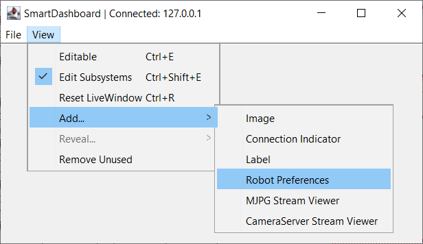
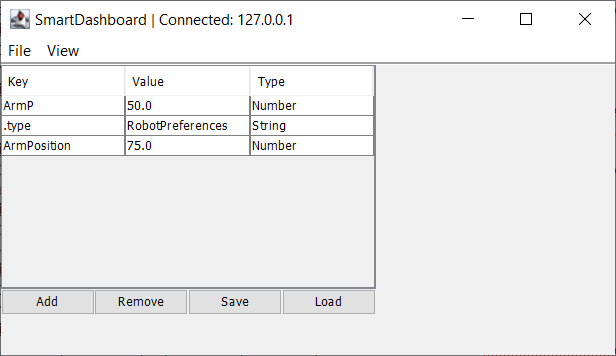
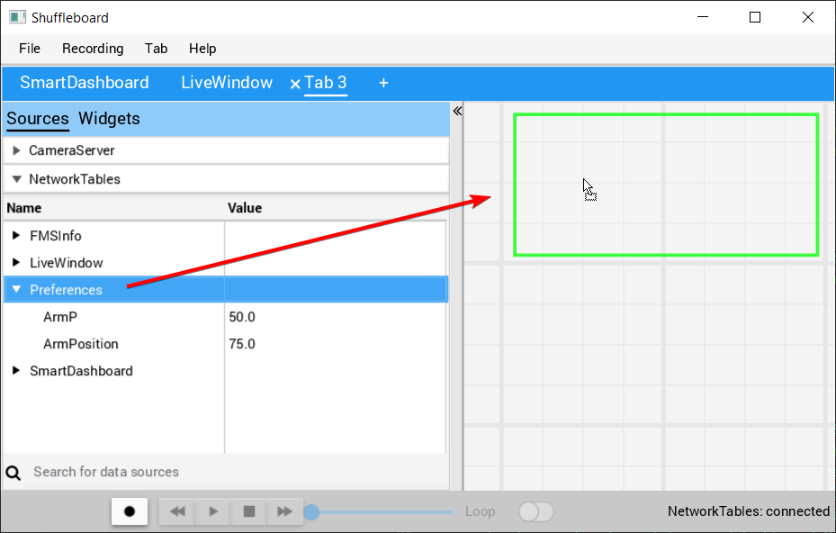
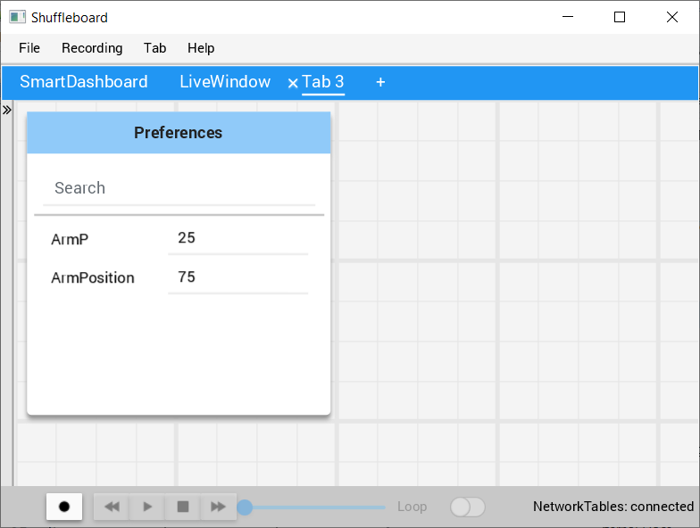

Setting Robot Preferences
=========================

The Robot Preferences (`Java <https://first.wpi.edu/wpilib/allwpilib/docs/development/java/edu/wpi/first/wpilibj/Preferences.html>`__, `C++ <https://first.wpi.edu/wpilib/allwpilib/docs/development/cpp/classfrc_1_1_preferences.html>`__) class is used to store values in the flash memory on the roboRIO. The values might be for remembering preferences on the robot such as calibration settings for potentiometers, PID values, setpoints, etc. that you would like to change without having to rebuild the program. The values can be viewed on SmartDashboard or Shuffleboard and read and written by the robot program.

This example shows how to utilize Preferences to change the setpoint of a PID controller and the P constant. The code examples are adapted from the Arm Simulation example (`Java <https://github.com/wpilibsuite/allwpilib/blob/main/wpilibjExamples/src/main/java/edu/wpi/first/wpilibj/examples/armsimulation/Robot.java>`__, `C++ <https://github.com/wpilibsuite/allwpilib/blob/main/wpilibcExamples/src/main/cpp/examples/ArmSimulation/cpp/Robot.cpp>`__). You can run the Arm Simulation example in the Robot Simulator to see how to use the preference class and interact with it using the dashboards without needing a robot.

Initializing Preferences
------------------------

.. tabs::

   .. group-tab:: Java

      .. rli:: https://raw.githubusercontent.com/wpilibsuite/allwpilib/v2023.1.1-beta-1/wpilibjExamples/src/main/java/edu/wpi/first/wpilibj/examples/armsimulation/Robot.java
         :language: java
         :lines: 35-42, 90-91, 98-105

   .. group-tab:: C++

      .. rli:: https://raw.githubusercontent.com/wpilibsuite/allwpilib/v2023.1.1-beta-1/wpilibcExamples/src/main/cpp/examples/ArmSimulation/cpp/Robot.cpp
         :language: cpp
         :lines: 38-45, 85-86, 92-100

Preferences are stored using a name, the key. It's helpful to store the key in a constant, like ``kArmPositionKey`` and ``kArmPKey`` in the code above to avoid typing it multiple times and avoid typos. We also declare variables, ``kArmKp`` and ``armPositionDeg`` to hold the data retrieved from preferences.

In ``robotInit``, each key is checked to see if it already exists in the Preferences database. The ``containsKey`` method takes one parameter, the key to check if data for that key already exists in the preferences database. If it doesn't exist, a default value is written. The ``setDouble`` method takes two parameters, the key to write and the data to write. There are similar methods for other data types like booleans, ints, and strings.

If using the Command Framework, this type of code could be placed in the constructor of a Subsystem or Command.

Reading Preferences
-------------------

.. tabs::

   .. group-tab:: Java

      .. rli:: https://raw.githubusercontent.com/wpilibsuite/allwpilib/v2023.1.1-beta-1/wpilibjExamples/src/main/java/edu/wpi/first/wpilibj/examples/armsimulation/Robot.java
         :language: java
         :lines: 126-134

   .. group-tab:: C++

      .. rli:: https://raw.githubusercontent.com/wpilibsuite/allwpilib/v2023.1.1-beta-1/wpilibcExamples/src/main/cpp/examples/ArmSimulation/cpp/Robot.cpp
         :language: cpp
         :lines: 122-130

Reading a preference is easy. The ``GetDouble`` method takes two parameters, the key to read, and a default value to use in case the preference doesn't exist. There are similar methods for other data types like booleans, ints, and strings.

Depending on the data that is stored in preferences, you can use it when you read it, such as the proportional constant above. Or you can store it in a variable and use it later, such as the setpoint, which is used in ``telopPeriodic`` below.

.. tabs::

   .. group-tab:: Java

      .. rli:: https://raw.githubusercontent.com/wpilibsuite/allwpilib/v2023.1.1-beta-1/wpilibjExamples/src/main/java/edu/wpi/first/wpilibj/examples/armsimulation/Robot.java
         :language: java
         :lines: 136-147

   .. group-tab:: C++

      .. rli:: https://raw.githubusercontent.com/wpilibsuite/allwpilib/v2023.1.1-beta-1/wpilibcExamples/src/main/cpp/examples/ArmSimulation/cpp/Robot.cpp
         :language: cpp
         :lines: 132-143

Using Preferences in SmartDashboard
-----------------------------------

Displaying Preferences in SmartDashboard
^^^^^^^^^^^^^^^^^^^^^^^^^^^^^^^^^^^^^^^^

In the SmartDashboard, the Preferences display can be added to the display by selecting :guilabel:`View` then :guilabel:`Add...` then :guilabel:`Robot Preferences`. This reveals the contents of the preferences file stored in the roboRIO flash memory.

Editing Preferences in SmartDashboard
^^^^^^^^^^^^^^^^^^^^^^^^^^^^^^^^^^^^^

The values are shown here with the default values from the code. If the values need to be adjusted they can be edited here and saved.

Using Preferences in Shuffleboard
---------------------------------

Displaying Preferences in Shuffleboard
^^^^^^^^^^^^^^^^^^^^^^^^^^^^^^^^^^^^^^

In Shuffleboard, the Preferences display can be added to the display by dragging the preferences field from the sources window. This reveals the contents of the preferences file stored in the roboRIO flash memory.

Editing Preferences in Shuffleboard
^^^^^^^^^^^^^^^^^^^^^^^^^^^^^^^^^^^^^

The values are shown here with the default values from the code. If the values need to be adjusted they can be edited here.
