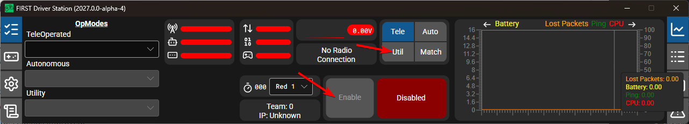

# Using Utility Mode

Utility mode is designed to enable programmers to have a place to put code to verify that all systems on the robot are functioning. In each of the robot program templates there is a place to add test code to the robot.

## Enabling Utility Mode

Utility mode on the robot can be enabled from the Driver Station just like autonomous or teleop. To enable utility mode in the Driver Station, select the :guilabel:`Util` button and enable the robot. The utility mode code will then run.

## Adding Utility mode code to your robot code

When in utility mode, the ``utilityInit`` method is run once, and the ``utilityPeriodic`` method is run once per tick, in addition to ``robotPeriodic``, similar to teleop and autonomous control modes.

Adding utility mode software can be as painless as calling your already written Teleop methods from Utility. Or you can write special code to try out a new feature that is only run in Utility mode, before integrating it into your teleop or autonomous code. You could even write code to move all motors and check all sensors to help the pit crew!

