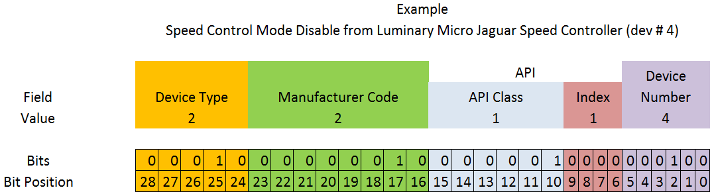

.. include:: <isonum.txt>

# FRC CAN Device Specifications

This document seeks to describe the basic functions of the current FRC\ |reg|
:term:`CAN` system and the requirements for any new CAN devices seeking to work
with the system.

## Addressing

FRC CAN nodes assign arbitration IDs based on a pre-defined scheme that
breaks the ID into 5 components:

#### Device Type

This is a 5-bit value describing the type of device being addressed. A
table of currently assigned device types can be found below. If you wish
to have a new device type assigned from the ``Reserved`` pool, please
submit a request to FIRST.

========================= =====
Device Types
========================= =====
Broadcast Messages        0
Robot Controller          1
Motor Controller          2
Relay Controller          3
Gyro Sensor               4
Accelerometer             5
Distance Sensor           6
Encoder                   7
Power Distribution Module 8
Pneumatics Controller     9
Miscellaneous             10
IO Breakout               11
Servo Controller          12
Color Sensor              13
Reserved                  14-30
Firmware Update           31
========================= =====

#### Manufacturer

This is an 8-bit value indicating the manufacturer of the CAN device.
Currently assigned values can be found in the table below. If you wish
to have a manufacturer ID assigned from the ``Reserved``\ pool, please
submit a request to FIRST.

===================== ==========
Manufacturer
===================== ==========
Broadcast             0
NI                    1
Luminary Micro        2
DEKA                  3
CTR Electronics       4
REV Robotics          5
Grapple               6
MindSensors           7
Team Use              8
Kauai Labs            9
Copperforge           10
Playing With Fusion   11
Studica               12
The Thrifty Bot       13
Redux Robotics        14
AndyMark              15
Vivid Hosting         16
Vertos Robotics       17
SWYFT Robotics        18
Lumyn Labs            19
Brushland Labs        20
Reserved              21-255
===================== ==========

#### API/Message Identifier

The API or Message Identifier is a 10-bit value that identifies a
particular command or message type. These identifiers are unique for
each Manufacturer + Device Type combination (so an API identifier that
may be a "Voltage Set" for a Luminary Micro Motor Controller may be a
"Status Get" for a CTR Electronics Motor Controller or ``Current Get``
for a CTR Power Distribution Module).

The Message identifier is further broken down into 2 sub-fields: the
6-bit API Class and the 4-bit API Index.

#### API Class

The API Class is a 6-bit identifier for an API grouping. Similar
messages are grouped into a single API Class. An example of the API
Classes for a CAN Motor Controller is shown in the table below.

========================= =
API Class
========================= =
Voltage Control Mode      0
Speed Control Mode        1
Voltage Compensation Mode 2
Position Control Mode     3
Current Control Mode      4
Status                    5
Periodic Status           6
Configuration             7
Ack                       8
========================= =

#### API Index

The API Index is a 4-bit identifier for a particular message within an
API Class. An example of the API Index values for a CAN Motor
Controller Speed Control API Class is shown in the table below.

=========================== ==
API Index
=========================== ==
Enable Control              0
Disable Control             1
Set Setpoint                2
P Constant                  3
I Constant                  4
D Constant                  5
Set Reference               6
Trusted Enable              7
Trusted Set No Ack          8
Trusted Set Setpoint No Ack 10
Set Setpoint No Ack         11
=========================== ==

#### Device Number

Device Number is a 6-bit quantity indicating the number of the device of
a particular type. Devices should default to device ID 0 to match other
components of the FRC Control System. Device 0x3F may be reserved for
device specific broadcast messages.



## Protected Frames

FRC CAN Nodes which implement actuator control capability (motor
controllers, relays, pneumatics controllers, etc.) must implement a way
to verify that the robot is enabled and that commands originate with the
main robot controller (i.e. the roboRIO).

## Broadcast Messages

Broadcast messages are messages sent to all nodes by setting the device
type and manufacturer fields to 0. The API Class for broadcast messages
is 0. The currently defined broadcast messages are shown in the table
below:

================= ==
Description
================= ==
Disable	          0
System Halt	      1
System Reset      2
Device Assign     3
Device Query	  4
Heartbeat         5
Sync              6
Update            7
Firmware Version  8
Enumerate         9
System Resume     10
================= ==

Devices should disable immediately when receiving the Disable message
(arbID 0).  Implementation of other broadcast messages is optional.

## Requirements for FRC CAN Nodes
For CAN Nodes to be accepted for use in the FRC System, they must:

-  Communicate using Arbitration IDs which match the prescribed FRC
   format:

   -  A valid, issued CAN Device Type (per Table 1 - CAN Device Types)
   -  A valid, issued Manufacturer ID (per Table 2 - CAN Manufacturer Codes)
   -  API Class(es) and Index(s) assigned and documented by the device manufacturer
   -  A user selectable device number if multiple units of the device type are intended to co-exist on the same network.

-  Support the minimum Broadcast message requirements as detailed in the Broadcast Messages section.
-  If controlling actuators, utilize a scheme to assure that the robot is issuing commands, is enabled, and is still present.
-  Provide software library support for C++, and Java or arrange with *FIRST*\ |reg| or FIRST's Control System Partners to provide such interfaces.

## Universal Heartbeat

The roboRIO provides a universal CAN heartbeat that any device on the bus can listen and react to. This heartbeat is sent every 20 ms. The heartbeat has a full CAN ID of ``0x01011840`` (which is the NI Manufacturer ID, RobotController type, Device ID 0 and API ID ``0x061``). It is an 8 byte CAN packet with the following bitfield layout.

+-----------------------+------+--------------+
| Description           | Byte | Width (bits) |
+=======================+======+==============+
| Match time (seconds)  | 8    | 8            |
+-----------------------+------+--------------+
| Match number          | 6-7  | 10           |
+-----------------------+------+--------------+
| Replay number         | 6    | 6            |
+-----------------------+------+--------------+
| Red alliance          | 5    | 1            |
+-----------------------+------+--------------+
| Enabled               | 5    | 1            |
+-----------------------+------+--------------+
| Autonomous mode       | 5    | 1            |
+-----------------------+------+--------------+
| Test mode             | 5    | 1            |
+-----------------------+------+--------------+
| System watchdog       | 5    | 1            |
+-----------------------+------+--------------+
| Tournament type       | 5    | 3            |
+-----------------------+------+--------------+
| Time of day (year)    | 4    | 6            |
+-----------------------+------+--------------+
| Time of day (month)   | 3-4  | 4            |
+-----------------------+------+--------------+
| Time of day (day)     | 3    | 5            |
+-----------------------+------+--------------+
| Time of day (seconds) | 2-3  | 6            |
+-----------------------+------+--------------+
| Time of day (minutes) | 1-2  | 6            |
+-----------------------+------+--------------+
| Time of day (hours)   | 1    | 5            |
+-----------------------+------+--------------+

```c++
struct [[gnu::packed]] RobotState {
  uint64_t matchTimeSeconds : 8;
  uint64_t matchNumber : 10;
  uint64_t replayNumber : 6;
  uint64_t redAlliance : 1;
  uint64_t enabled : 1;
  uint64_t autonomous : 1;
  uint64_t testMode : 1;
  uint64_t systemWatchdog : 1;
  uint64_t tournamentType : 3;
  uint64_t timeOfDay_yr : 6;
  uint64_t timeOfDay_month : 4;
  uint64_t timeOfDay_day : 5;
  uint64_t timeOfDay_sec : 6;
  uint64_t timeOfDay_min : 6;
  uint64_t timeOfDay_hr : 5;
};
```

If the ``System watchdog`` flag is set, motor controllers are enabled. If 100 ms has passed since this packet was received, the robot program can be considered hung, and devices should act as if the robot has been disabled.

Note that all fields except ``Enabled``, ``Autonomous mode``, ``Test mode``, and ``System watchdog`` will contain invalid values until an arbitrary time after the Driver Station connects.
