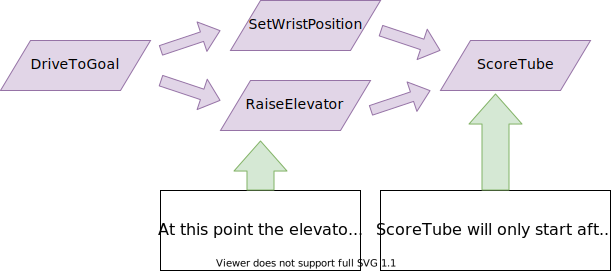

Command Groups
==============

Individual commands are capable of accomplishing a large variety of robot tasks, but the simple three-state format can quickly become cumbersome when more advanced functionality requiring extended sequences of robot tasks or coordination of multiple robot subsystems is required. In order to accomplish this, users are encouraged to use the powerful command group functionality included in the command-based library.

As the name suggests, a command group is a :term:`composition` of multiple commands. Command groups *compose* multiple commands into a *composite* command. This allows code to be kept much cleaner and simpler, as the individual *component* commands may be written independently of the code that combines them, greatly reducing the amount of complexity at any given step of the process.

Most importantly, however, command groups *are themselves commands* - they implement the ``Command`` interface. This allows command groups to be grouped as a :term:`recursive composition` - that is, a command group may contain *other command groups* as components.

Types of Command Groups
-----------------------

.. note:: In the C++ command-based library, command groups *own* their component commands.  This means that commands passed to command groups will be either moved or copied depending on whether they are rvalues or lvalues (`rvalue/lvalue explanation <http://thbecker.net/articles/rvalue_references/section_01.html>`__).  Due to certain technical concerns, command groups themselves are not copyable, and so recursive composition *must* use move semantics.

The command-based library supports four basic types of command groups: ``SequentialCommandGroup``, ``ParallelCommandGroup``, ``ParallelRaceGroup``, and ``ParallelDeadlineGroup``. Each of these command groups combines multiple commands into a composite command - however, they do so in different ways:

SequentialCommandGroup
^^^^^^^^^^^^^^^^^^^^^^

A ``SequentialCommandGroup`` (`Java <https://first.wpi.edu/wpilib/allwpilib/docs/beta/java/edu/wpi/first/wpilibj2/command/SequentialCommandGroup.html>`__, `C++ <https://first.wpi.edu/wpilib/allwpilib/docs/beta/cpp/classfrc2_1_1_sequential_command_group.html>`__) runs a list of commands in sequence - the first command will be executed, then the second, then the third, and so on until the list finishes. The sequential group finishes after the last command in the sequence finishes. It is therefore usually important to ensure that each command in the sequence does actually finish (if a given command does not finish, the next command will never start!).

ParallelCommandGroup
^^^^^^^^^^^^^^^^^^^^

A ``ParallelCommandGroup`` (`Java <https://first.wpi.edu/wpilib/allwpilib/docs/beta/java/edu/wpi/first/wpilibj2/command/ParallelCommandGroup.html>`__, `C++ <https://first.wpi.edu/wpilib/allwpilib/docs/beta/cpp/classfrc2_1_1_parallel_command_group.html>`__) runs a set of commands concurrently - all commands will execute at the same time. The parallel group will end when all commands have finished.

ParallelRaceGroup
^^^^^^^^^^^^^^^^^

A ``ParallelRaceGroup`` (`Java <https://first.wpi.edu/wpilib/allwpilib/docs/beta/java/edu/wpi/first/wpilibj2/command/ParallelRaceGroup.html>`__, `C++ <https://first.wpi.edu/wpilib/allwpilib/docs/beta/cpp/classfrc2_1_1_parallel_race_group.html>`__) is much like a ``ParallelCommandgroup``, in that it runs a set of commands concurrently. However, the race group ends as soon as any command in the group ends - all other commands are interrupted at that point.

ParallelDeadlineGroup
^^^^^^^^^^^^^^^^^^^^^

A ``ParallelDeadlineGroup`` (`Java <https://first.wpi.edu/wpilib/allwpilib/docs/beta/java/edu/wpi/first/wpilibj2/command/ParallelDeadlineGroup.html>`__, `C++ <https://first.wpi.edu/wpilib/allwpilib/docs/beta/cpp/classfrc2_1_1_parallel_deadline_group.html>`__) also runs a set of commands concurrently. However, the deadline group ends when a *specific* command (the "deadline") ends, interrupting all other commands in the group that are still running at that point.

Creating Command Groups
-----------------------

Users have several options for creating command groups. One way - similar to the previous implementation of the command-based library - is to subclass one of the command group classes. Consider the following from the Hatch Bot example project (`Java <https://github.com/wpilibsuite/allwpilib/tree/main/wpilibjExamples/src/main/java/edu/wpi/first/wpilibj/examples/hatchbottraditional>`__, `C++ <https://github.com/wpilibsuite/allwpilib/tree/main/wpilibcExamples/src/main/cpp/examples/HatchbotTraditional>`__):

.. tabs::

  .. group-tab:: Java

    .. remoteliteralinclude:: https://raw.githubusercontent.com/wpilibsuite/allwpilib/v2023.1.1-beta-1/wpilibjExamples/src/main/java/edu/wpi/first/wpilibj/examples/hatchbottraditional/commands/ComplexAuto.java
      :language: java
      :lines: 5-
      :linenos:
      :lineno-start: 5

  .. group-tab:: C++ (Header)

    .. remoteliteralinclude:: https://raw.githubusercontent.com/wpilibsuite/allwpilib/v2023.1.1-beta-1/wpilibcExamples/src/main/cpp/examples/HatchbotTraditional/include/commands/ComplexAuto.h
      :language: c++
      :lines: 5-
      :linenos:
      :lineno-start: 5

  .. group-tab:: C++ (Source)

    .. remoteliteralinclude:: https://raw.githubusercontent.com/wpilibsuite/allwpilib/v2023.1.1-beta-1/wpilibcExamples/src/main/cpp/examples/HatchbotTraditional/cpp/commands/ComplexAuto.cpp
      :language: c++
      :lines: 5-
      :linenos:
      :lineno-start: 5

The ``addCommands()`` method adds commands to the group, and is present in all four types of command group.

Inline Command Groups
---------------------

.. note:: Due to the verbosity of Java's ``new`` syntax, the Java ``CommandGroupBase`` object offers a factory method for each of the four command-group types: `sequence <https://first.wpi.edu/wpilib/allwpilib/docs/beta/java/edu/wpi/first/wpilibj2/command/CommandGroupBase.html#sequence(edu.wpi.first.wpilibj2.command.Command...)>`__, `parallel <https://first.wpi.edu/wpilib/allwpilib/docs/beta/java/edu/wpi/first/wpilibj2/command/CommandGroupBase.html#parallel(edu.wpi.first.wpilibj2.command.Command...)>`__, `race <https://first.wpi.edu/wpilib/allwpilib/docs/beta/java/edu/wpi/first/wpilibj2/command/CommandGroupBase.html#race(edu.wpi.first.wpilibj2.command.Command...)>`__, and `deadline <https://first.wpi.edu/wpilib/allwpilib/docs/beta/java/edu/wpi/first/wpilibj2/command/CommandGroupBase.html#deadline(edu.wpi.first.wpilibj2.command.Command,edu.wpi.first.wpilibj2.command.Command...)>`__.

Command groups can be used without subclassing at all: one can simply pass in the desired commands through the constructor:

.. tabs::

   .. code-tab:: java

      new SequentialCommandGroup(new FooCommand(), new BarCommand());

   .. code-tab:: c++

      frc2::SequentialCommandGroup{FooCommand(), BarCommand()};

This is called an :ref:`inline <docs/software/commandbased/convenience-features:Inline Command Definitions>` command definition, and is very handy for circumstances where command groups are not likely to be reused, and writing an entire class for them would be wasteful.

Recursive Composition of Command Groups
---------------------------------------

As mentioned earlier, command groups are recursively composable - since command groups are themselves commands, they may be included as components of other command groups. This is an extremely powerful feature of command groups, and allows users to build very complex robot actions from simple pieces. For example, consider the following code:

.. tabs::

   .. code-tab:: java

      new SequentialCommandGroup(
         new DriveToGoal(m_drive),
         new ParallelCommandGroup(
            new RaiseElevator(m_elevator),
            new SetWristPosition(m_wrist)),
         new ScoreTube(m_wrist));

   .. code-tab:: c++

      #include <frc2/command/SequentialCommandGroup.h>
      #include <frc2/command/ParallelCommandGroup.h>

      ...

      frc2::SequentialCommandGroup{
         DriveToGoal(&m_drive),
         frc2::ParallelCommandGroup{
            RaiseElevator(&m_elevator),
            SetWristPosition(&m_wrist)},
         ScoreTube(&m_wrist)};

This creates a sequential command group that *contains* a parallel command group. The resulting control flow looks something like this:

Notice how the recursive composition allows the embedding of a parallel control structure within a sequential one. Notice also that this entire, more-complex structure, could be again embedded in another structure. Composition is an extremely powerful tool, and one that users should be sure to use extensively.

Command Groups and Requirements
-------------------------------

As command groups are commands, they also must declare their requirements. However, users are not required to specify requirements manually for command groups - requirements are automatically inferred from the commands included. As a rule, *command groups include the union of all of the subsystems required by their component commands.* Thus, the ``ComplexAuto`` shown previously will require both the drive subsystem and the hatch subsystem of the robot.

Additionally, requirements are enforced within all three types of parallel groups - a parallel group may *not* contain multiple commands that require the same subsystem.

Some advanced users may find this overly-restrictive - for said users, the library offers a ``ScheduleCommand`` class (`Java <https://first.wpi.edu/wpilib/allwpilib/docs/beta/java/edu/wpi/first/wpilibj2/command/ScheduleCommand.html>`__, `C++ <https://first.wpi.edu/wpilib/allwpilib/docs/beta/cpp/classfrc2_1_1_schedule_command.html>`__) that can be used to independently "branch off" from command groups to provide finer granularity in requirement management.

Restrictions on Command Group Components
----------------------------------------

.. note:: The following is only relevant for the Java command-based library; the C++ library's ownership model naturally prevents users from making this category of mistake.

Since command group components are run through their encapsulating command groups, errors could occur if those same command instances were independently scheduled at the same time as the group - the command would be being run from multiple places at once, and thus could end up with inconsistent internal state, causing unexpected and hard-to-diagnose behavior.

For this reason, command instances that have been added to a command group cannot be independently scheduled or added to a second command group. Attempting to do so will throw an exception and crash the user program.

Advanced users who wish to re-use a command instance and are *certain* that it is safe to do so may bypass this restriction with the ``clearGroupedCommand()`` `method <https://first.wpi.edu/wpilib/allwpilib/docs/beta/java/edu/wpi/first/wpilibj2/command/CommandGroupBase.html#clearGroupedCommand(edu.wpi.first.wpilibj2.command.Command)>`__ in the ``CommandGroupBase`` class.
