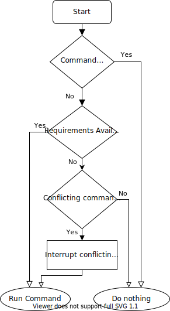
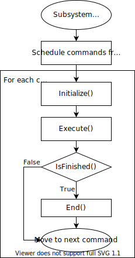

The Command Scheduler
=====================

The ``CommandScheduler`` (`Java <https://first.wpi.edu/wpilib/allwpilib/docs/beta/java/edu/wpi/first/wpilibj2/command/CommandScheduler.html>`__, `C++ <https://first.wpi.edu/wpilib/allwpilib/docs/beta/cpp/classfrc2_1_1_command_scheduler.html>`__) is the class responsible for actually running commands.  Each iteration (ordinarily once per 20ms), the scheduler polls all registered buttons, schedules commands for execution accordingly, runs the command bodies of all scheduled commands, and ends those commands that have finished or are interrupted.

The ``CommandScheduler`` also runs the ``periodic()`` method of each registered ``Subsystem``.

Using the Command Scheduler
---------------------------

The ``CommandScheduler`` is a *singleton*, meaning that it is a globally-accessible class with only one instance.  Accordingly, in order to access the scheduler, users must call the ``CommandScheduler.getInstance()`` command.

For the most part, users do not have to call scheduler methods directly - almost all important scheduler methods have convenience wrappers elsewhere (e.g. in the ``Command`` and ``Subsystem`` interfaces).

However, there is one exception: users *must* call ``CommandScheduler.getInstance().run()`` from the ``robotPeriodic()`` method of their ``Robot`` class.  If this is not done, the scheduler will never run, and the command framework will not work.  The provided command-based project template has this call already included.

The ``schedule()`` Method
-------------------------

To schedule a command, users call the ``schedule()`` method (`Java <https://first.wpi.edu/wpilib/allwpilib/docs/beta/java/edu/wpi/first/wpilibj2/command/CommandScheduler.html#schedule(boolean,edu.wpi.first.wpilibj2.command.Command...)>`__, `C++ <https://first.wpi.edu/wpilib/allwpilib/docs/beta/cpp/classfrc2_1_1_command_scheduler.html#a26c120054ec626806d740f2c42d9dc4f>`__.  This method takes a command (and, optionally, a specification as to whether that command is interruptible), and attempts to add it to list of currently-running commands, pending whether it is already running or whether its requirements are available.  If it is added, its ``initialize()`` method is called.

The Scheduler Run Sequence
--------------------------

.. note:: The ``initialize()`` method of each ``Command`` is called when the command is scheduled, which is not necessarily when the scheduler runs (unless that command is bound to a button).

What does a single iteration of the scheduler's ``run()`` method (`Java <https://first.wpi.edu/wpilib/allwpilib/docs/beta/java/edu/wpi/first/wpilibj2/command/CommandScheduler.html#run()>`__, `C++ <https://first.wpi.edu/wpilib/allwpilib/docs/beta/cpp/classfrc2_1_1_command_scheduler.html#aa5000fa52e320da7ba72c196f34aa0f5>`__) actually do?  The following section walks through the logic of a scheduler iteration.

Step 1: Run Subsystem Periodic Methods
^^^^^^^^^^^^^^^^^^^^^^^^^^^^^^^^^^^^^^

First, the scheduler runs the ``periodic()`` method of each registered ``Subsystem``.

Step 2: Poll Command Scheduling Triggers
^^^^^^^^^^^^^^^^^^^^^^^^^^^^^^^^^^^^^^^^

.. note:: For more information on how trigger bindings work, see :doc:`binding-commands-to-triggers`

Secondly, the scheduler polls the state of all registered triggers to see if any new commands that have been bound to those triggers should be scheduled.  If the conditions for scheduling a bound command are met, the command is scheduled and its ``Initialize()`` method is run.

Step 3: Run/Finish Scheduled Commands
^^^^^^^^^^^^^^^^^^^^^^^^^^^^^^^^^^^^^

Thirdly, the scheduler calls the ``execute()`` method of each currently-scheduled command, and then checks whether the command has finished by calling the ``isFinished()`` method.  If the command has finished, the ``end()`` method is also called, and the command is de-scheduled and its required subsystems are freed.

Note that this sequence of calls is done in order for each command - thus, one command may have its ``end()`` method called before another has its ``execute()`` method called.  Commands are handled in the order they were scheduled.

Step 4: Schedule Default Commands
^^^^^^^^^^^^^^^^^^^^^^^^^^^^^^^^^

Finally, any registered ``Subsystem`` has its default command scheduled (if it has one).  Note that the ``initialize()`` method of the default command will be called at this time.

Disabling the Scheduler
-----------------------

The scheduler can be disabled by calling ``CommandScheduler.getInstance().disable()``.  When disabled, the scheduler's ``schedule()`` and ``run()`` commands will not do anything.

The scheduler may be re-enabled by calling ``CommandScheduler.getInstance().enable()``.

Command Event Methods
---------------------

Occasionally, it is desirable to have the scheduler execute a custom action whenever a certain command event (initialization, execution, or ending) occurs.  This can be done with the following methods:

onCommandInitialize
^^^^^^^^^^^^^^^^^^^

The ``onCommandInitialize`` method (`Java <https://first.wpi.edu/wpilib/allwpilib/docs/beta/java/edu/wpi/first/wpilibj2/command/CommandScheduler.html#onCommandInitialize(java.util.function.Consumer)>`__, `C++ <https://first.wpi.edu/wpilib/allwpilib/docs/beta/cpp/classfrc2_1_1_command_scheduler.html#a5f983f0e45b0500c96eebe52780324d4>`__) runs a specified action whenever a command is initialized.

onCommandExecute
^^^^^^^^^^^^^^^^

The ``onCommandExecute`` method (`Java <https://first.wpi.edu/wpilib/allwpilib/docs/beta/java/edu/wpi/first/wpilibj2/command/CommandScheduler.html#onCommandExecute(java.util.function.Consumer)>`__, `C++ <https://first.wpi.edu/wpilib/allwpilib/docs/beta/cpp/classfrc2_1_1_command_scheduler.html#a58c538f4b8dd95e266e4a99167aa7f99>`__) runs a specified action whenever a command is executed.

onCommandFinish
^^^^^^^^^^^^^^^

The ``onCommandFinish`` method (`Java <https://first.wpi.edu/wpilib/allwpilib/docs/beta/java/edu/wpi/first/wpilibj2/command/CommandScheduler.html#onCommandFinish(java.util.function.Consumer)>`__, `C++ <https://first.wpi.edu/wpilib/allwpilib/docs/beta/cpp/classfrc2_1_1_command_scheduler.html#a068e61446afe2341cc0651f0dfd2a55f>`__) runs a specified action whenever a command finishes normally (i.e. the ``isFinished()`` method returned true).

onCommandInterrupt
^^^^^^^^^^^^^^^^^^

The ``onCommandInterrupt`` method (`Java <https://first.wpi.edu/wpilib/allwpilib/docs/beta/java/edu/wpi/first/wpilibj2/command/CommandScheduler.html#onCommandInterrupt(java.util.function.Consumer)>`__, `C++ <https://first.wpi.edu/wpilib/allwpilib/docs/beta/cpp/classfrc2_1_1_command_scheduler.html#ab5ba99a542aa778a76726d7c68461bf0>`__) runs a specified action whenever a command is interrupted (i.e. by being explicitly canceled or by another command that shares one of its requirements).

A typical use-case for these methods is adding markers in an event log whenever a command scheduling event takes place, as demonstrated in the SchedulerEventLogging example project (`Java <https://github.com/wpilibsuite/allwpilib/tree/main/wpilibjExamples/src/main/java/edu/wpi/first/wpilibj/examples/schedulereventlogging>`__, `C++ <https://github.com/wpilibsuite/allwpilib/tree/main/wpilibcExamples/src/main/cpp/examples/SchedulerEventLogging>`__):

.. tabs::

  .. group-tab:: Java

    .. remoteliteralinclude:: https://raw.githubusercontent.com/wpilibsuite/allwpilib/v2023.1.1-beta-1/wpilibjExamples/src/main/java/edu/wpi/first/wpilibj/examples/schedulereventlogging/RobotContainer.java
      :language: java
      :lines: 44-59
      :linenos:
      :lineno-start: 44

  .. group-tab:: C++ (Source)

    .. remoteliteralinclude:: https://raw.githubusercontent.com/wpilibsuite/allwpilib/v2023.1.1-beta-1/wpilibcExamples/src/main/cpp/examples/SchedulerEventLogging/cpp/RobotContainer.cpp
      :language: c++
      :lines: 19-38
      :linenos:
      :lineno-start: 19
