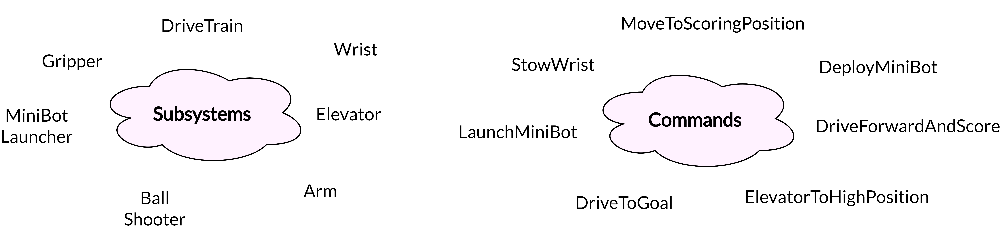
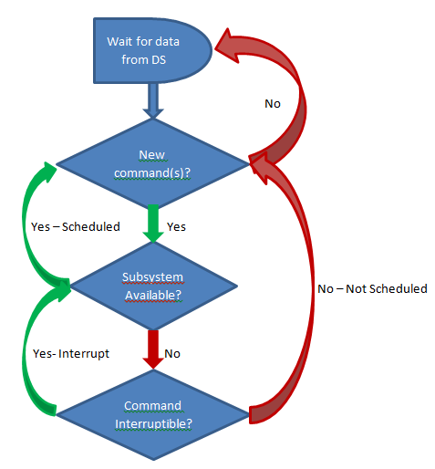

.. _what-is-command-based:

What is “command-based” programming?
====================================

WPILib supports a robot programming methodology called “command-based”
programming. In general, “command-based” can refer both the general
programming paradigm, and to the set of WPILib library resources
included to facilitate it.

“Command-based” programming is an example of what is known as a `design
pattern. <https://en.wikipedia.org/wiki/Design_pattern>`__ It is a
general way of organizing one’s robot code that is well-suited to a
particular problem-space. It is not the only way to write a robot
program, but it is a very effective one; command-based robot code tend
to be clean, extensible, and (with some tricks) easy to re-use from year
to year.

The command-based paradigm is also an example of what is known as
`declarative <https://en.wikipedia.org/wiki/Declarative_programming>`__
programming. In declarative programming, the emphasis is placed on
*what* the program ought to do, rather than *how* the program ought to
do it. Thus, the command-based libraries allow users to define desired
robot behaviors while minimizing the amount of iteration-by-iteration
robot logic that they must write. For example, in a command-based
program, a user can specify that “the robot should perform an action
when a button is pressed”:

.. code-block:: java

   aButton.whenPressed(intake::run);

In contrast, in an ordinary
`imperative <https://en.wikipedia.org/wiki/Imperative_programming>`__
program, the user would need to check the button state every iteration,
and perform the appropriate action based on the state of the button.

.. code-block:: java

   if(aButton.get()) {
     if(!pressed) {
       intake.run();
       pressed = true;
     } else {
       pressed = false;
     }
   }

Subsystems and commands
-----------------------

   image of subsystems and commands

The command-based pattern is based around two core abstractions:
**commands**, and **subsystems.**

**Subsystems** are the basic unit of robot organization in the
design-based paradigm. Subsystems
`encapsulate <https://en.wikipedia.org/wiki/Encapsulation_(computer_programming)>`__
lower-level robot hardware (such as motor controllers, sensors, and/or
pneumatic actuators), and define the interfaces through which that
hardware can be accessed by the rest of the robot code. Subsystems allow
users to “hide” the internal complexity of their actual hardware from
the rest of their code - this both simplifies the rest of the robot
code, and allows changes to the internal details of a subsystem without
also changing the rest of the robot code. Subsystems implement the
``Subsystem`` interface.

**Commands** define high-level robot actions or behaviors that utilize
the methods defined by the subsystems. A command is a simple `state
machine <https://en.wikipedia.org/wiki/Finite-state_machine>`__ that is
either initializing, executing, ending, or idle. Users write code
specifying which action should be taken in each state. Simple commands
can be composed into “command groups” to accomplish more-complicated
tasks. Commands, including command groups, implement the ``Command``
interface.

How commands are run
--------------------

Commands are run by the ``CommandScheduler``, a singleton class that is
at the core of the command-based library. The ``CommandScheduler`` is in
charge of polling buttons for new commands to schedule, checking the
resources required by those commands to avoid conflicts, executing
currently-scheduled commands, and removing commands that have finished
or been interrupted. The scheduler’s ``run()`` method may be called from
any place in the user’s code; it is generally recommended to call it
from the ``robotPeriodic()`` method of the ``Robot`` class, which is run
at a default frequency of 50Hz (once every 20ms).

Multiple commands can run concurrently, as long as they do not require
the same resources on the robot. Resource management is handled on a
per-subsystem basis: commands may specify which subsystems they interact
with, and the scheduler will never schedule more than one command
requiring a given subsystem at a time. this ensures that, for example,
users will not end up with two different pieces of code attempting to
set the same motor controller to different output values. If a new
command is scheduled that requires a subsystem that is already in use,
it will either interrupt the currently-running command that requires
that subsystem (if the command has been scheduled as interruptible), or
else it will not be scheduled.

Subsystems also can be associated with “default commands” that will be
automatically scheduled when no other command is currently using the
subsystem. This is useful for continuous “background” actions such as
controlling the robot drive, or keeping an arm held at a setpoint.

TODO: replace this graphic with one that isn’t wrong

   scheduler control flow diagram

When a command is scheduled, its ``initialize()`` method is called once.
Its ``execute()`` method is then called once per call to
``CommandScheduler.getInstance().run()``. A command is un-scheduled and
has its ``end(boolean interrupted)`` method called when either its
``isFinished()`` method returns true, or else it is interrupted (either
by another command with which it shares a required subsystem, or by
being canceled).

Command groups
--------------

It is often desirable to build complex commands from simple pieces. This
is achievable by
`composing <https://en.wikipedia.org/wiki/Object_composition>`__
commands into “command groups.” A command group is a command that
contains multiple commands within it, which run either in parallel or in
sequence. The command-based library provides several types of command
groups for teams to use, and users are encouraged to write their own, if
desired. As command groups themselves implement the ``Command``
interface, they are `recursively
composeable <https://en.wikipedia.org/wiki/Object_composition#Recursive_composition>`__
- one can include command groups *within* other command groups. This
provides an extremely powerful way of building complex robot actions
with a simple library.