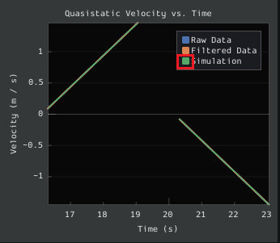
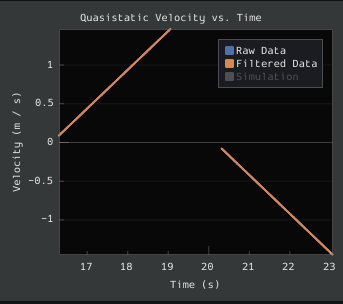
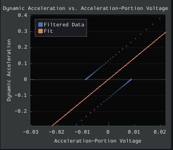
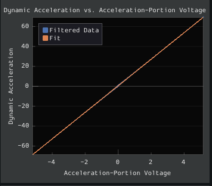
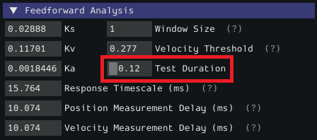
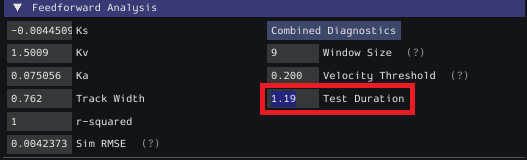

Additional Utilities and Tools
==============================

This page mainly covers useful information about additional functionality that this tool provides.

ImGui Tips
----------

The following are essentially handy features that come with the ImGui framework that SysId uses:

Showing and Hiding Plot Data
^^^^^^^^^^^^^^^^^^^^^^^^^^^^
To add or remove certain data from the plots, click on the color of the data that you would like to hide or remove.

For example, if we want to hide sim data, we can click the green color box.

Auto Sizing Plots
^^^^^^^^^^^^^^^^^
If you zoom in to plots and want to revert back to the normally sized plots, just double click on the plot and it will automatically resize it.

Here is a plot that is zoomed in:

After double clicking, it is automatically resized:

Setting Slider Values
^^^^^^^^^^^^^^^^^^^^^
To set the value of a slider as a number rather than sliding the widget, you can CTRL + Click the slider and it will allow you to input a number.

Here is a regular slider:

Here is the input after double clicking the slider:

