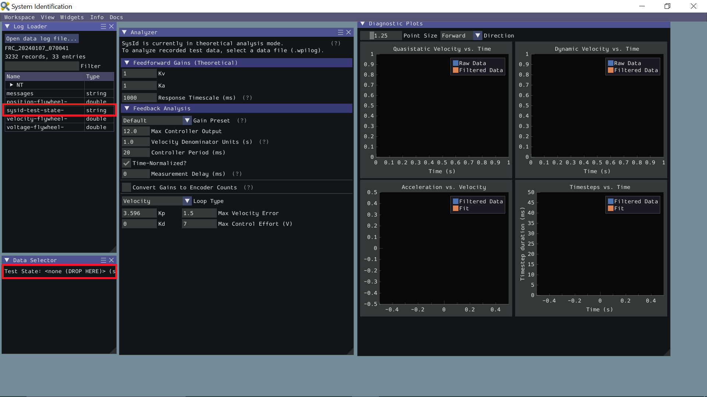
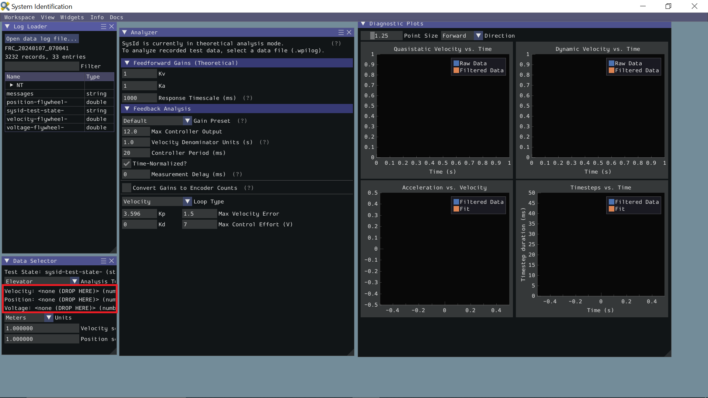
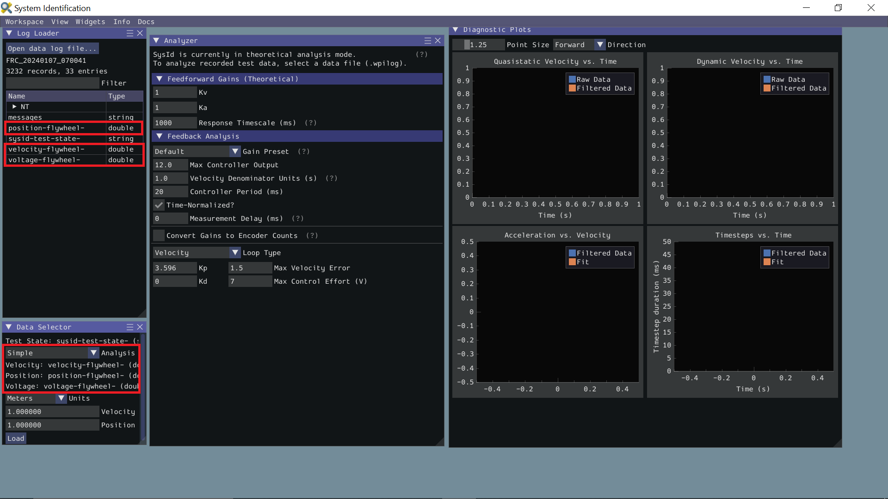
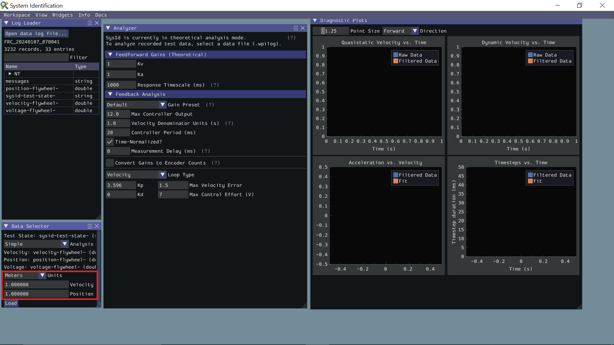

Loading Data
============

After downloading the WPILog containing the tests from the roboRIO, go to the ``Log Loader`` pane in SysId and click ``Open data log file...``.

After the file loads, look for a ``string`` type entry with a name containing "state". Drag this entry into the Data Selector pane's Test State slot.

.. note:: SysIdRoutine will name the entry "sysid-test-state-mechanism", where "mechanism" is the name passed to the ``Mechanism`` contructor or the subsystem name.

Now the ``Data Selector`` pane will present ``Position``, ``Velocity``, and ``Voltage`` slots. In the ``Log Loader`` pane, find entries starting with each of those terms and containing the motor name you set in the ``log`` callback, and drag those into the ``Data Selector`` slots.

Ideally, the correct units for the position and velocity entries would have been set in the code before running the tests. If this was not the case, use the Units dropdown in the ``Data Selector`` pane to correct it. Additionally, if you did not account for a gear ratio or some other factor that scales the recorded values up or down uniformly, you can compensate for that by setting position and velocity scaling factors in the provided boxes.

Ensure the correct analysis type has been selected, then click the ``Load`` button and move on to checking the fit diagnostics  in the ``Diagnostics`` pane.
