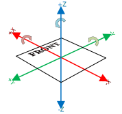
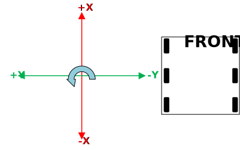
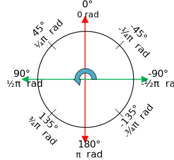
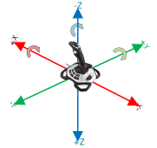

Coordinate system
=================

Coordinate systems are used in FRC programming in several places. A few of the common places are: robot movement, joystick input, pose estimation, AprilTags, and path planning.

It is important to understand the basics of the coordinate system used throughout WPILib and other common tools for programming an FRC robot, such as PathPlanner. Many teams intuitively  think of a coordinate system that is different from what is used in WPILib, and this leads to problems that need to be tracked down throughout the season. It is worthwhile to take a few minutes to understand the coordinate system, and come back here as a reference when programming. It's not very difficult to get robot movement with a joystick working without getting the coordinate system right, but it will be much more difficult to build on code using a different coordinate system to add pose estimation with AprilTags and path planning for autonomous.

WPILib coordinate system
------------------------

In most cases, WPILib uses the NWU axes convention (North-West-Up as external reference in the world frame.) In the NWU axes convention, where the positive X axis points ahead, the positive Y axis points left, and the positive Z axis points up. When viewed with each positive axis pointing toward you, counter-clockwise (CCW) is a positive value and clockwise (CW) is a negative value.

The figure above shows the coordinate system in relation to an FRC robot. The figure below shows this same coordinate system when viewed from the top (with the Z axis pointing toward you.) This is how you can think of the robot's coordinates in 2D.

Rotation conventions
--------------------

In most cases in WPILib programming, 0° is aligned with the positive X axis, and 180° is aligned with the negative X axis. CCW rotation is positive, so 90° is aligned with the positive Y axis, and -90° is aligned with the negative Y axis.

The figure above shows the unit circle with common angles labeled in degrees (°) and radians (rad). Notice that rotation to the right is negative, and the range for the whole unit circle is -180° to 180° (-Pi radians to Pi radians).

There are some places you may choose to use a different range, such as 0° to 360° or 0 to 1 rotation, but be aware that many core WPILib classes and FRC tools are built with the unit circle above.

.. note:: The range is (-180, 180], meaning it is exclusive of -180° and inclusive of 180°.

Joystick and XBox Controller coordinate system
----------------------------------------------

Joysticks, including the sticks on XBox controllers, don't use the same NWU coordinate system. They use the NED (North-East-Down) convention, where the positive X axis points ahead, the positive Y axis points right, and the positive Z axis points down. When viewed with each positive axis pointing toward you, counter-clockwise (CCW) is a positive value and clockwise (CW) is a negative value.

It's important to note that joystick axes values are rotations around the respective axes, not translations. When viewed with each axis pointing toward you, CCW is a positive value and CW is a negative value.

In practical terms, this means:

 - pushing forward on the joystick (toward the positive X axis) is a CW rotation around the Y axis, so you get a negative Y value.
 - pushing to the right (toward the postivie Y axis) is a CCW rotation around the X axis, so you get a positive X value.
 - twisting the joystick CW (toward the positive Y axis) is a CCW rotation around the Z axis, so you get a positive Z value.
