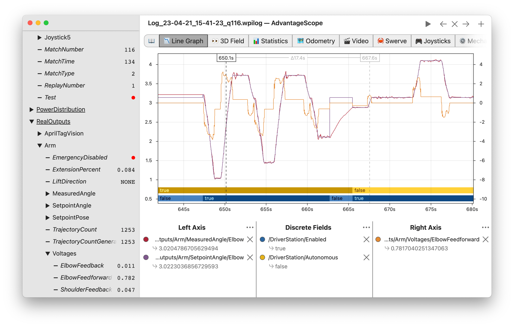

AdvantageScope
==============

AdvantageScope is a data visualization tool for :ref:`NetworkTables <docs/software/networktables/networktables-intro:What is NetworkTables>`, :ref:`WPILib data logs <docs/software/telemetry/datalog:On-Robot Telemetry Recording Into Data Logs>`, and :ref:`Driver Station logs <docs/software/driverstation/driver-station-log-viewer:Driver Station Log File Viewer>`. It is a programmer's tool (rather than a competition dashboard) and can be used to debug real or simulated robot code from a log file or live over the network.

In Visual Studio Code, press :kbd:`Ctrl+Shift+P` and type ``WPILib`` or click the WPILib logo in the top right to launch the WPILib Command Palette. Select :guilabel:`Start Tool`, then select :guilabel:`AdvantageScope`. You can also open any supported log file in AdvantageScope using a standard file browser.

.. note:: Detailed documentation for AdvantageScope can be found `here <https://github.com/Mechanical-Advantage/AdvantageScope/blob/main/docs/INDEX.md>`__. It is also available offline by clicking the book icon in the tab bar.

The capabilities of AdvantageScope include:

- Display of numeric, textual, and boolean data in graphs and tables
- Visualization of pose and mechanism data in 2D and 3D, including custom 3D robot models
- Automatic synchronization of data sources, including log files, match videos, and `Zebra MotionWorks <https://www.firstinspires.org/robotics/frc/blog/2023-zebra-motionworks-for-first-robotics-competition-at-the-first-championship>`__ tracking
- Specialized displays for joysticks, swerve module states, and console text
- Analysis of numeric fields using histograms and statistical measures
- Multiple export options, including CSV and WPILib data logs

