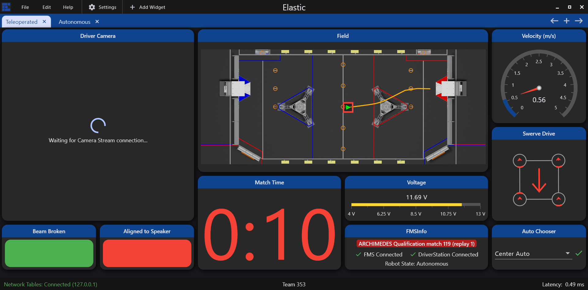

# Elastic

Elastic is a simple and modern dashboard made by Team 353. It is meant to be used behind the glass as a competition driver dashboard, but it can also be used for testing. It was built with the goal of being a drag & drop dashboard with an easy setup and elegant UI designed for a high pressure competition environment.

In Visual Studio Code, press :kbd:`Ctrl+Shift+P` and type ``WPILib`` or click the WPILib logo in the top right to launch the WPILib Command Palette. Select :guilabel:`Start Tool`, then select :guilabel:`Elastic`.

.. note:: Detailed documentation for Elastic can be found [here](https://frc-elastic.gitbook.io/docs).

The capabilities of Elastic include:

- Viewing data from different NT4 topics and widgets
- Draggable and resizable card widgets
- Customizable color scheme with over 20 variants
- Optimized camera streams which automatically deactivate when not in use
- Automatic IP retrieval from the FRC Driver Station

