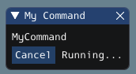
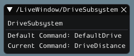
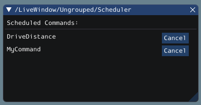

Widgets for the Command-Based Framework
=======================================

Glass also has several widgets that are specific to the :ref:`command-based framework <docs/software/commandbased/index:Command-Based Programming>`. These include widgets to schedule commands, view actively running commands on a specific subsystem, or view the state of the :ref:`command scheduler <docs/software/commandbased/command-scheduler:The Command Scheduler>`.

Command Selector Widget
-----------------------

The :guilabel:`Command Selector`  widget allows you to start and cancel a specific instance of a command (sent over NetworkTables) from Glass. For example, you can create an instance of ``MyCommand`` and send it to SmartDashboard:

.. tabs::
   .. code-tab:: java

      MyCommand command = new MyCommand(...);
      SmartDashboard.putData("My Command", command);

   .. code-tab:: c++

      #include <frc/smartdashboard/SmartDashboard.h>

      ...

      MyCommand command{...};
      frc::SmartDashboard::PutData("My Command", &command);

.. note:: The ``MyCommand`` instance can also be sent using a lower-level NetworkTables API or using the :ref:`Shuffleboard API <docs/software/dashboards/shuffleboard/getting-started/shuffleboard-displaying-data:Displaying data from your robot>`. In this case, the ``SmartDashboard`` API was used, meaning that the :guilabel:`Command Selector` widget will appear under the ``SmartDashboard`` table name.

The widget has two states. When the command is not running, a :guilabel:`Run` button will appear -- clicking it will schedule the command. When the command is running, a :guilabel:`Cancel` button, accompanied by :guilabel:`Running...` text, will appear (as shown above). This will cancel the command.

Subsystem Widget
----------------

The :guilabel:`Subsystem` widget can be used to see the default command and the currently scheduled command on a specific subsystem. If you are using the ``SubsystemBase`` base class, your subsystem will be automatically sent to NetworkTables over LiveWindow. To view this widget, look under the :guilabel:`LiveWindow` main table name in the :guilabel:`NetworkTables` menu.

Command Scheduler Widget
------------------------

The :guilabel:`Command Scheduler` widget allows you to see all currently scheduled commands. In addition, any of these commands can be canceled from the GUI.

The ``CommandScheduler`` instance is automatically sent to NetworkTables over LiveWindow. To view this widget, look under the :guilabel:`LiveWindow` main table name in the :guilabel:`NetworkTables` menu.
