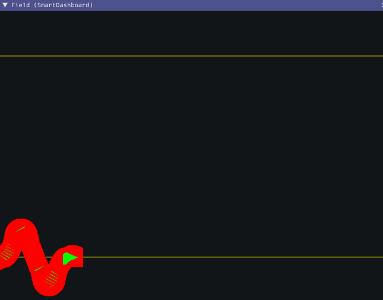
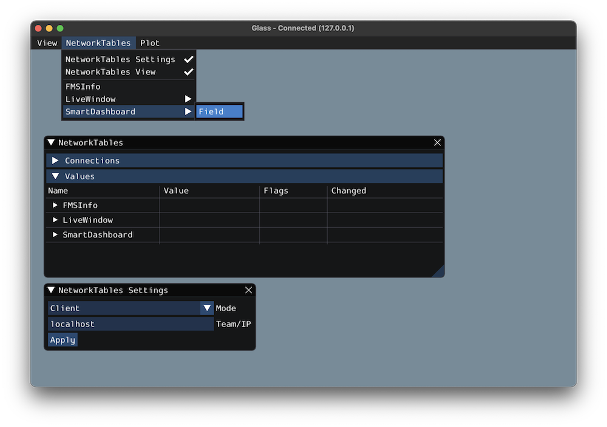
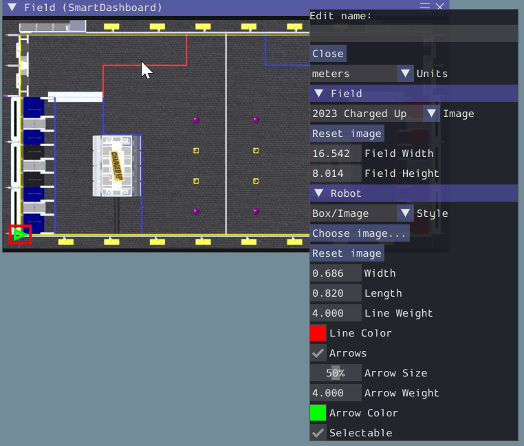
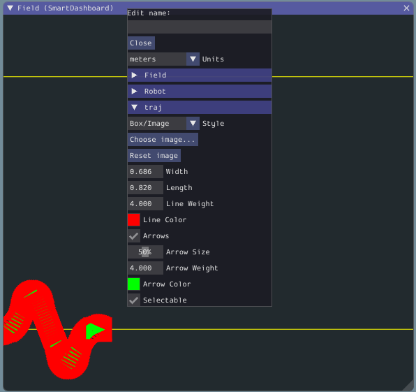
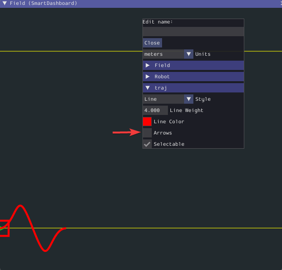

The Field2d Widget
==================

Glass supports displaying your robot's position on the field using the :guilabel:`Field2d` widget. An instance of the ``Field2d`` class should be created, sent over NetworkTables, and updated periodically with the latest robot pose in your robot code.

Sending Robot Pose from User Code
---------------------------------

To send your robot's position (usually obtained by :ref:`odometry <docs/software/kinematics-and-odometry/intro-and-chassis-speeds:What is odometry?>` or a pose estimator), a ``Field2d`` instance must be created in robot code and sent over NetworkTables. The instance must then be updated periodically with the latest robot pose.

.. tabs::
   .. code-tab:: java

      private final Field2d m_field = new Field2d();

      public Drivetrain() {
        ...
        SmartDashboard.putData("Field", m_field);
      }

      ...

      public void periodic() {
        ...
        m_field.setRobotPose(m_odometry.getPoseMeters());
      }

   .. code-tab:: c++

      #include <frc/smartdashboard/Field2d.h>
      #include <frc/smartdashboard/SmartDashboard.h>

      frc::Field2d m_field;

      Drivetrain() {
        ...
        frc::SmartDashboard::PutData("Field", &m_field);
      }

      ...

      void Periodic() {
        ...
        m_field.SetRobotPose(m_odometry.GetPose());
      }

.. note:: The ``Field2d`` instance can also be sent using a lower-level NetworkTables API or using the :ref:`Shuffleboard API <docs/software/dashboards/shuffleboard/getting-started/shuffleboard-displaying-data:Displaying data from your robot>`. In this case, the ``SmartDashboard`` API was used, meaning that the :guilabel:`Field2d` widget will appear under the ``SmartDashboard`` table name.

Sending Trajectories to Field2d
-------------------------------

Visualizing your trajectory is a great debugging step for verifying that your trajectories are created as intended. Trajectories can be easily visualized in :ref:`Field2d <docs/software/dashboards/glass/field2d-widget:The Field2d Widget>` using the ``setTrajectory()``/``SetTrajectory()`` functions.

.. tabs::

   .. group-tab:: Java

      .. rli:: https://github.com/wpilibsuite/allwpilib/raw/a610379965680a8f9214d5f0db3a8e1bc20d4712/wpilibjExamples/src/main/java/edu/wpi/first/wpilibj/examples/ramsetecontroller/Robot.java
         :language: java
         :lines: 44-61
         :linenos:
         :lineno-start: 44

   .. group-tab:: C++

      .. rli:: https://raw.githubusercontent.com/wpilibsuite/allwpilib/v2023.1.1-beta-1/wpilibcExamples/src/main/cpp/examples/RamseteController/cpp/Robot.cpp
         :language: cpp
         :lines: 18-30
         :linenos:
         :lineno-start: 18

Viewing Trajectories with Glass
-------------------------------

The sent trajectory can be viewed with :ref:`Glass <docs/software/dashboards/glass/index:Glass>` through the dropdown :guilabel:`NetworkTables` -> :guilabel:`SmartDashboard` -> :guilabel:`Field2d`.

.. note:: The above example which uses the `RamseteController (Java) <https://github.com/wpilibsuite/allwpilib/blob/a610379965680a8f9214d5f0db3a8e1bc20d4712/wpilibjExamples/src/main/java/edu/wpi/first/wpilibj/examples/ramsetecontroller/Robot.java>`__/`RamseteController (C++) <https://github.com/wpilibsuite/allwpilib/blob/a610379965680a8f9214d5f0db3a8e1bc20d4712/wpilibcExamples/src/main/cpp/examples/RamseteController/cpp/Robot.cpp>`__ will not show the sent trajectory until autonomous is enabled at least once.

Viewing the Robot Pose in Glass
-------------------------------

After sending the ``Field2d`` instance over NetworkTables, the :guilabel:`Field2d` widget can be added to Glass by selecting :guilabel:`NetworkTables` in the menu bar, choosing the table name that the instance was sent over, and then clicking on the :guilabel:`Field` button.

Once the widget appears, you can resize and place it on the Glass workspace as you desire. Right-clicking the top of the widget will allow you to customize the name of the widget, select a custom field image, select a custom robot image, and choose the dimensions of the field and robot.

When selecting :guilabel:`Choose image...` you can choose to either select an image file or a PathWeaver JSON file as long as the image file is in the same directory.  Choosing the JSON file will automatically import the correct location of the field in the image and the correct size of the field.

.. note:: You can retrieve the latest field image and JSON files from `here <https://github.com/wpilibsuite/PathWeaver/tree/main/src/main/resources/edu/wpi/first/pathweaver>`__. This is the same image and JSON that are used when generating paths using :ref:`PathWeaver <docs/software/pathplanning/pathweaver/introduction:Introduction to PathWeaver>`.

Modifying Pose Style
--------------------

Poses can be customized in a plethora of ways by right clicking on the Field2d menu bar. Examples of customization are: line width, line weight, style, arrow width, arrow weight, color, etc.

One usage of customizing the pose style is converting the previously shown ``traj`` pose object to a line, rather than a list of poses. Click on the :guilabel:`Style` dropdown box and select :guilabel:`Line`. You should notice an immediate change in how the trajectory looks.

.. image:: images/changing-style-line.png
   :alt: Selecting the "style" dropdown and then selecting "line".

Now, uncheck the :guilabel:`Arrows` checkbox. This will cause our trajectory to look like a nice and fluid line!

