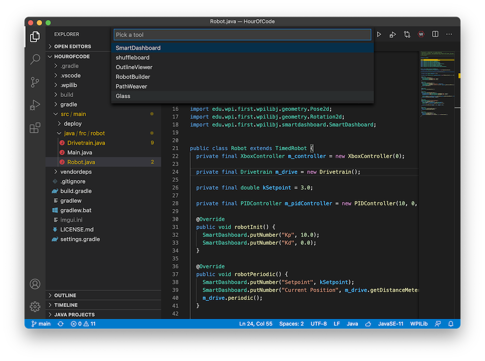
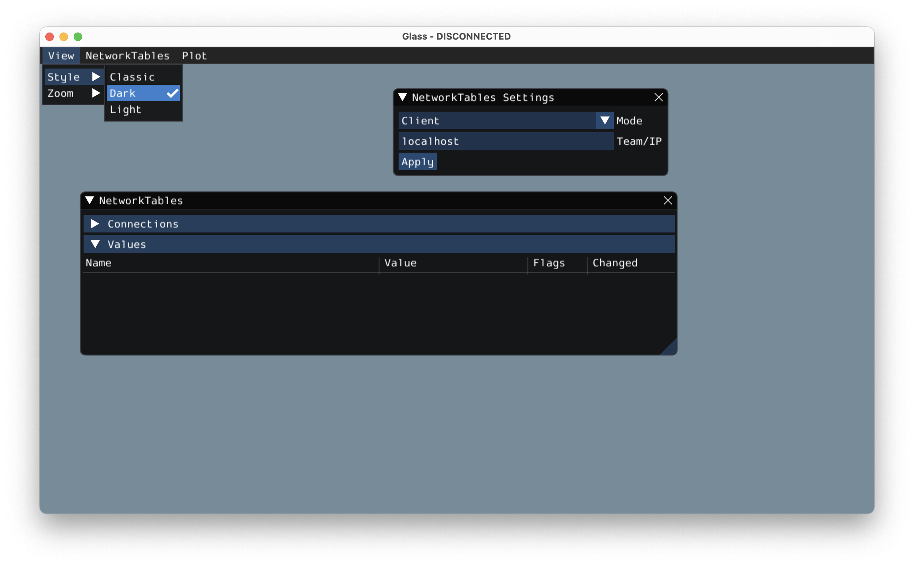

Introduction to Glass
=====================

Glass is a new dashboard and robot data visualization tool. It supports many of the same :ref:`widgets <docs/software/wpilib-tools/robot-simulation/simulation-gui:Learning the Layout>` that the Simulation GUI supports, including robot pose visualization and advanced plotting. In its current state, it is meant to be used as a programmer's tool for debugging and not as a dashboard for competition use.

Opening Glass
-------------

Glass can be launched by selecting the ellipsis menu (:guilabel:`...`) in VS Code, clicking on :guilabel:`Start Tool` and then choosing :guilabel:`Glass`.

.. note:: You can also launch Glass directly by navigating to ``~/wpilib/YYYY/tools`` and running ``Glass.py`` (Linux and macOS) or by using the shortcut inside the WPILib Tools desktop folder (Windows).

Changing View Settings
----------------------

The :guilabel:`View` menu item contains :guilabel:`Zoom` and :guilabel:`Style` settings that can be customized. The :guilabel:`Zoom` option dictates the size of the text in the application whereas the :guilabel:`Style` option allows you to select between the ``Classic``, ``Light``, and ``Dark`` modes.

An example of the ``Dark`` style setting is below:

Clearing Application Data
-------------------------

Application data for Glass, including widget sizes and positions as well as other custom information for widgets is stored in a ``glass.ini`` file. The location of this file varies based on your operating system:

 - On Windows, the configuration file is located in ``%APPDATA%``.
 - On macOS, the configuration file is located in ``~/Library/Preferences``.
 - On Linux, the configuration file is located in ``$XDG_CONFIG_HOME`` or ``~/.config`` if the former does not exist.

The ``glass.ini`` configuration file can simply be deleted to restore Glass to a "clean slate".
