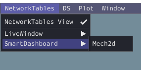
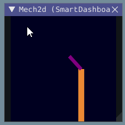
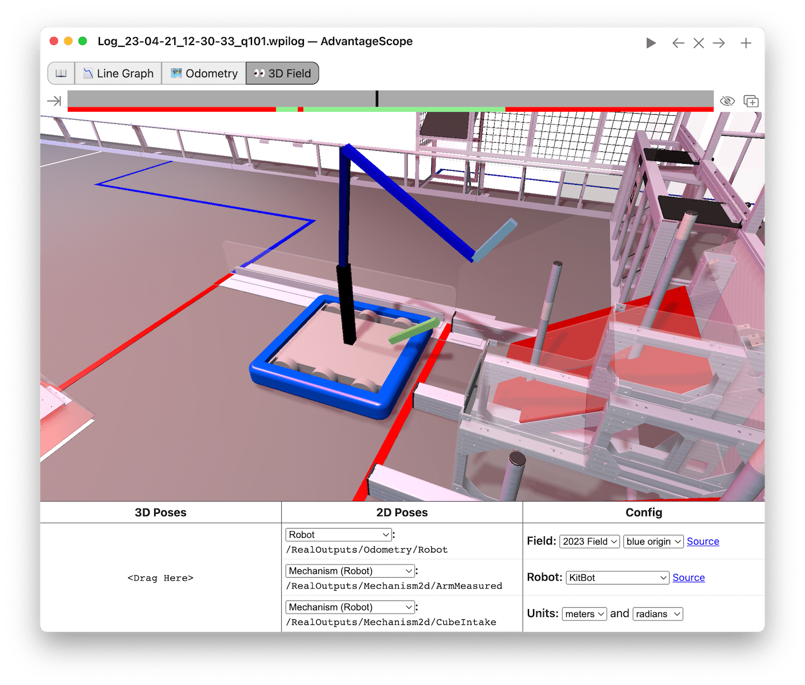

The Mechanism2d Widget
======================

Glass supports displaying stick-figure representations of your robot's mechanisms using the :guilabel:`Mechanism2d` widget. It supports combinations of ligaments that can rotate and / or extend or retract, such as arms and elevators and they can be combined for more complicated mechanisms. An instance of the ``Mechanism2d`` class should be created and populated, sent over NetworkTables, and updated periodically with the latest mechanism states in your robot code. It can also be used with the :doc:`Physics Simulation </docs/software/wpilib-tools/robot-simulation/physics-sim>` to visualize and program your robot's mechanisms before the robot is built.

Creating and Configuring the Mechanism2d Instance
-------------------------------------------------

The ``Mechanism2d`` object is the "canvas" where the mechanism is drawn. The root node is where the mechanism is anchored to ``Mechanism2d``. For a single jointed arm this would the pivot point. For an elevator, this would be where it's attached to the robot's base. To get a root node (represented by a ``MechanismRoot2d`` object), call ``getRoot(name, x, y)`` on the container ``Mechanism2d`` object. The name is used to name the root within NetworkTables, and should be unique, but otherwise isn't important. The ``x / y`` coordinate system follows the same orientation as ``Field2d`` - ``(0,0)`` is bottom left.

In the examples below, an elevator is drawn, with a rotational wrist on top of the elevator. The full Mechanism2d example is available in [Java](https://github.com/wpilibsuite/allwpilib/blob/main/wpilibjExamples/src/main/java/edu/wpi/first/wpilibj/examples/mechanism2d/Robot.java) / [C++](https://github.com/wpilibsuite/allwpilib/blob/main/wpilibcExamples/src/main/cpp/examples/Mechanism2d/cpp/Robot.cpp)

.. tab-set-code::

   .. remoteliteralinclude:: https://raw.githubusercontent.com/wpilibsuite/allwpilib/v2024.3.2/wpilibjExamples/src/main/java/edu/wpi/first/wpilibj/examples/mechanism2d/Robot.java
      :language: java
      :lines: 43-46
      :linenos:
      :lineno-start: 43

   .. remoteliteralinclude:: https://raw.githubusercontent.com/wpilibsuite/allwpilib/v2024.3.2/wpilibcExamples/src/main/cpp/examples/Mechanism2d/cpp/Robot.cpp
      :language: c++
      :lines: 59-62
      :linenos:
      :lineno-start: 59

   .. remoteliteralinclude:: https://raw.githubusercontent.com/robotpy/examples/2024.0.0b4/Mechanism2d/robot.py
      :language: python
      :lines: 32-35
      :linenos:
      :lineno-start: 32

Each ``MechanismLigament2d`` object represents a stage of the mechanism. It has a three required parameters, a name, an initial length to draw (relative to the size of the ``Mechanism2d`` object), and an initial angle to draw the ligament in degrees. Ligament angles are relative to the parent ligament, and follow math notation - the same as :ref:`Rotation2d <docs/software/advanced-controls/geometry/pose:Rotation>` (counterclockwise-positive). A ligament based on the root with an angle of zero will point right. Two optional parameters let you change the width (also relative to the size of the Mechanism2d object) and the color. Call ``append()``/``Append()`` on a root node or ligament node to add another node to the figure. In Java, pass a constructed ``MechanismLigament2d`` object to add it. In C++, pass the construction parameters in order to construct and add a ligament.

.. tab-set-code::

   .. remoteliteralinclude:: https://raw.githubusercontent.com/wpilibsuite/allwpilib/v2024.3.2/wpilibjExamples/src/main/java/edu/wpi/first/wpilibj/examples/mechanism2d/Robot.java
      :language: java
      :lines: 48-53
      :linenos:
      :lineno-start: 48

   .. remoteliteralinclude:: https://raw.githubusercontent.com/wpilibsuite/allwpilib/v2024.3.2/wpilibcExamples/src/main/cpp/examples/Mechanism2d/cpp/Robot.cpp
      :language: c++
      :lines: 63-69
      :linenos:
      :lineno-start: 63

   .. remoteliteralinclude:: https://raw.githubusercontent.com/robotpy/examples/2024.0.0b4/Mechanism2d/robot.py
         :language: python
         :lines: 37-44
         :linenos:
         :lineno-start: 37

Then, publish the ``Mechanism2d`` object to NetworkTables:

.. tab-set-code::

   .. remoteliteralinclude:: https://raw.githubusercontent.com/wpilibsuite/allwpilib/v2024.3.2/wpilibjExamples/src/main/java/edu/wpi/first/wpilibj/examples/mechanism2d/Robot.java
      :language: java
      :lines: 55-56
      :linenos:
      :lineno-start: 55

   .. remoteliteralinclude:: https://raw.githubusercontent.com/wpilibsuite/allwpilib/v2024.3.2/wpilibcExamples/src/main/cpp/examples/Mechanism2d/cpp/Robot.cpp
      :language: c++
      :lines: 36-37
      :linenos:
      :lineno-start: 36

   .. remoteliteralinclude:: https://raw.githubusercontent.com/robotpy/examples/2024.0.0b4/Mechanism2d/robot.py
      :language: python
      :lines: 46-47
      :linenos:
      :lineno-start: 46

.. note:: The ``Mechanism2d`` instance can also be sent using a lower-level NetworkTables API or using the :ref:`Shuffleboard API <docs/software/dashboards/shuffleboard/getting-started/shuffleboard-displaying-data:Displaying data from your robot>`. In this case, the ``SmartDashboard`` API was used, meaning that the :guilabel:`Mechanism2d` widget will appear under the ``SmartDashboard`` table name.

To manipulate a ligament angle or length, call ``setLength()`` or ``setAngle()`` on the ``MechanismLigament2d`` object. When manipulating ligament length based off of sensor measurements, make sure to add the minimum length to prevent 0-length (and therefore invisible) ligaments.

.. tab-set-code::

   .. remoteliteralinclude:: https://raw.githubusercontent.com/wpilibsuite/allwpilib/v2024.3.2/wpilibjExamples/src/main/java/edu/wpi/first/wpilibj/examples/mechanism2d/Robot.java
      :language: java
      :lines: 59-64
      :linenos:
      :lineno-start: 59

   .. remoteliteralinclude:: https://raw.githubusercontent.com/wpilibsuite/allwpilib/v2024.3.2/wpilibcExamples/src/main/cpp/examples/Mechanism2d/cpp/Robot.cpp
      :language: c++
      :lines: 40-45
      :linenos:
      :lineno-start: 40

   .. remoteliteralinclude:: https://raw.githubusercontent.com/robotpy/examples/2024.0.0b4/Mechanism2d/robot.py
      :language: python
      :lines: 49-54
      :linenos:
      :lineno-start: 49

Viewing the Mechanism2d in Glass
--------------------------------

After sending the ``Mechanism2d`` instance over NetworkTables, the :guilabel:`Mechanism2d` widget can be added to Glass by selecting :guilabel:`NetworkTables` in the menu bar, choosing the table name that the instance was sent over, and then clicking on the :guilabel:`Field` button.

Once the widget appears as shown below, you can resize and place it on the Glass workspace as you desire. Right-clicking the top of the widget will allow you to customize the name of the widget. As the wrist potentiometer and elevator encoder changes, the mechanism will update in the widget.

Viewing the Mechanism2d in AdvantageScope
-----------------------------------------

:ref:`AdvantageScope <docs/software/dashboards/advantagescope:AdvantageScope>` is an alternative option for viewing a ``Mechanism2d`` object, including data recorded to a log file using :ref:`WPILib data logs <docs/software/telemetry/datalog:On-Robot Telemetry Recording Into Data Logs>`. Both 2D and 3D visualizations are supported. See the documentation for the [mechanism](https://github.com/Mechanical-Advantage/AdvantageScope/blob/main/docs/tabs/MECHANISM.md) and [3D field](https://github.com/Mechanical-Advantage/AdvantageScope/blob/main/docs/tabs/3D-FIELD.md) tabs for more details.

Next Steps
----------

As mentioned above, the Mechanism2d visualization can be combined with :doc:`Physics Simulation </docs/software/wpilib-tools/robot-simulation/physics-sim>` to help you program mechanisms before your robot is built. The ArmSimulation ([Java](https://github.com/wpilibsuite/allwpilib/blob/main/wpilibjExamples/src/main/java/edu/wpi/first/wpilibj/examples/armsimulation/Robot.java) / [C++](https://github.com/wpilibsuite/allwpilib/blob/main/wpilibcExamples/src/main/cpp/examples/ArmSimulation/cpp/Robot.cpp) / [Python](https://github.com/robotpy/examples/blob/2024.0.0b4/ArmSimulation/robot.py)) and ElevatorSimulation ([Java](https://github.com/wpilibsuite/allwpilib/blob/main/wpilibjExamples/src/main/java/edu/wpi/first/wpilibj/examples/elevatorsimulation/Robot.java) / [C++](https://github.com/wpilibsuite/allwpilib/blob/main/wpilibcExamples/src/main/cpp/examples/ElevatorSimulation/cpp/Robot.cpp) / [Python](https://github.com/robotpy/examples/blob/2024.0.0b4/ElevatorSimulation/robot.py)) examples combine physics simulation and Mechanism2d visualization so that you can practice programming a single jointed arm and elevator without a robot.
