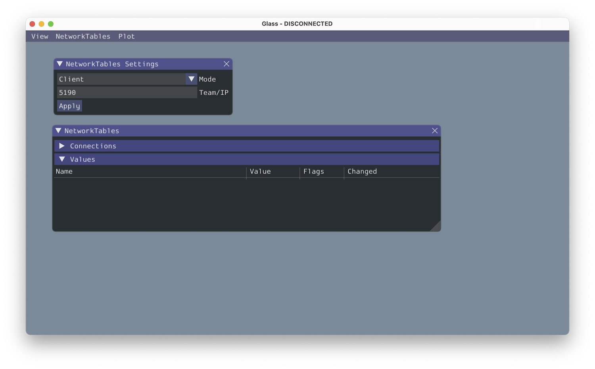
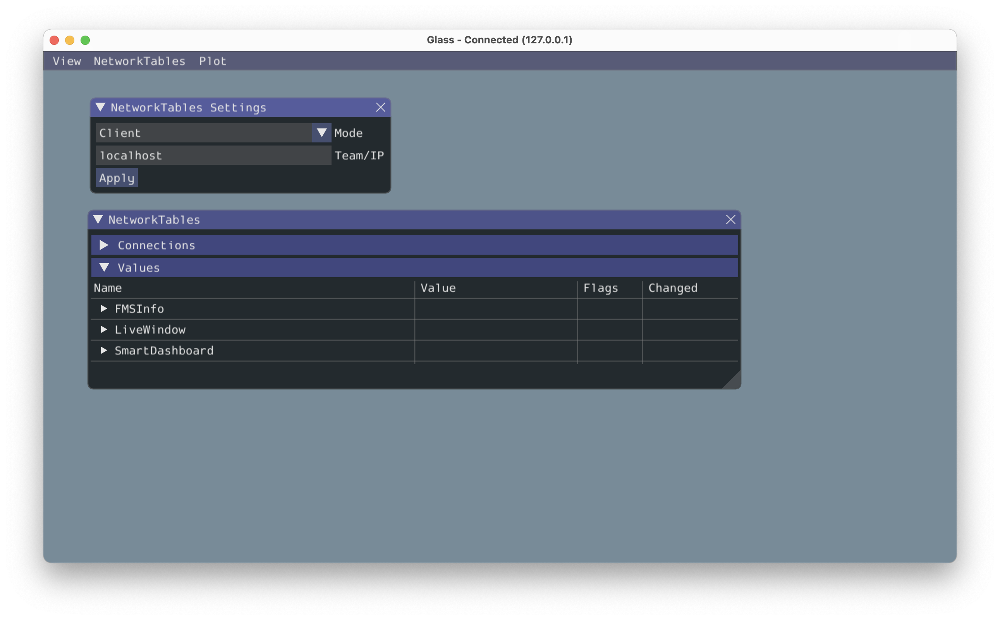
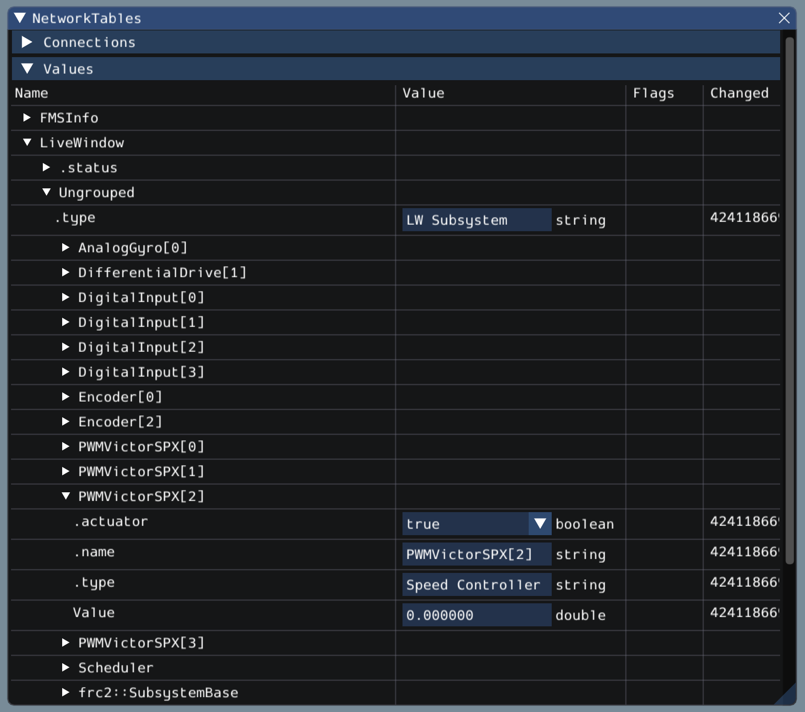

Establishing NetworkTables Connections
======================================

Glass uses the :ref:`NetworkTables <docs/software/networktables/networktables-intro:What is NetworkTables>` protocol to establish a connection with your robot program. It is also used to transmit and receive data to and from the robot.

Connecting to a Robot
---------------------

When Glass is first launched, you will see two widgets -- :guilabel:`NetworkTables Settings` and :guilabel:`NetworkTables`. To connect to a robot, select :guilabel:`Client` under :guilabel:`Mode` in the :guilabel:`NetworkTables Settings` widget, enter your team number and click on :guilabel:`Apply`.

You can also connect to a robot that is running in simulation on your computer (including Romi robots) by typing in ``localhost`` into the :guilabel:`Team/IP` box.

.. important:: The NetworkTables connection status is always visible on the title bar of the Glass application.

Viewing NetworkTables Entries
-----------------------------

The :guilabel:`NetworkTables` widget can be used to view all entries that are being sent over NetworkTables. These entries are hierarchically arranged by main table, sub-table, and so on.

Furthermore, you can view all connected NetworkTables clients under the :guilabel:`Connections` pane of the widget.
