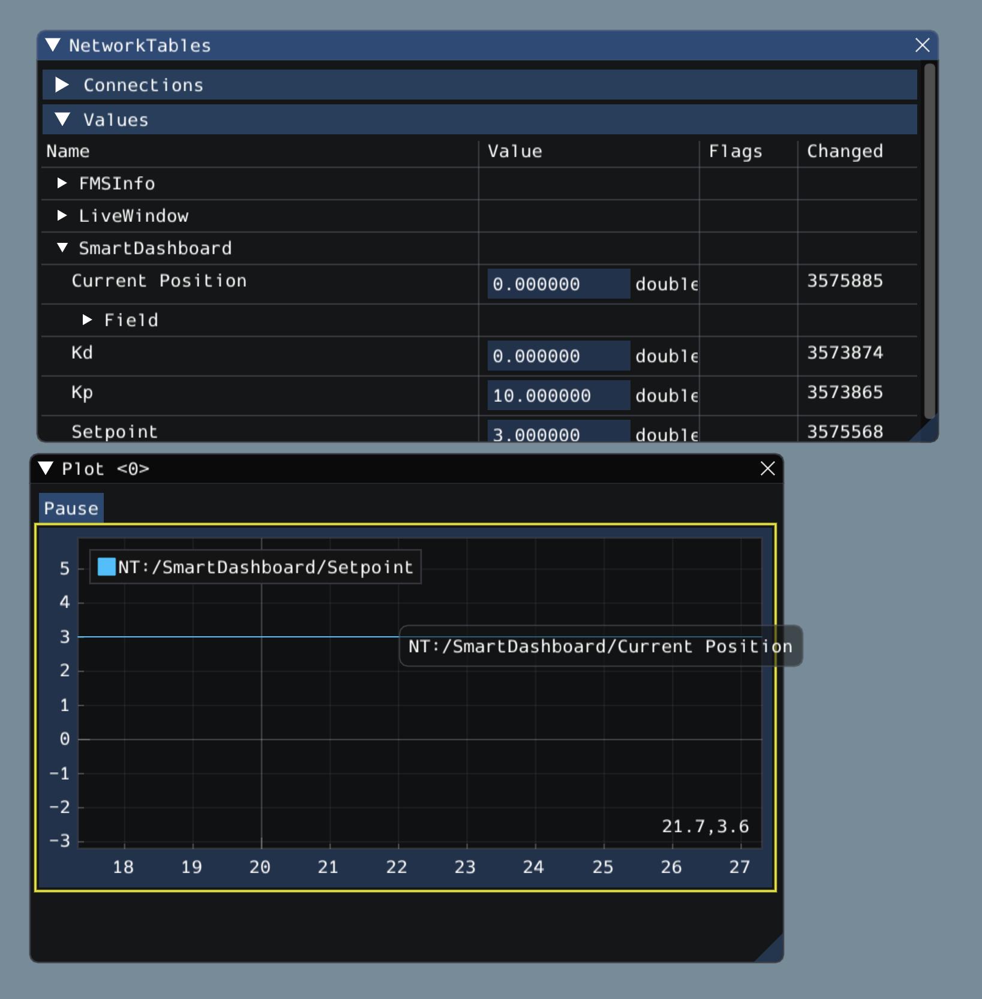
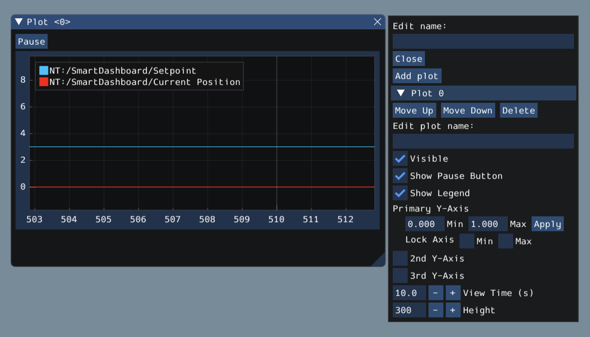
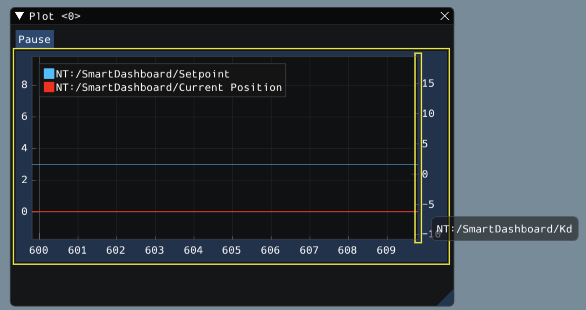
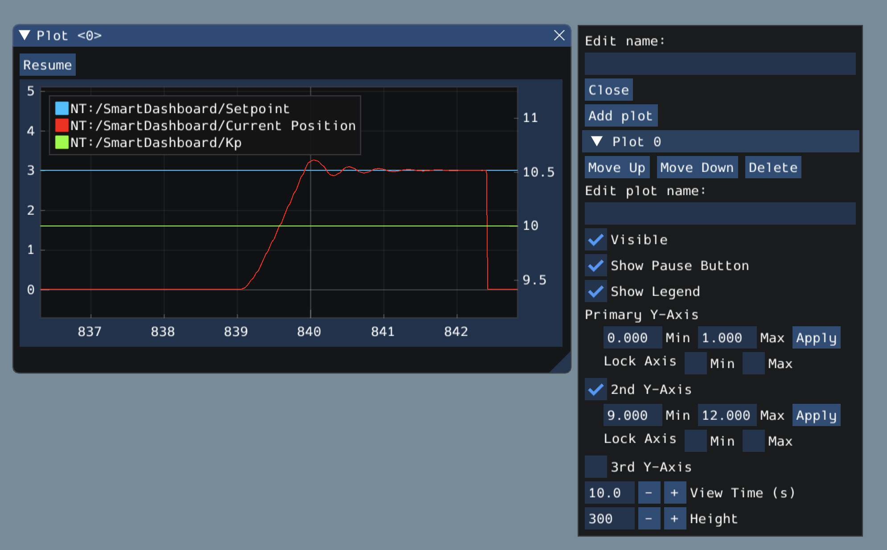
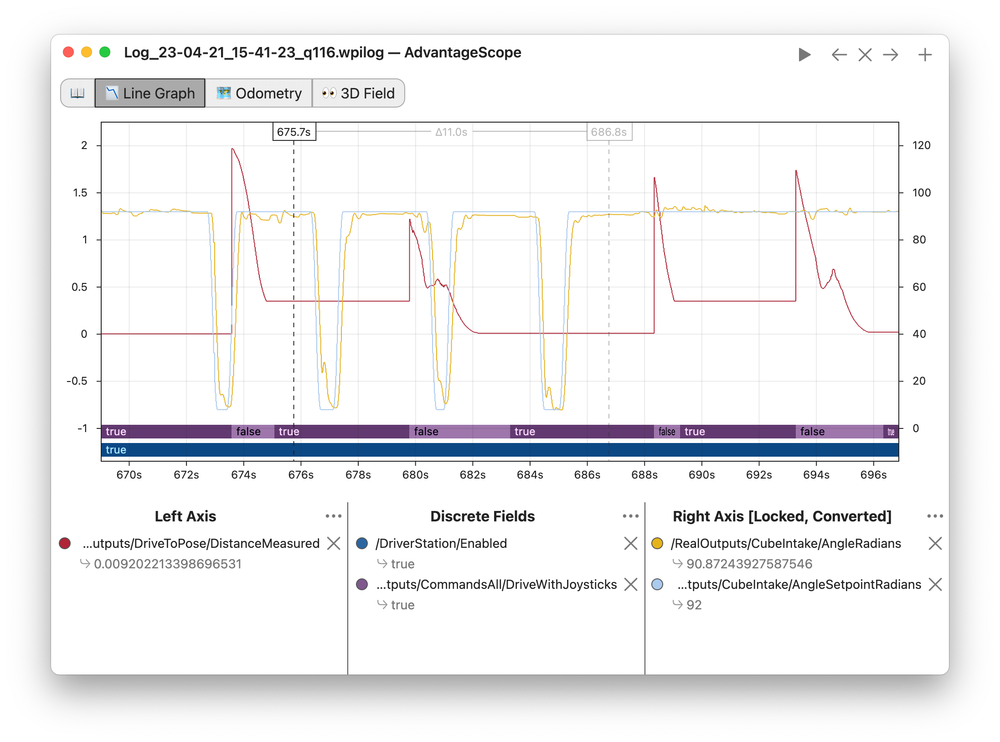

Plots
=====

Glass excels at high-performance, comprehensive plotting of data from NetworkTables. Some features include resizable plots, plots with multiple y axes and the ability to pause, examine, and resume plots.

Creating a Plot
---------------

A new plot widget can be created by selecting the :guilabel:`Plot` button on the main menu bar and then clicking on :guilabel:`New Plot Window`. Several individual plots can be added to each plot window. To add a plot within a plot window, click the :guilabel:`Add plot` button inside the widget. Then you can drag various sources from the :guilabel:`NetworkTables` widget into the plot:

Manipulating Plots
------------------

You can click and drag on the plot to move around and scroll on top of the plot to zoom the y axes in and out. Double clicking on the graph will autoscale it so that the zoom and axis limits fit all of the data it is plotting.  Furthermore, right-clicking on the plot will present you with a plethora of options, including whether you want to display secondary and tertiary y axes, if you wish to lock certain axes, etc.

If you choose to make secondary and tertiary y axes available, you can drag data sources onto those axes to make their lines correspond with your desired axis:

Then, you can lock certain axes so that their range always remains constant, regardless of panning. In this example, the secondary axis range (with the ``/SmartDashboard/Kp`` entry) was locked between 9 and 12.

Plotting with AdvantageScope
----------------------------

:ref:`AdvantageScope <docs/software/dashboards/advantagescope:AdvantageScope>` is an alternative option for creating plots, including from data recorded to a log file using :ref:`WPILib data logs <docs/software/telemetry/datalog:On-Robot Telemetry Recording Into Data Logs>`. See the documentation for the [line graph](https://github.com/Mechanical-Advantage/AdvantageScope/blob/main/docs/tabs/LINE-GRAPH.md) tab for more details.

