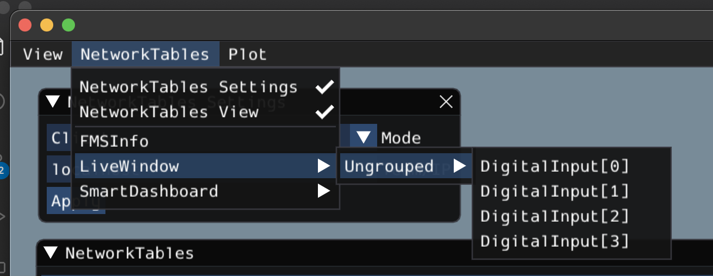
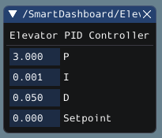
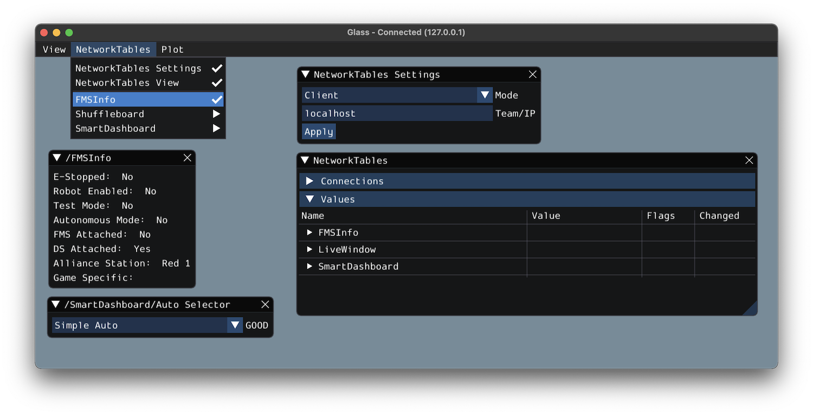

Glass Widgets
=============

Specialized widgets are available for certain types that exist in robot code. These include objects that are manually sent over NetworkTables such as ``SendableChooser`` instances, or hardware that is automatically sent over :ref:`LiveWindow <docs/software/dashboards/smartdashboard/test-mode-and-live-window/displaying-LiveWindow-values:Displaying LiveWindow Values>`.

.. note:: Widget support in Glass is still in its infancy -- therefore, there are only a handful of widgets available. This list will grow as development work continues.

.. note:: A widget can be renamed by right-clicking on its header and specifying a new name.

Hardware Widgets
----------------

Widgets for specific hardware (such as motor controllers) are usually available via LiveWindow. These can be accessed by selecting the :guilabel:`NetworkTables` menu option, clicking on :guilabel:`LiveWindow` and choosing the desired widget.

The list of hardware (sent over LiveWindow automatically) that has widgets is below:

 - ``DigitalInput``
 - ``DigitalOutput``
 - ``SpeedController``
 - ``Gyro``

Here is an example of the widget for gyroscopes:

 .. image:: images/gyro.png
    :alt: Gyro widget with both text and dial visualizations of the current gyro angle. Current Gyro Angle in degrees is -60.9704.

Sendable Chooser Widget
-----------------------

The :guilabel:`Sendable Chooser` widget represents a ``SendableChooser`` instance from robot code. It is often used to select autonomous modes. Like other dashboards, your ``SendableChooser`` instance simply needs to be sent using a NetworkTables API. The simplest is to use something like ``SmartDashboard``:

.. tabs::
   .. code-tab:: java

      SmartDashboard.putData("Auto Selector", m_selector);

   .. code-tab:: c++

      frc::SmartDashboard::PutData("Auto Selector", &m_selector);

.. note:: For more information on creating a ``SendableChooser``, please see :ref:`this document <docs/software/dashboards/smartdashboard/choosing-an-autonomous-program-from-smartdashboard:Setting up SendableChooser>`.

The :guilabel:`Sendable Chooser` widget will appear in the :guilabel:`NetworkTables` menu and underneath the main table name that the instance was sent over. From the example above, the main table name would be :guilabel:`SmartDashboard`.

 .. image:: images/sendable-chooser.png

PID Controller Widget
---------------------

The :guilabel:`PID Controller` widget allows you to quickly tune PID values for a certain controller. A ``PIDController`` instance must be sent using a NetworkTables API. The simplest is to use something like ``SmartDashboard``:

.. tabs::
   .. code-tab:: java

      SmartDashboard.putData("Elevator PID Controller", m_elevatorPIDController);

   .. code-tab:: c++

      frc::SmartDashboard::PutData("Elevator PID Controller", &m_elevatorPIDController);

This allows you to quickly tune P, I, and D values for various setpoints.

FMSInfo Widget
--------------

The :guilabel:`FMSInfo` widget is created by default when Glass connects to a robot. This widget displays basic information about the robot's enabled state, whether a Driver Station is connected, whether an FMS is connected, the game-specific data, etc. It can be viewed by selecting the :guilabel:`NetworkTables` menu item and clicking on :guilabel:`FMSInfo`.

