.. include:: <isonum.txt>

FRC LabVIEW Dashboard
=====================

The Dashboard application installed and launched by the FRC\ |reg| Driver Station is a LabVIEW program designed to provide teams with basic feedback from their robot, with the ability to expand and customize the information to suit their needs. This Dashboard application uses :term:`NetworkTables` and contains a variety of tools that teams may find useful.

LabVIEW Dashboard
-----------------

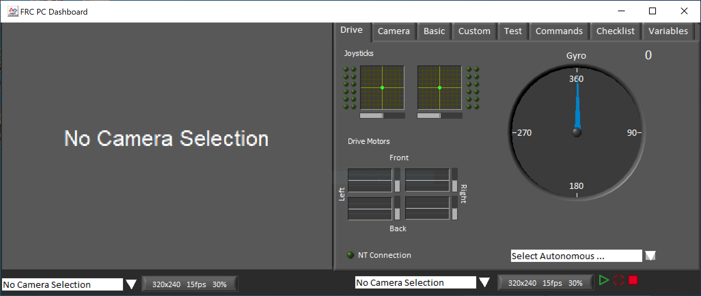

The Dashboard is broken into two main sections. The left pane is for displaying a camera image. The right pane contains:

- Drive tab that contains indicators for joystick and drive motor values (hooked up by default when used with LabVIEW robot code), a gyro indicator, an Autonomous selection text box, a connection indicator and some controls and indicators for the camera
- Basic tab that contains some default controls and indicators
- Camera tab that contains a secondary camera viewer, similar to the viewer in the left pane
- Custom tab for customizing the dashboard using LabVIEW
- Test tab for use with Test Mode in the LabVIEW framework
- Commands tab for use with the new LabVIEW C&C Framework
- Checklist tab that can be used to create task lists to complete before and/or between matches
- Variables tab that displays the raw NetworkTables variables in a tree view format

The LabVIEW Dashboard also includes Record/Playback functionality, located in the bottom right. More detail about this feature is included below under `Record/Playback`_.

Camera Image and Controls
-------------------------

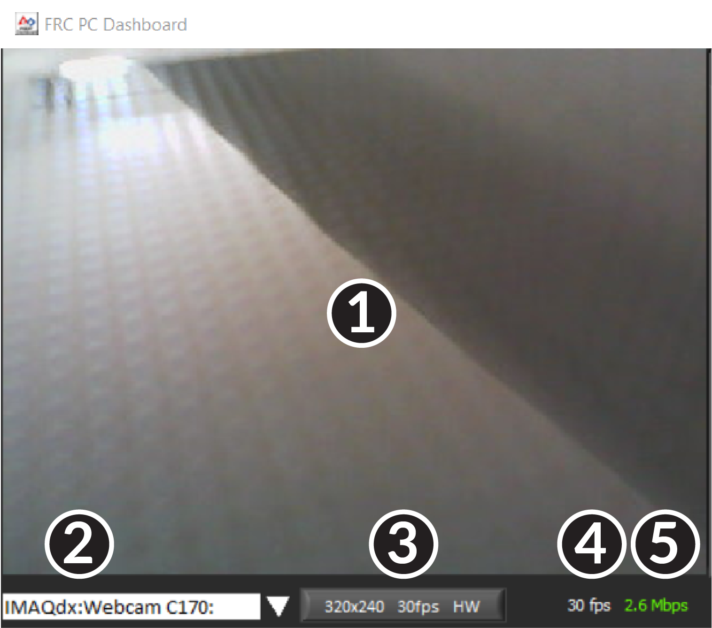

The left pane is used to display a video feed from acamera located on the robot. There are also some controls and indicators related to the camera below the tab area:

1. Camera Image Display
2. Mode Selector - This drop-down allows you to select the type of camera display to use. The choices are Camera Off, USB Camera SW (software compression), USB Camera HW (hardware compression) and IP Camera (Axis camera). Note that the IP Camera setting will not work when your PC is connected to the roboRIO over USB.
3. Camera Settings - This control allows you to change the resolution, framerate and compression of the image stream to the dashboard, click the control to pop-up the configuration.
4. Bandwidth Indicator - Indicates approximate bandwidth usage of the image stream. The indicator will display green for "safe" bandwidth usage, yellow when teams should use caution and red if the stream bandwidth is beyond levels that will work on the competition field.
5. Framerate - Indicates the approximate received framerate of the image stream.

.. tip:: The bandwidth indicator indicates the combined bandwidth for all camera streams open.

Drive
-----

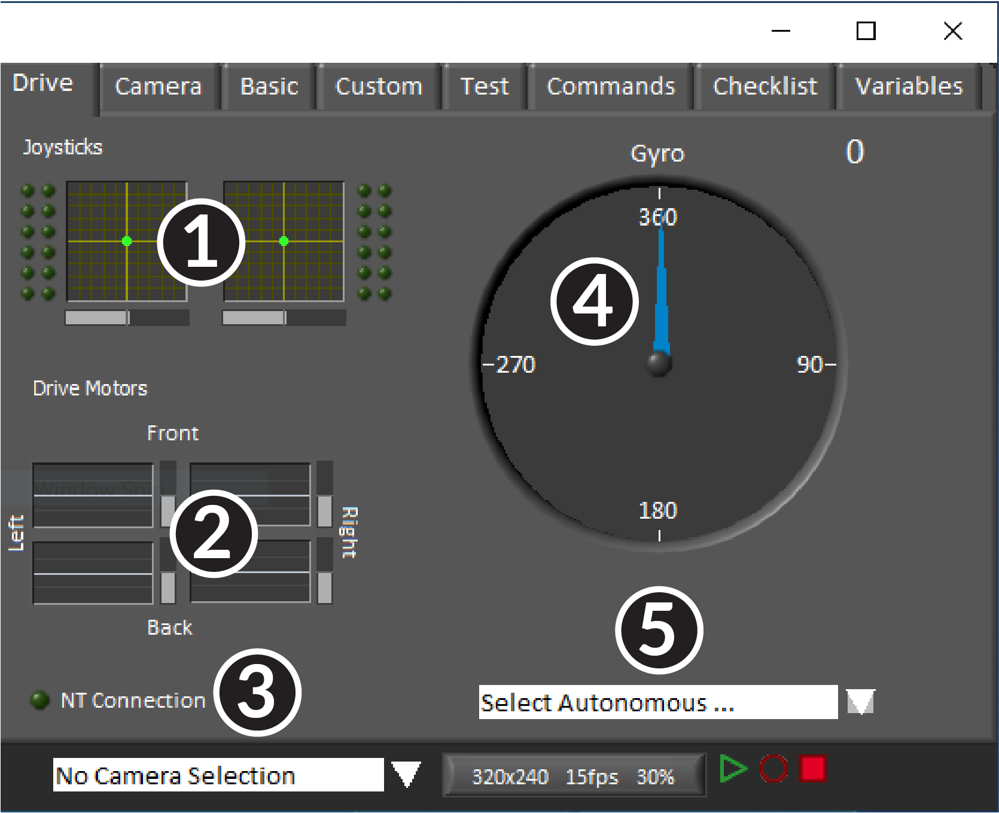

The center pane contains a section that provides feedback on the joysticks and drive commands when used with the LabVIEW framework and a section that displays the NetworkTables status and autonomous selector:

1. Displays X,Y and Throttle information and button values for up to 2 joysticks when using the LabVIEW framework
2. Displays values being sent to motor controllers when using LabVIEW framework
3. Displays a connection indicator for the NetworkTables data from the robot
4. Displays a Gyro value
5. Displays a text box that can be used to select Autonomous modes. Each language's code templates have examples of using this box to select from multiple autonomous programs.

These indicators (other than the Gyro) are hooked up to appropriate values by default when using the LabVIEW framework. For information on using them with C++/Java code see :doc:`using-the-labview-dashboard-with-c++-java-code`.

Camera
------

.. tip:: The left pane can only display a single camera output, so use the camera tab on the right pane to display a second camera output if needed.

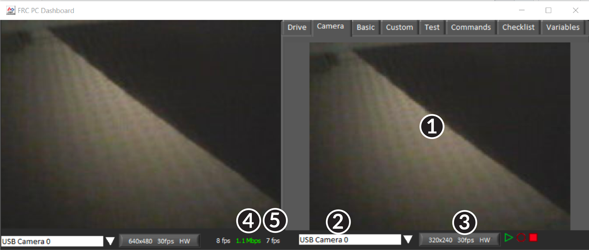

The camera tab is used to display a video feed from a camera located on the robot. There are also some controls and indicators related to the camera below the tab area:

1. Camera Image Display
2. Mode Selector - This drop-down allows you to select the type of camera display to use. The choices are Camera Off, USB Camera SW (software compression), USB Camera HW (hardware compression) and IP Camera (Axis camera). Note that the IP Camera setting will not work when your PC is connected to the roboRIO over USB.
3. Camera Settings - This control allows you to change the resolution, framerate and compression of the image stream to the dashboard, click the control to pop-up the configuration.
4. Bandwidth Indicator - Indicates approximate bandwidth usage of the image stream. The indicator will display green for "safe" bandwidth usage, yellow when teams should use caution and red if the stream bandwidth is beyond levels that will work on the competition field.
5. Framerate - Indicates the approximate received framerate of the image stream.

.. tip:: The bandwidth indicator indicates the combined bandwidth for all camera streams open.

Basic
-----

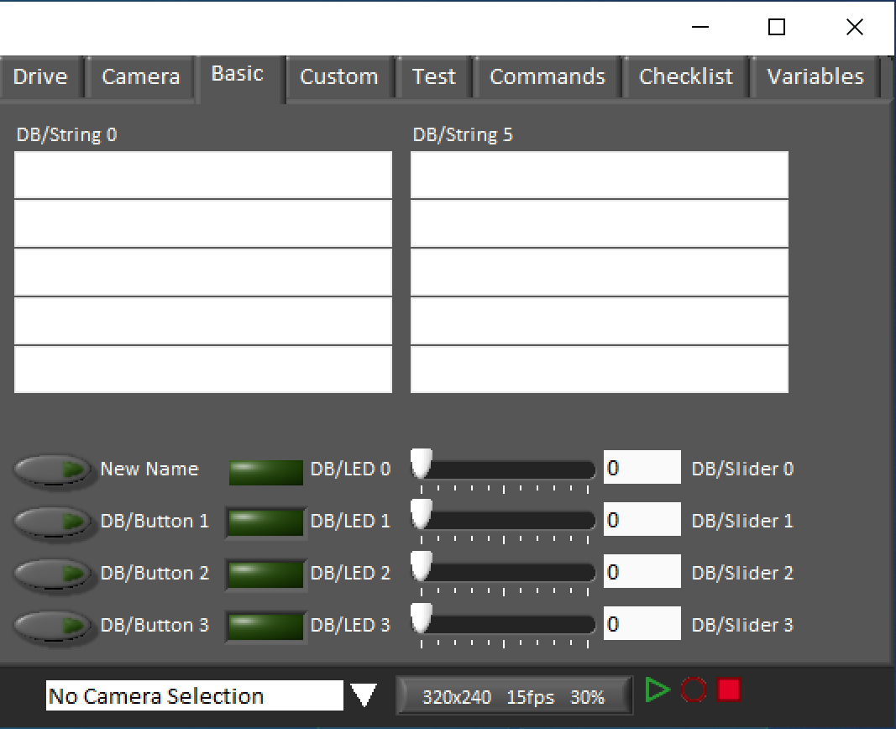

The Basic tab contains a variety of pre-populated bi-directional controls/indicators which can be used to control the robot or display information from the robot. The SmartDashboard key names associated with each item are labeled next to the indicator with the exception of the Strings which follow the same naming pattern and increment from DB/String 0 to DB/String 4 on the left and DB/String 5 to DB/String 9 on the right. The LabVIEW framework contains an example of reading from the Buttons and Sliders in Teleop. It also contains an example of customizing the labels in Begin. For more detail on using this tab with C++\Java code, see :doc:`using-the-labview-dashboard-with-c++-java-code`.

Custom
------

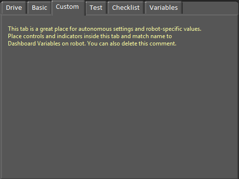

The Custom tab allows you to add additional controls/indicators to the dashboard using LabVIEW without removing any existing functionality. To customize this tab you will need to create a Dashboard project in LabVIEW.

Test
----

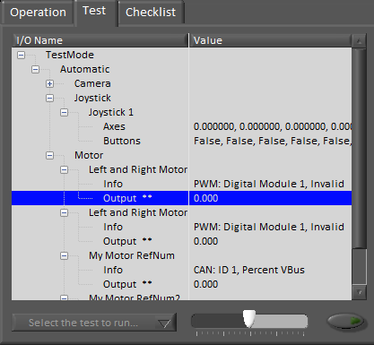

The Test tab is for use with Test mode for teams using LabVIEW (Java and C++ teams should use SmartDashboard or Shuffleboard when using Test Mode). For many items in the libraries, Input/Output info will be populated here automatically. All items which have ** next to them are outputs that can be controlled by the dashboard. To control an output, click on it to select it, drag the slider to set the value then press and hold the green button to enable the output. As soon as the green button is released, the output will be disabled. This tab can also be used to run and monitor tests on the robot. An example test is provided in the LabVIEW framework. Selecting this test from the dropdown box will show the status of the test in place of the slider and enable controls.

Commands
--------

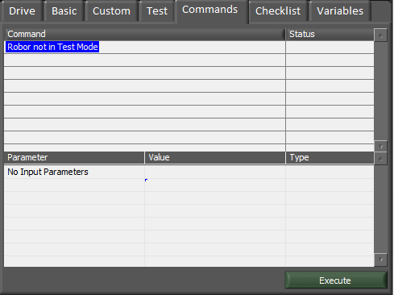

The Commands tab can be used with the Robot in Test mode to see which commands are running and to manually run commands for test purposes.

Checklist
---------

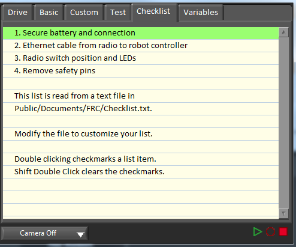

The Checklist tab can be used by teams to create a list of tasks to perform before or between matches. Instructions for using the Checklist tab are pre-populated in the default checklist file.

Variables
---------

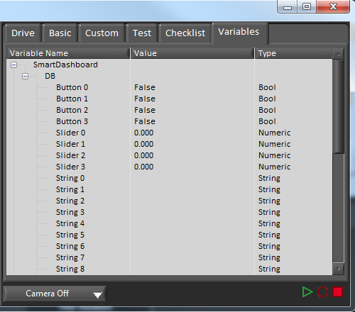

The Variables tab of the left pane shows all NetworkTables variables in a tree display. The Variable Name (Key), Value and data type are shown for each variable. Information about the NetworkTables bandwidth usage is also displayed in this tab. Entries will be shown with black diamonds if they are not currently synced with the robot.

Record/Playback
---------------

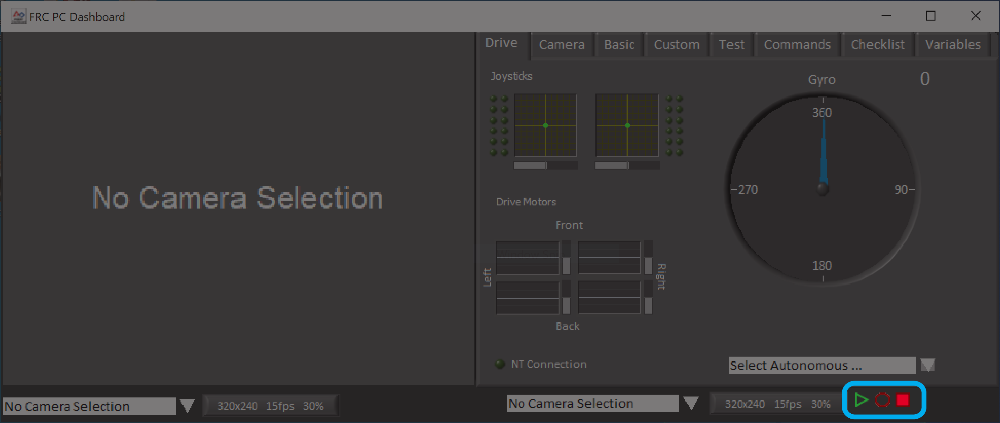

The LabVIEW Dashboard includes a Record/Playback feature that allows you to record video and NetworkTables data (such as the state of your Dashboard indicators) and play it back later.

Recording
^^^^^^^^^

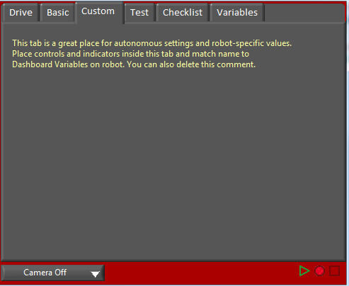

To begin recording, click the red circular Record button. The background of the right pane will turn red to indicate you are recording. To stop recording, press the red square Stop button.

Playback
^^^^^^^^

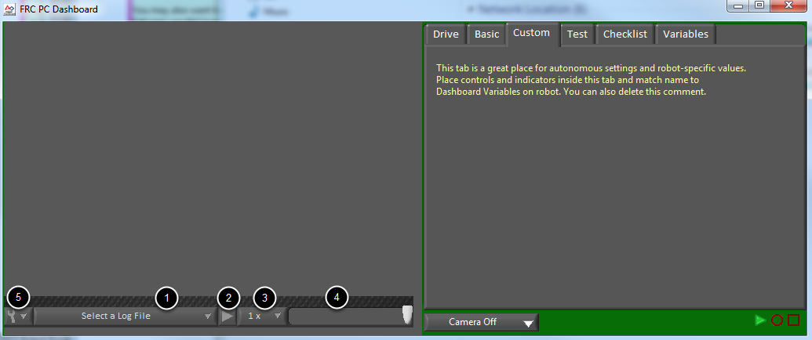

To play a recording back, click the green triangle Play button. The background of the right pane will begin pulsing green and playback controls will appear at the bottom of the camera pane.

#. File Selector - The dropdown allows you to select a log file to play back. The log files are named using the date and time and the dropdown will also indicate the length of the file. Selecting a logfile will immediately begin playing that file.
#. Play/Pause button - This button allows you to pause and resume playback of the log file.
#. Playback Speed - This dropdown allows you to adjust playback speed from 1/10 speed to 10x speed, the default is real-time (1x)
#. Time Control Slider - This slider allows you to fast-forward or rewind through the logfile by clicking on the desired location or dragging the slider.
#. Settings - With a log file selected, this dropdown allows you to rename or delete a file or open the folder containing the logs in Windows Explorer (Typically ``C:\Users\Public\Documents\FRC\Log Files\Dashboard``)
