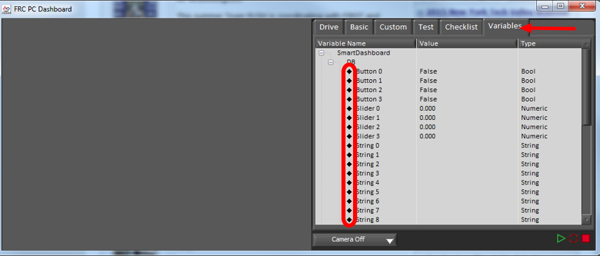
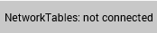

Troubleshooting Dashboard Connectivity
======================================

We have received a number of reports of Dashboard connectivity issues from events. This document will help explain how to recognize if the Dashboard is not connected to your robot, steps to troubleshoot this condition and a code modification you can make.

LabVIEW Dashboard
-----------------

This section discusses connectivity between the robot and LabVIEW dashboard

Recognizing LabVIEW Dashboard Connectivity
^^^^^^^^^^^^^^^^^^^^^^^^^^^^^^^^^^^^^^^^^^

If you have an indicator on your dashboard that you expect to be changing it may be fairly trivial to recognize if the Dashboard is connected. If not, there is a way to check without making any changes to your robot code. On the Variables tab of the Dashboard, the variables are shown with a black diamond when they are not synced with the robot. Once the Dashboard connects to the robot and these variables are synced, the diamond will disappear.

Troubleshooting LabVIEW Dashboard Connectivity
^^^^^^^^^^^^^^^^^^^^^^^^^^^^^^^^^^^^^^^^^^^^^^

If the Dashboard does not connect to the Robot (after the Driver Station has connected to the robot) the recommended troubleshooting steps are:

1. Close the Driver Station and Dashboard, then re-open the Driver Station (which should launch the Dashboard).

2. If that doesn't work, restart the Robot Code using the Restart Robot Code button on the Diagnostics tab of the Driver Station

Recognizing Connectivity
------------------------

This section discusses connectivity between the robot and SmartDashboard

Recognizing SmartDashboard Connectivity
^^^^^^^^^^^^^^^^^^^^^^^^^^^^^^^^^^^^^^^

.. image:: images/troubleshooting-dashboard-connectivity/connection-indicator.png
   :alt: Click "View" then "Add..." then Connection indicator to place one on the SmartDashboard.

The typical way to recognize connectivity with the SmartDashboard is to add a Connection Indicator widget and to make sure your code is writing at least one key during initialization or disabled to trigger the connection indicator. The connection indicator can be moved or re-sized if the Editable checkbox is checked.

Recognizing Shuffleboard Connectivity
^^^^^^^^^^^^^^^^^^^^^^^^^^^^^^^^^^^^^

Shuffleboard indicates if it is connected or not in the bottom right corner of the application as shown in the image above.

Recognizing Glass Connectivity
^^^^^^^^^^^^^^^^^^^^^^^^^^^^^^

.. image:: images/troubleshooting-dashboard-connectivity/glass-connection.png

Glass displays if it is connected or not in the bar across the top.  See this :ref:`page <docs/software/dashboards/glass/networktables-connection:Establishing NetworkTables Connections>` for more on configuring the connection.

Troubleshooting Connectivity
^^^^^^^^^^^^^^^^^^^^^^^^^^^^

If the Dashboard does not connect to the Robot (after the Driver Station has connected to the robot) the recommended troubleshooting steps are:

1. Restart the Dashboard (there is no need to restart the Driver Station software)

2. If that doesn't work, restart the Robot Code using the Restart Robot Code button on the Diagnostics tab of the Driver Station

3. If it still doesn't connect, verify that the Team Number / Server is set properly in the Dashboard and that your Robot Code writes a value during initialization or disabled
