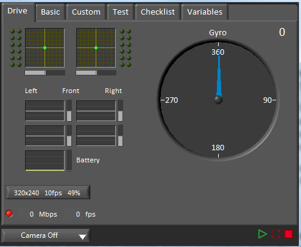
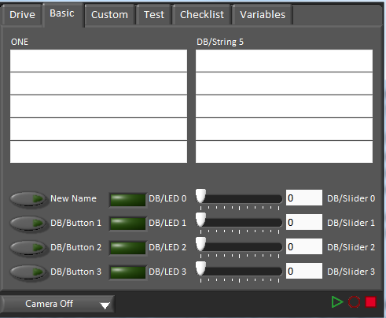
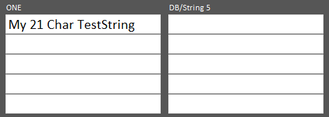
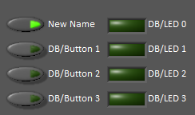
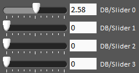

Using the LabVIEW Dashboard with C++/Java Code
==============================================

The default LabVIEW Dashboard utilizes :term:`NetworkTables` to pass values and is therefore compatible with C++ and Java robot programs. This article covers the keys and value ranges to use to work with the Dashboard.

Drive Tab
---------

The :guilabel:`Select Autonomous...` dropdown can be used so show the available autonomous routines and choose one to run for the match.

.. tabs::

    .. code-tab:: java

       SmartDashboard.putStringArray("Auto List", {"Drive Forwards", "Drive Backwards", "Shoot"});

       // At the beginning of auto
       String autoName = SmartDashboard.getString("Auto Selector", "Drive Forwards") // This would make "Drive Forwards the default auto
       switch(autoName) {
          case "Drive Forwards":
            // auto here
          case "Drive Backwards":
            // auto here
          case "Shoot":
            // auto here
       }

    .. code-tab:: c++

       frc::SmartDashboard::PutStringArray("Auto List", {"Drive Forwards", "Drive Backwards", "Shoot"});

       // At the beginning of auto
       String autoName = SmartDashboard.GetString("Auto Selector", "Drive Forwards") // This would make "Drive Forwards the default auto
       switch(autoName) {
          case "Drive Forwards":
            // auto here
          case "Drive Backwards":
            // auto here
          case "Shoot":
            // auto here
       }

Sending to the "Gyro" NetworkTables entry will populate the gyro here.

.. tabs::

    .. code-tab:: java

       SmartDashboard.putNumber("Gyro", drivetrain.getHeading());

    .. code-tab:: c++

       frc::SmartDashboard::PutNumber("Gyro", Drivetrain.GetHeading());

There are four outputs that show the motor power to the drivetrain.  This is configured for 2 motors per side and a tank style drivetrain.  This is done by setting "RobotDrive Motors" like the example below.

.. tabs::

    .. code-tab:: java

       SmartDashboard.putNumberArray("RobotDrive Motors", {drivetrain.getLeftFront(), drivetrain.getRightFront(), drivetrain.getLeftBack(), drivetrain.getRightBack()});

    .. code-tab:: c++

       frc::SmartDashboard::PutNumberArray("Gyro", {drivetrain.GetLeftFront(), drivetrain.GetRightFront(), drivetrain.GetLeftBack(), drivetrain.GetRightBack()});

Basic Tab
---------

The Basic tab uses a number of keys in the a "DB" sub-table to send/receive Dashboard data. The LED's are output only, the other fields are all bi-directional (send or receive).

Strings
^^^^^^^

The strings are labeled top-to-bottom, left-to-right from "DB/String 0" to "DB/String 9". Each String field can display at least 21 characters (exact number depends on what characters). To write to these strings:

.. tabs::

    .. code-tab:: java

       SmartDashboard.putString("DB/String 0", "My 21 Char TestString");

    .. code-tab:: c++

       frc::SmartDashboard::PutString("DB/String 0", "My 21 Char TestString");

To read string data entered on the Dashboard:

.. tabs::

    .. code-tab:: java

       String dashData = SmartDashboard.getString("DB/String 0", "myDefaultData");

    .. code-tab:: c++

       std::string dashData = frc::SmartDashboard::GetString("DB/String 0", "myDefaultData");

Buttons and LEDs
^^^^^^^^^^^^^^^^

The Buttons and LEDs are boolean values and are labeled top-to-bottom from "DB/Button 0" to "DB/Button 3" and "DB/LED 0" to "DB/LED 3". The Buttons are bi-directional, the LEDs are only able to be written from the Robot and read on the Dashboard. To write to the Buttons or LEDs:

.. tabs::

    .. code-tab:: java

       SmartDashboard.putBoolean("DB/Button 0", true);

    .. code-tab:: c++

       frc::SmartDashboard::PutBoolean("DB/Button 0", true);

To read from the Buttons: (default value is false)

.. tabs::

    .. code-tab:: java

       boolean buttonValue = SmartDashboard.getBoolean("DB/Button 0", false);

    .. code-tab:: c++

       bool buttonValue = frc::SmartDashboard::GetBoolean("DB/Button 0", false);

Sliders
^^^^^^^

The Sliders are bi-directional analog (double) controls/indicators with a range from 0 to 5. To write to these indicators:

.. tabs::

    .. code-tab:: java

       SmartDashboard.putNumber("DB/Slider 0", 2.58);

    .. code-tab:: c++

       frc::SmartDashboard::PutNumber("DB/Slider 0", 2.58);

To read values from the Dashboard into the robot program: (default value of 0.0)

.. tabs::

    .. code-tab:: java

       double dashData = SmartDashboard.getNumber("DB/Slider 0", 0.0);

    .. code-tab:: c++

       double dashData = frc::SmartDashboard::GetNumber("DB/Slider 0", 0.0);
