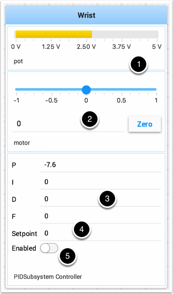

Testing and Tuning PID Loops
============================

One challenge in using sensors to control mechanisms is to have a good algorithm to drive the motors to the proper position or speed. The most commonly used control algorithm is called PID control.  There is a `good set of videos <https://wp.wpi.edu/wpilib/robotics-videos/>`__ (look for the robot controls playlist) that explain the control algorithms described here The PID algorithm converts sensor values into motor speeds by:

1. Reading sensor values to determine how far the robot or mechanism from the desired setpoint. The setpoint is the sensor value that corresponds to the expected goal. For example, a robot arm with a wrist joint should be able to move to a specified angle very quickly and stop at that angle as indicated by a sensor. A potentiometer is a sensor that can measure. rotational angle. By connecting it to an analog input, the program can get a voltage measurement that is directly proportional to the angle.
2. Compute an error (the difference between the sensor value and the desired value). The sign of the error value indicates which side of the setpoint the wrist is on. For example negative values might indicate that the measured wrist angle is larger than the desired wrist angle. The magnitude of the error is how far the measured wrist angle is from the actual wrist angle. If the error is zero, then the measured angle exactly matches the desired angle. The error can be used as an input to the PID algorithm to compute a motor speed.
3. The resultant motor speed is them used to drive the motor in the correct direction and a speed that hopefully will reach the setpoint as quickly as possible without overshooting (moving past the setpoint).

WPILib has a PIDController class that implements the PID algorithm and accepts constants that correspond to the Kp, Ki, and Kd values. The PID algorithm has three components that contribute to computing the motor speed from the error.

1. P (proportional) - this is a term that when multiplied by a constant (Kp) will generate a motor speed that will help move the motor in the correct direction and speed.
2. I (integral) - this term is the sum of successive errors. The longer the error exists the larger the integral contribution will be. It is simply a sum of all the errors over time. If the wrist isn't quite getting to the setpoint because of a large load it is trying to move, the integral term will continue to increase (sum of the errors) until it contributes enough to the motor speed to get it to move to the setpoint. The sum of the errors is multiplied by a constant (Ki) to scale the integral term for the system.
3. D (differential) - this value is the rate of change of the errors. It is used to slow down the motor speed if it's moving too fast. It's computed by taking the difference between the current error value and the previous error value. It is also multiplied by a constant (kd) to scale it to match the rest of the system.

Tuning the PID Controller
-------------------------

Tuning the PID controller consists of picking constants that will give good performance. Shuffleboard helps this process by displaying the details of a PID subsystem with a user interface for setting constant values and testing how well it operates. This is displayed while the robot is operating in test mode (done by setting "Test" in the driver station).

This is the test mode picture of a wrist subsystem that has a potentiometer as the sensor (pot) and a motor controller connected to the motor. It has a number of areas that correspond to the PIDSubsystem.

1. The analog input voltage value from the potentiometer. This is the sensor input value.
2. A slider that moves the wrist motor in either direction with 0 as stopped. The positive and negative values correspond to moving up or down.
3. The PID constants as described above (F is a feedforward value that is used for speed PID loops)
4. The setpoint value that corresponds the to the pot value when the wrist has reached the desired value
5. Enables the PID controller - No longer working, see below.

Try various PID gains to get the desired motor performance. You can look at the video linked to at the beginning of this article or other sources on the internet to get the desired performance.

.. important:: The enable option does not affect the `PIDController <https://first.wpi.edu/wpilib/allwpilib/docs/beta/java/edu/wpi/first/math/controller/PIDController.html>`__ introduced in 2020, as the controller is updated every robot loop. See the example below on how to retain this fuctionality.

Enable Functionality in the New PIDController
---------------------------------------------

The following example demonstrates how to create a button on your dashboard that will enable/disable the PIDController.

.. tabs::

  .. code-tab:: java

    ShuffleboardTab tab = Shuffleboard.getTab("Shooter");
    NetworkTableEntry shooterEnable = tab.add("Shooter Enable", false).getEntry();

    // Command Example assumed to be in a PIDSubsystem
    new NetworkButton(shooterEnable).whenPressed(new InstantCommand(m_shooter::enable));

    // Timed Robot Example
    if (shooterEnable.getBoolean()) {
      // Calculates the output of the PID algorithm based on the sensor reading
      // and sends it to a motor
      motor.set(pid.calculate(encoder.getDistance(), setpoint));
    }

  .. code-tab:: c++

    frc::ShuffleboardTab& tab = frc::Shuffleboard::GetTab("Shooter");
    nt::NetworkTableEntry shooterEnable = tab.Add("Shooter Enable", false).GetEntry();

    // Command-based assumed to be in a PIDSubsystem
    frc2::NetworkButton(shooterEnable).WhenPressed(frc2::InstantCommand([&] { m_shooter.Enable(); }));

    // Timed Robot Example
    if (shooterEnable.GetBoolean()) {
      // Calculates the output of the PID algorithm based on the sensor reading
      // and sends it to a motor
      motor.Set(pid.Calculate(encoder.GetDistance(), setpoint));
    }
