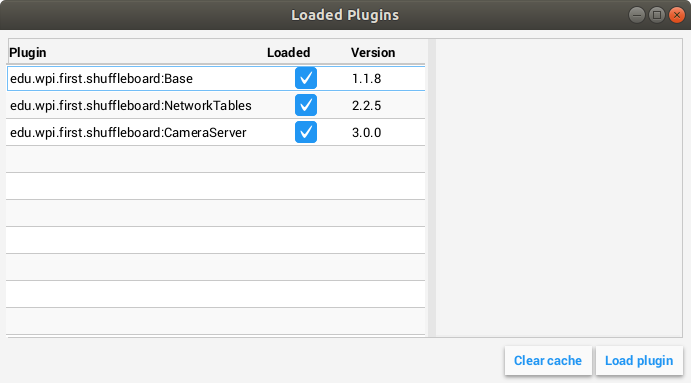

.. include:: <isonum.txt>

Creating a Plugin
=================

Overview
--------
Plugins provide the ability to create custom widgets, layouts, data sources/types, and custom themes. Shuffleboard provides the following :ref:`built-in plugins <docs/software/dashboards/shuffleboard/custom-widgets/builtin-plugins:Built-in Plugins>`.

- NetworkTables Plugin: To connect to data published over NetworkTables
- Base Plugin: To display custom FRC\ |reg| data types in custom widgets
- CameraServer Plugin: To view streams from the CameraServer

.. tip:: An example custom Shuffleboard plugin which creates a custom data type and a simple widget for displaying it can be found `here <https://github.com/wpilibsuite/shuffleboard/tree/main/example-plugins/custom-data-and-widget>`__.

Create a Custom Plugin
----------------------
In order to define a plugin, the plugin class must be a subclass of `edu.wpi.first.shuffleboard.api.Plugin <https://github.com/wpilibsuite/shuffleboard/blob/main/api/src/main/java/edu/wpi/first/shuffleboard/api/plugin/Plugin.java>`_ or one of its subclasses. An example of a plugin class would be as following.

.. tabs::

   .. code-tab:: java

      import edu.wpi.first.shuffleboard.api.plugin.Description;
      import edu.wpi.first.shuffleboard.api.plugin.Plugin;

      @Description(group = "com.example", name = "MyPlugin", version = "1.2.3", summary = "An example plugin")
      public class MyPlugin extends Plugin {

      }

Additional explanations on how these attributes are used, including version numbers can be found `here <https://semver.org/>`_.

Note the ``@Description`` annotation is needed to tell the plugin loader the properties of the custom plugin class.
Plugin classes are permitted to have a default constructor but it cannot take any arguments.

Building plugin
---------------
Plugins require the usage of the `Shuffleboard API Library <https://frcmaven.wpi.edu/artifactory/development/edu/wpi/first/shuffleboard/api/>`_. These dependencies can be resolved in the ``build.gradle`` file or using maven. The dependencies would be as follows:

For Gradle:

.. code-block:: groovy

   repositories {
      mavenCentral()
      maven{ url "https://frcmaven.wpi.edu:443/artifactory/release" }
   }

   dependencies {
      compileOnly 'edu.wpi.first.shuffleboard:api:2020.+'
      compileOnly 'edu.wpi.first.shuffleboard.plugin:networktables:2020.+'
   }

Plugins are allowed to have dependencies on other plugins and libraries, however, they must be included correctly in the maven or gradle build file. When a plugin depends on other plugins, it is good practice to define those dependencies so the plugin does not load when the dependencies do not load as well. This can be done using the ``@Requires`` annotation as shown below:

.. code-block:: java

   @Requires(group = "com.example", name = "Good Plugin", minVersion = "1.2.3")
   @Requires(group = "edu.wpi.first.shuffleboard", "Base", minVersion = "1.0.0")
   @Description(group = "com.example", name = "MyPlugin", version = "1.2.3", summary = "An example plugin")
   public class MyPlugin extends Plugin {

   }

The ``minVersion`` specifies the minimum allowable version of the plugin that can be loaded. For example, if the ``minVersion`` is 1.4.5, and the plugin with the version 1.4.7 is loaded, it will be allowed to do so. However, if the plugin with the version 1.2.4 is loaded, it will not be allowed to since it is less than the ``minVersion``.

Deploying Plugin To Shuffleboard
--------------------------------
In order to load a plugin in Shuffleboard, you will need to generate a jar file of the plugin and put it in the ``~/Shuffleboard/plugins`` folder. This can be done automatically
from gradle as noted:

.. code-block::groovy

   task deployPlugin (type: Copy, group: "...", description: "...", dependsOn: "build") {
      from "build/libs"
      into "path/to/Shuffleboard/plugins"
      include "*.jar"
   }

The path to your Shuffleboard plugin folder will most likely be ``~/Shuffleboard/plugins``.

The ``deployPlugin`` task takes four parameters, the ``type: Copy`` parameter makes the task implement the `CopySpec <https://docs.gradle.org/current/javadoc/org/gradle/api/file/CopySpec.html>`_ interface
specifying what to copy. The group and description parameters to specify what the Group ID of the plugin is and a short descriptive description to what the Plugin does.

In the body, the ``from`` field specifies from where the file is to be copied from, followed by the ``into`` field specifying the destination to where the file needs to be copied to.
Finally, the ``include`` field ensures all files with the ``.jar`` extension is also copied.

After deploying, Shuffleboard will cache the path of the plugin so it can be automatically loaded the next time Shuffleboard loads. It may be necessary to click on ``Clear Cache`` under the plugins menu to remove a plugin or reload a plugin into Shuffleboard.

By running ``gradle deployPlugin`` from the command line, the jar file will automatically placed into the Shuffleboard plugin folder.

Manually Adding Plugin
----------------------
The other way to add a plugin to Shuffleboard is to compile it to a jar file and add it from Shuffleboard.
First, compile your plugin into a ``.jar`` file using Maven or Gradle. Then, open Shuffleboard, click on the file tab in the top left, and choose Plugins from the drop down menu.

From the plugins window, choose the "Load plugin" button in the bottom right, and select your jar file.
