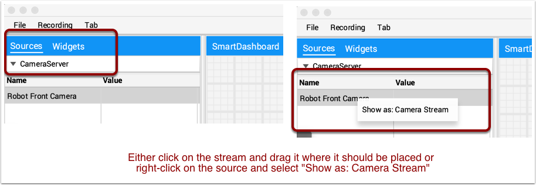
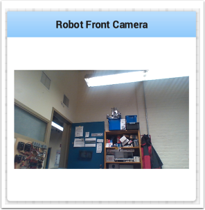

Displaying Camera Streams
=========================

Camera streams from the robot can be viewed on a tab in Shuffleboard. This is useful for viewing what the robot is seeing to give a less obstructed view for operators or helping visualize the output from a vision algorithm running on the driver station computer or a coprocessor on the robot. Any stream that is running using the CameraServer API can be viewed in a camera stream widget.

Adding a Camera Stream
----------------------

To add a camera to your dashboard select "Sources" and view the "CameraServer" source in the left side panel in the Shuffleboard window as shown in the example below. A list of camera streams will be shown, in this case there is only one camera called "Robot Front Camera". Drag that to the tab where it should be displayed. Alternatively the stream can also be placed on the dashboard by right-clicking on the stream in the Sources list and selecting "Show as: Camera Stream".

Once the camera stream is added it will be displayed in the window. It can be resized and moved where you would like it.

.. note:: Be aware that sending too much data from too high a resolution or too high a frame rate will cause high CPU usage on both the roboRIO and the laptop.

