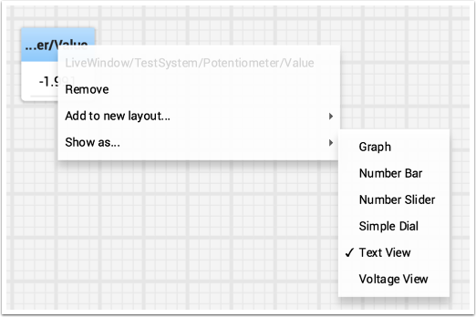
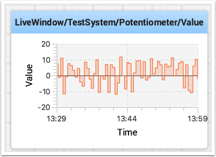
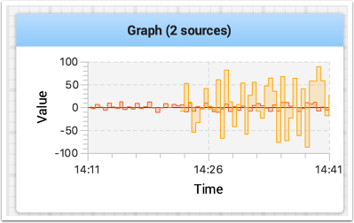
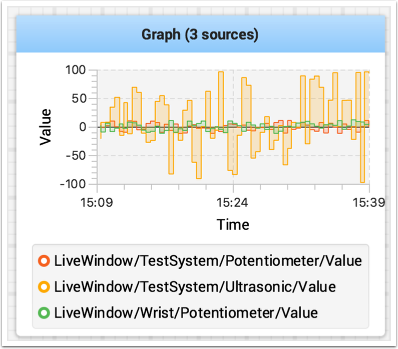
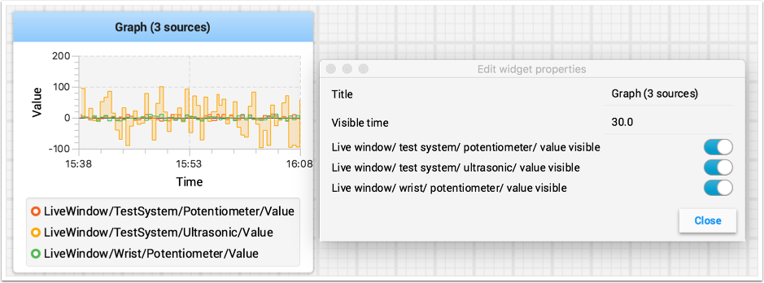

Working with Graphs
===================

With Shuffleboard you can graph numeric values over time. Graphs are very useful to see how sensor or motor values are changing as your robot is operating. For example the sensor value can be graphed in a PID loop to see how it is responding during tuning.

To create a graph, choose a numeric value and right-click in the heading and select "Show as..." and then choose graph

The graph widget shows line plots of the value that you selected. It will automatically set the scale and the default time interval that the graph will show will be 30 seconds. You can change that in the setting for the graph (see below).

Adding Additional Data Values
-----------------------------

For related values it is often desirable to show multiple values on the same graph. To do that, simply drag additional values from the NetworkTables source view (left side of the Shuffleboard window) and drop it onto the graph and that value will be added as shown below. You can continue to drag additional values onto the graph.

You can resize the graph vertically to view the legend if it is not displayed as shown in the image below. The legend shows all the sources that are used in the plot.

Setting Graph Properties
------------------------

You can set the number of seconds that are shown in the graph by changing the "Visible time" in the graph widget properties. To access the properties, right-click on the graph and select "Edit properties".

In addition to setting the visible time the graph can selectively turn sources on and off by turning the switch on and off for each of the sources shown in the properties window (see below).

