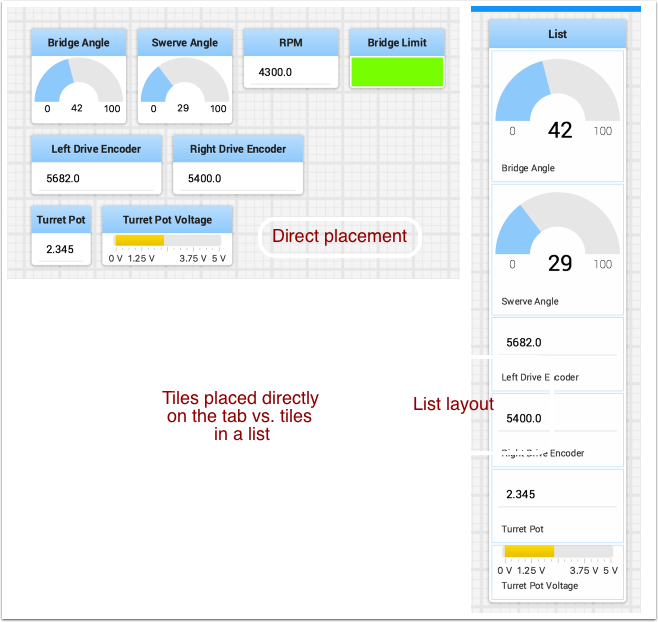
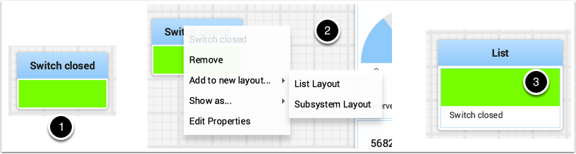
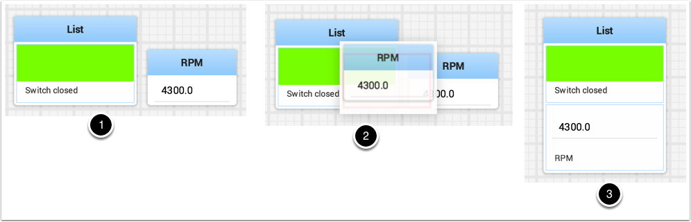
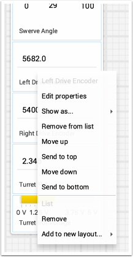
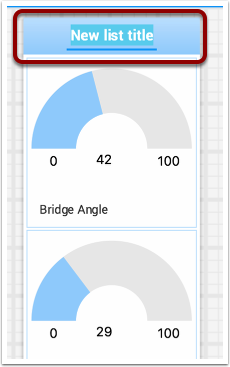

Working with Lists
==================

Lists are sets of tiles that are logically grouped together in a vertical layout. When tiles are added to a list,it becomes visually obvious that the tiles are related in function. In addition tiles in lists take up less screen space than the same tiles directly on the desktop because tiles in a list don't display the dark window title, but instead display a smaller textual label documenting the contents of the list.

Creating a list
---------------

A list can be created by: 1. Right-clicking on the first tile that should go into the list. 2. Select the "Add to new layout..." option from the popup menu. 3. A new list will be created called "List" and the tile will be at the top of it. Notice that tiles in lists do not have the window title at the top, but instead have the text that was in the window title.

Adding tiles to a list
----------------------

Add tiles to a list layout by: 1. identify the list and the tile to be added. 2. Drag the new tile onto the list. 3. The tile will be added to the list. If there is no room as the list is currently sized, the tile will be added off the end of the list and a vertical scrollbar will be added if it's not already there.

Rearranging tiles in a list
---------------------------

Tiles in a list can be rearranged by right-clicking on the tile to be moved and selecting:

1. "Move up" to move the tile before the previous tile
2. "Move down" to move the tile after the next tile
3. "Send to top" to move the tile to the top of the list
4. "Send to bottom" to move the tile to the bottom of the list
5. "Remove from list" to delete the tile from the list.

Renaming a list
---------------

You can rename a list by double-clicking on the list title and changing the name. Click outside fo the title to save the changes

