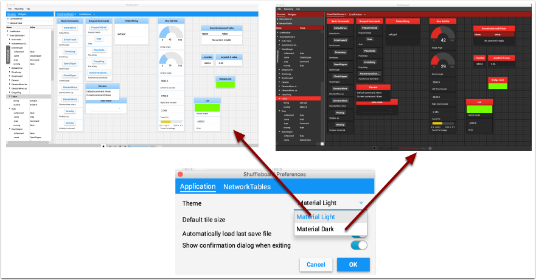
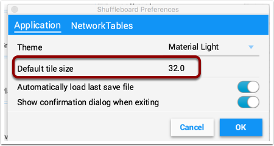
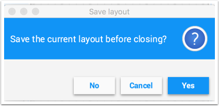
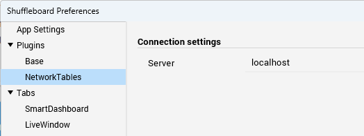

Setting global preferences for Shuffleboard
===========================================

There are a number of settings that set the way Shuffleboard looks and behaves. Those are on the Shuffleboard Preferences pane that can be accessed from the File menu.

Setting the theme
-----------------

Shuffleboard supports two themes, Material Dark and Material Light and the setting depends on your preferences. This uses css styles that apply to the entire application and can be changed any time.

Setting the default tile size
-----------------------------

Shuffleboard positions tiles on a grid when you are adding or moving them yourself or when they are auto-populated. You can set the default tile size when for each tab or it can be set globally for all the tabs created after the default setting is changed. Finer resolution in the grid results in finer control over placement of tiles. This can be set in the Shuffleboard Preferences window as shown below.

Working with the layout save files
----------------------------------

You can save your layout using the File / Save and File / Save as... menu options. The preferences window has options to cause the previous layout to be automatically applied when Shuffleboard starts. In addition, Shuffleboard will display a "Save layout" window to remind you to save the layout on exit, if the layout has changed. You can choose to turn off the automatic prompt on exit, but be sure to save the layout manually in this case so you don't loose your changes.

Setting the team number
-----------------------

In order for Shuffleboard to be able to find your NetworkTables server on your robot, specify your team number in the "NetworkTables" tab on the Preferences pane. If you're running Shuffleboard with a running Driver Station, the Server field will be auto-populated with the correct information. If you're running on a computer without the Driver Station, you can manually enter your team number or the robotRIO network address.
