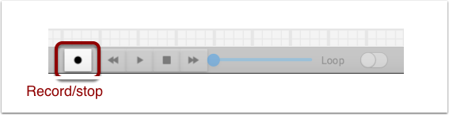
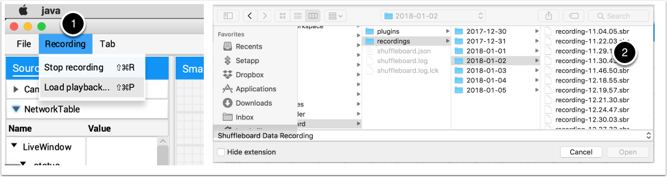
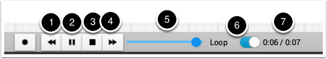
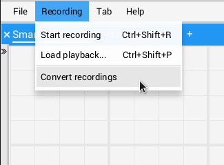
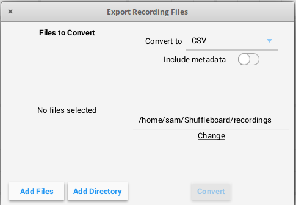

Recording and Playback
======================

Shuffleboard can log all widget updates during a session. Later the log file can be "played back" to see what happened during a match or a practice run. This is especially useful if something doesn't operate as intended during a match and you want to see what happened. Each recording is captured in a recording file.

Creating a Recording
--------------------

When shuffleboard starts it begins recording to all the NetworkTables values are recorded and continues until stopped by hitting the record/stop button in the recorder controls as shown below. If a new recording is desired, such as when a new piece of code or mechanical system is being tested, stop the current recording if it is running, and click the record button. Click the button again to stop recording and close the recording file. If the button is round (as shown) then click it to start a recording. If the button is a square, then a recoding is currently running so click it to stop the recording.

Playing a Recording
-------------------

Previous recordings can be played back by:

1. Selecting the "Recording" menu then click "Load playback".
2. Choose a recording from the from the directory shown. Recordings are grouped by date and the file names are the time the recording was made to help identify the correct one. Select the correct recording from the list.

Controlling the Playback
------------------------

Selecting the recoding file will begin playback of that file. While the recording is playing the recording controls will show the current time within the recording as well as the option to loop the recording while watching it. When the recording is being played back the "transport" controls will allow the playback to be controlled.

The controls work as follows:

1. The left double-arrow button backs up the playback to the last changed data point
2. The play/pause controls starts and stops the playback
3. The square stop button stops playback and resumes showing current robot values
4. The right double-arrow skips forward to the next changed data value
5. The slider allows for direct positioning to any point in time to view different parts of the recording
6. The loop switch turns on playback looping, that is, the playback will run over and over until stopped
7. The time shows the current point within the recording and the total time of the recording

Converting to Different File Formats
------------------------------------

Shuffleboard recordings are in a custom binary format for efficiency. To analyze recorded data without playing it back through the app, Shuffleboard supports data converters to convert the recordings to an arbitrary format. Only a simple CSV converter is shipped with the app, but teams can write custom converters and include them in Shuffleboard plugins.

Multiple recordings can be converted at once. Individual files can be selected with the "Add Files" button, or all recording files in a directory can be selected at once with the "Add Directory" button.

Converted recordings will be generated in the ``~/Shuffleboard/recordings`` directory, but can be manually selected with the "Change" button.

Different converters can be selected with the dropdown in the top right. By default, only the CSV converter is available. Custom converters from plugins will appear as options in the dropdown.

Additional Notes
----------------

Graphs won't display properly while scrubbing the timeline but if it is playing through where the graph history can be captured by the graph then they will display as in the original run.
