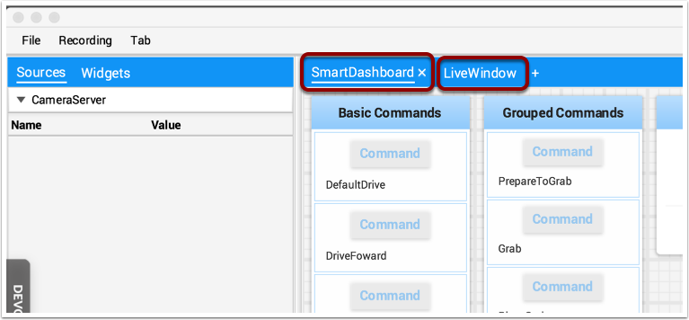
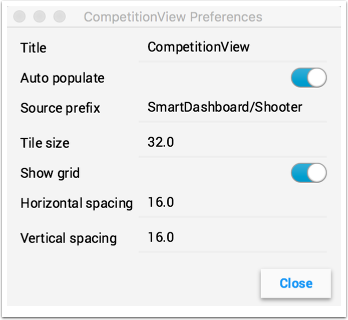
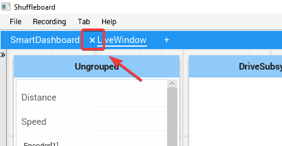

Creating and manipulating tabs
==============================

The tabbed layout the Shuffleboard uses help separate different "views" of your robot data and make the displays more useful. You might have a tab the has the display for helping debug the robot program and a different tab for use in competitions. There are a number of options that make tabs very powerful. You can control which data from NetworkTables or other sources appears in each of your tabs using the auto-populate options described later in this article.

Default tabs
------------

When you open Shuffleboard for the first time there are two tabs, labeled SmartDashboard and LiveWindow. These correspond to the two views that SmartDashboard had depending on whether your robot is running in Autonomous/Teleop or Test mode. In shuffleboard both of these views are available any time.

On the SmartDashboard tab all the values that are written using the SmartDashboard.putType() set of methods. On the LiveWindow tab all the autogenerated debugging values are shown.

Switching between tabs
----------------------

You can switch between tabs clicking on the tab label at the top of the window. In the case above, simply click on SmartDashboard or LiveWindow to see the values that are associated with each tab.

Adding and Hiding Tabs
----------------------

You can add additional tabs by clicking on the plus(+) symbol just to the right of the last tab. Once you create a new tab you can set the label by double-clicking on the label in the tab and editing it. You can also right-click on the tab or use the Tab menu to bring up the tab preferences and from that window you can change the name by editing the Title field.

You can hide tabs by clicking the minus(-) symbol to the left of the selected tab name. Since tabs are generated based on the relevant :term:`NetworkTable <NetworkTables>`, it is not possible to permanently delete them without deleting the table.

Setting the tab to auto-populate
--------------------------------

One of the most powerful features with tabs is to have them automatically populate new values based on a source prefix that is supplied in the tab Preferences pane. In the above example the Preferences pane has a Source prefix of "SmartDashboard/Shooter" and Auto populate is turned on. Any values that are written using the SmartDashboard class that specifies a sub-key of Shooter will automatically appear on that tab. Note: keys that match more than one Source prefix will appear in both tabs. Because those keys also start with SmartDashboard/ and that's the Source prefix for the default SmartDashboard tab, those widgets will appear in both panes. To only have values appear in one pane, you can use NetworkTables to write labels and values and use a different path that is not under SmartDashboard. Alternatively you could let everything appear in the SmartDashboard tab making it very cluttered, but have specific tabs for your needs that will be better filtered.

Using the tab grid and spacing
------------------------------

Each tab can have it's own Tile size (number of pixels per large square). So some tabs might have coarser resolution for easier layout and others might have a fine grid. The Tile size in the Tab preferences overrides any global settings in the Shuffleboard preferences. In addition, you can specify the padding between the drawing in the widget and the edge of the of the widget. If you program user interfaces these parameters are usually referred to as horizontal and vertical gap (hgap, vgap).

Moving widgets between tabs
---------------------------

Currently there is no way to easily move widgets between tabs without deleting it from one tab and dragging the field from the sources hierarchy on the left into the new pane. We hope to have that capability in a subsequent update soon.
