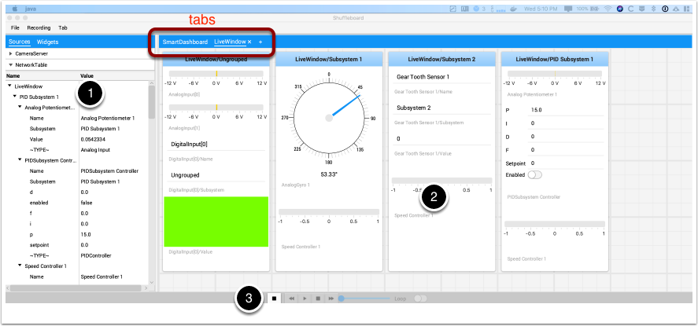
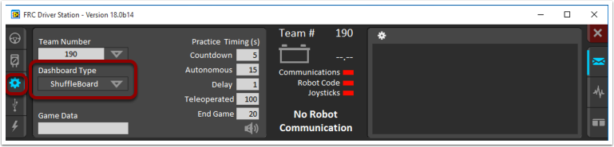
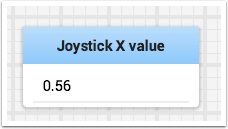

.. include:: <isonum.txt>

Tour of Shuffleboard
====================

Shuffleboard is a dashboard for FRC\ |reg| based on newer technologies such as JavaFX that are available to Java programs. It is designed to be used for creating dashboards for C++ and Java programs. If you've used SmartDashboard in the past then you are already familiar with many of the features of Shuffleboard since they fundamentally work the same way. But Shuffleboard has many features that aren't in SmartDashboard. Here are some of the highlights:

-  Graphics is based on **JavaFX**, the Java graphics standard. Each of the components has an associated style sheet so it becomes possible to have different "skins" or "themes" for Shuffleboard. We supply default light and dark themes.
-  Shuffleboard supports **multiple sheets for the display of your data**. In fact you can create a new sheet (shown as a tab in the Shuffleboard window) and indicate if and which data should be autopopulated on it. By default there is a Test tab and a SmartDashboard tab that are autopopulated as data arrives. Other tabs might be for robot debugging vs. driving.
-  Graphical **display elements (widgets) are laid out on a grid** to keep the interface clean and easy to read. You can change the grid size to have more or less resolution in your layouts and visual cues are provided to help you change your layout using drag and drop. Or you can choose to turn off the grid lines although the grid layout is preserved.
-  Layouts are saved and the previous layout is instantiated by default when you run shuffleboard again.
-  There is a **record and playback** feature that lets you review the data sent by your robot program after it finishes. That way you can carefully review the actions of the robot if something goes wrong.
-  **Graph widgets are available for numeric data** and you can drag data onto a graph to see multiple points at the same time and on the same scale.
-  You can extend Shuffleboard by writing your own widgets that are specific to your team's requirements. Documentation on extending it can be found in :doc:`Custom Widgets</docs/software/dashboards/shuffleboard/custom-widgets/index>`.

1. **Sources area:** Here are data sources from which you can choose values from NetworkTables or other sources to display by dragging a value into one of the tabs
2. **Tab panes:** This is where you data is displayed from the robot or other sources. In this example it is Test-mode subsystems that are shown here in the LiveWindow tab. This area can show any number of tabbed windows, and each window has it's own set of properties like grid size and auto-populate.
3. **Record/playback controls:** set of media-like controls where you can playback the current session to see historical data

Starting Shuffleboard
---------------------

You can start Shuffleboard in one of four ways:

1. You can automatically start it when the Driver Station starts by setting the "Dashboard Type" to Shuffleboard in the settings tab as shown in the picture above.
2. You can run it by double-clicking the Shuffleboard icon in the WPILib tools folder on the Windows Desktop.
3. You can run it by double-clicking on the shuffleboard.XXX file (where XXX is ``.vbs`` on Windows and ``.py`` on Linux or macOS) in ``~/WPILib/YYYY/tools/`` (where YYYY is the year and ~ is ``C:\Users\Public`` on Windows). This is useful on a development system that does not have the Driver Station installed such as a macOS or Linux system.
4. You can start it from the command line by typing the command: ``shuffleboard`` on Windows or ``python shuffleboard.py`` on macOS or Linux from ``~/WPILib/YYYY/tools`` directory (where YYYY is the year and ~ is ``C:\Users\Public`` on Windows). This is often easiest on a development system that doesn't have the Driver Station installed.

.. note:: The ``.vbs`` (Windows) and ``.py`` (macOS/Linux) scripts help launch the tools using the correct JDK.

Getting robot data onto the dashboard
-------------------------------------

The easiest way to get data displayed on the dashboard is simply to use methods in the SmartDashboard class. For example to write a number to Shuffleboard write:

.. tabs::

   .. code-tab:: java

        SmartDashboard.putNumber("Joystick X value", joystick1.getX());

to see a field displayed with the label "Joystick X value" and a value of the X value of the joystick. Each time this line of code is executed, a new joystick value will be sent to Shuffleboard. Remember: you must write the joystick value whenever you want to see an updated value. Executing this line once at the start of the program will only display the value once at the time the line of code was executed.

