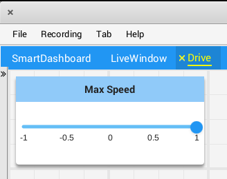
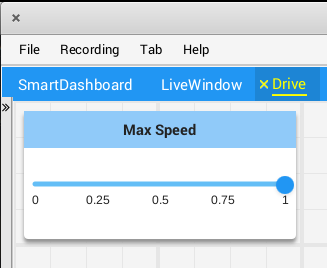

Configuring widgets
===================

Robot programs can specify exactly which widget to use to display a data point, as well as how that widget should be configured. As there are too many widgets to be listed here, consult the docs for details.

Specifying a widget
-------------------

Call ``withWidget`` after ``add`` in the call chain:

.. tabs::

   .. code-tab:: java

       Shuffleboard.getTab("Drive")
        .add("Max Speed", 1)
        .withWidget(BuiltInWidgets.kNumberSlider) // specify the widget here
        .getEntry();

   .. code-tab:: cpp

       frc::Shuffleboard::GetTab("Drive")
        .Add("Max Speed", 1)
        .WithWidget(frc::BuiltInWidgets::kNumberSlider) // specify the widget here
        .GetEntry();

In this example, we configure the "Max Speed" widget to use a slider to modify the values instead of a basic text field.

Setting widget properties
-------------------------
Since the maximum speed only makes sense to be a value from 0 to 1 (full stop to full speed), a slider from -1 to 1 can cause problems if the value drops below zero. Fortunately, we can modify that using the ``withProperties`` method

.. tabs::

   .. code-tab:: java

    Shuffleboard.getTab("Drive")
        .add("Max Speed", 1)
        .withWidget(BuiltInWidgets.kNumberSlider)
        .withProperties(Map.of("min", 0, "max", 1)) // specify widget properties here
        .getEntry();

   .. code-tab:: cpp

    frc::Shuffleboard::GetTab("Drive")
        .Add("Max Speed", 1)
        .WithWidget(frc::BuiltInWidgets::kNumberSlider)
        .WithProperties({ // specify widget properties here
          {"min", nt::Value::MakeDouble(0)},
          {"max", nt::Value::MakeDouble(1)}
        })
        .GetEntry();

Notes
-----
Widgets can be specified by name; however, names are case- and whitespace-sensitive ("Number Slider" is different from "Number slider" and "NumberSlider"). For this reason, it is recommended to use the built in widgets class to specify the widget instead of by raw name. However, a custom widget can only be specified by name or by creating a custom ``WidgetType`` for that widget.

Widget property names are neither case-sensitive nor whitespace-sensitive ("Max" and "max" are the same). Consult the documentation on the widget in the BuiltInWidgets class for details on the properties of that widget.
