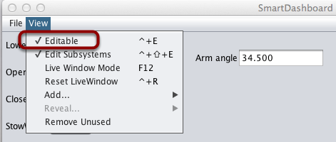
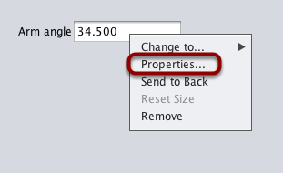
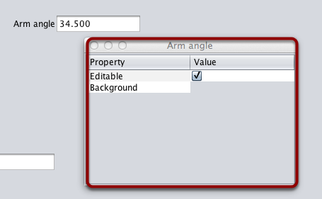
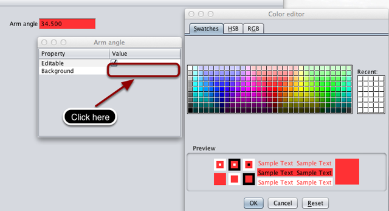
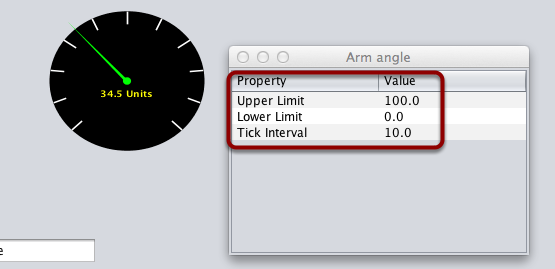

Changing the display properties of a value
==========================================

Each value displayed with SmartDashboard has a set of properties that effect the way it's displayed.

Setting the SmartDashboard display into editing mode
----------------------------------------------------

The SmartDashboard has two modes it can operate in, display mode and edit mode. In edit mode you can move around widgets on the screen and edit their properties. To put the SmartDashboard into edit mode, click the "View" menu, then select "Editable" to turn on edit mode.

Getting the properties editor of a widget
-----------------------------------------

Once in edit mode, you can display and edit the properties for a widget. Right-click on the widget and select "Properties...".

Editing the properties on a field
---------------------------------

A dialog box will be shown in response to the "Properties..." menu item on the widgets right-click context menu.

Editing the widgets background color
------------------------------------

To edit a property value, say, Background color, click the background color shown (in this case grey), and choose a color from the color editor that pops up. This will be used as the widgets background color.

Edit properties of other widgets
--------------------------------

Different widget types have different sets of editable properties to change the appearance. In this example, the upper and lower limits of the dial and the tick interval are changeable parameters.
