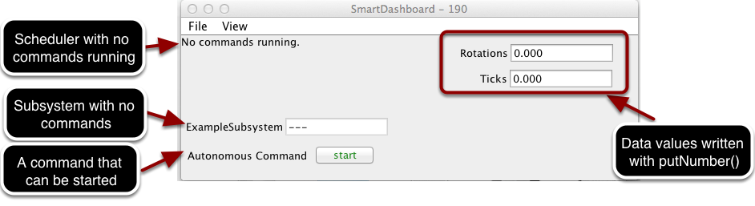
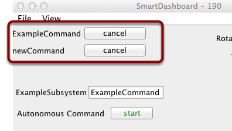
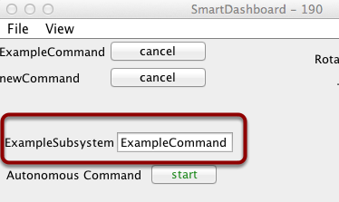
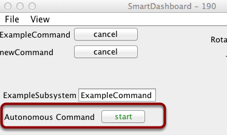

Displaying the Status of Commands and Subsystems
================================================

If you are using the command-based programming features of WPILib, you will find that they are very well integrated with SmartDashboard. It can help diagnose what the robot is doing at any time and it gives you control and a view of what's currently running.

Overview of Command and Subsystem Displays
------------------------------------------

With SmartDashboard you can display the status of the commands and subsystems in your robot program in various ways. The outputs should significantly reduce the debugging time for your programs. In this picture you can see a number of displays that are possible. Displayed here are:

- The Scheduler currently with ``No commands running``. In the next example you can see what it looks like with a few commands running showing the status of the robot.
- A subsystem, ``ExampleSubsystem`` that indicates that there are currently no commands running that are "requiring" it. When commands are running, it will indicate the name of the commands that are using the subsystem.
- A command written to SmartDashboard that shows a ``start`` button that can be pressed to run the command. This is an excellent way of testing your commands one at a time.
- And a few data values written to the dashboard to help debug the code that's running.

In the following examples, you'll see what the screen would look like when there are commands running, and the code that produces this display.

Displaying the Scheduler Status
-------------------------------

.. tabs::

  .. code-tab:: java

    SmartDashboard.putData(CommandScheduler.getInstance());

  .. code-tab:: c++

    frc::SmartDashboard::PutData(frc2::CommandScheduler::GetInstance());

You can display the status of the Scheduler (the code that schedules your commands to run). This is easily done by adding a single line to the ``RobotInit`` method in your RobotProgram as shown here. In this example the Scheduler instance is written using the ``putData`` method to SmartDashboard. This line of code produces the display in the previous image.

This is the scheduler status when there are two commands running, ``ExampleCommand`` and ``newCommand``. This replaces the ``No commands running.`` message from the previous screen image. You can see commands displayed on the dashboard as the program runs and various commands are triggered.

Displaying Subsystem Status
---------------------------

.. tabs::

  .. code-tab:: java

    SmartDashboard.putData(exampleSubsystem);

  .. code-tab:: c++

    frc::SmartDashboard::PutData(&exampleSubsystem);

In this example we are writing the command instance, ``exampleSubsystem`` and instance of the ``ExampleSubsystem`` class to the SmartDashboard. This causes the display shown in the previous image. The text field will either contain a few dashes, ``---`` indicating that no command is current using this subsystem, or the name of the command currently using this subsystem.

Running commands will "require" subsystems. That is the command is reserving the subsystem for its exclusive use. If you display a subsystem on SmartDashboard, it will display which command is currently using it. In this example, ``ExampleSubsystem`` is in use by ``ExampleCommand``.

Activating Commands with a Button
---------------------------------

.. tabs::

  .. code-tab:: java

    SmartDashboard.putData("Autonomous Command", exampleCommand);

  .. code-tab:: c++

    frc::SmartDashboard::PutData("Autonomous Command", &exampleCommand);

This is the code required to create a button for the command on SmartDashboard. Pressing the button will schedule the command. While the command is running, the button label changes from ``start`` to ``cancel`` and pressing the button will cancel the command.

In this example you can see a button labeled ``Autonomous Command``. Pressing this button will run the associated command and is an excellent way of testing commands one at a time without having to add throw-away test code to your robot program. Adding buttons for each command makes it simple to test the program, one command at a time.
