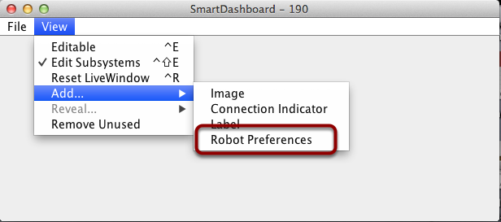
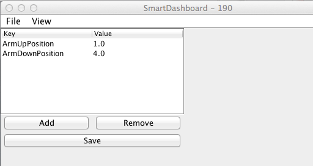

Setting Robot Preferences
=========================

The Robot Preferences (`Java <https://first.wpi.edu/wpilib/allwpilib/docs/development/java/edu/wpi/first/wpilibj/Preferences.html>`__, `C++ <https://first.wpi.edu/wpilib/allwpilib/docs/development/cpp/classfrc_1_1_preferences.html>`__) class is used to store values in the flash memory on the roboRIO. The values might be for remembering preferences on the robot such as calibration settings for potentiometers, PID values, etc. that you would like to change without having to rebuild the program. The values can be viewed on the SmartDashboard and read and written by the robot program.

Reading and Writing Preferences
-------------------------------

.. tabs::

  .. code-tab:: java

    public class Robot extends TimedRobot {

      Preferences prefs;

      double armUpPosition;
      double armDownPosition;

      public void robotInit() {
        armUpPosition = Preferences.getDouble("ArmUpPosition", 1.0);
        armDownPosition = Preferences.getDouble("ArmDownPosition", 4.);
      }
    }

  .. code-tab:: c++

    class Robot: public TimedRobot {

      frc::Preferences *prefs;

      double armUpPosition;
      double armDownPosition;

      public void RobotInit() {
        armUpPosition = frc::Preferences::GetDouble("ArmUpPosition", 1.0);
        armDownPosition = frc::Preferences::GetDouble("ArmDownPosition", 4.);
      }
    }

Often potentiometers are used to measure the angle of an arm or the position of some other shaft. In this case, the arm has two positions, ``ArmUpPosition`` and ``ArmDownPosition``. Usually programmers create constants in the program that are the two pot values that correspond to the positions of the arm. When the potentiometer needs to be replaced or adjusted then the program needs to be edited and reloaded onto the robot.

Rather than having "hard-coded" values in the program the potentiometer settings can be stored in the preferences file and read by the program when it starts. In this case the values are read on program startup in the ``robotInit()`` method. These values are automatically read from the preferences file stored in the roboRIO flash memory.

Displaying Preferences in SmartDashboard
----------------------------------------

In the SmartDashboard, the Preferences display can be added to the display revealing the contents of the preferences file stored in the roboRIO flash memory.

Viewing and Editing Preferences
-------------------------------

The values are shown here with the default values from the code. This was read from the robot through the NetworkTables interface built into SmartDashboard. If the values need to be adjusted they can be edited here and saved. The next time the robot program starts up the new values will be loaded in the ``robotInit()`` method. Each subsequent time the robot starts, the new values will be retrieved without having to edit and recompile/reload the robot program.
