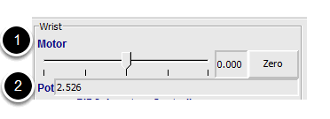
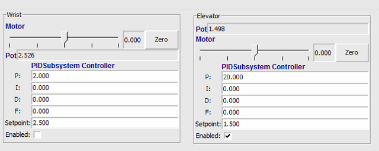
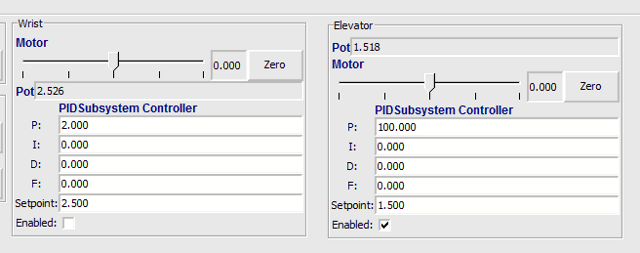

PID Tuning with SmartDashboard
==============================

The PID (Proportional, Integral, Differential) is an algorithm for determining the motor speed based on sensor feedback to reach a setpoint as quickly as possible. For example, a robot with an elevator that moves to a predetermined position should move there as fast as possible then stop without excessive overshoot leading to oscillation. Getting the PID controller to behave this way is called "tuning". The idea is  to compute an error value that is the difference between the current value of the mechanism feedback element and the desired (setpoint) value. In the case of the arm, there might be a potentiometer connected to an analog channel that provides a voltage that is proportional to the position of the arm. The desired value is the voltage that is predetermined for the position the arm should move to, and the current value is the voltage for the actual position of the arm.

Finding the setpoint values with LiveWindow
-------------------------------------------

Create a PID Subsystem for each mechanism with feedback. The PID Subsystems contain the actuator (motor) and the feedback sensor (potentiometer in this case). You can use Test mode to display the subsystem sensors and actuators. Using the slider manually adjust the actuator to each desired position. Note the sensor values (2) for each of the desired positions. These will become the setpoints for the PID controller.

Viewing the PIDController in LiveWindow
---------------------------------------

In Test mode, the PID Subsystems display their P, I, and D parameters that are set in the code. The P, I, and D values are the weights applied to the computed error (P), sum of errors over time (I), and the rate of change of errors (D). Each of those terms is multiplied by the weights and added together to form the motor value. Choosing the optimal P, I, and D values can be difficult and requires some amount of experimentation. The Test mode on the robot allows the values to be modified, and the mechanism response observed.

.. important:: The enable option does not affect the `PIDController <https://first.wpi.edu/wpilib/allwpilib/docs/beta/java/edu/wpi/first/math/controller/PIDController.html>`__ introduced in 2020, as the controller is updated every robot loop. See the example :ref:`here <docs/software/dashboards/shuffleboard/advanced-usage/shuffleboard-tuning-pid:Enable Functionality in the New PIDController>` on how to retain this fuctionality.

Tuning the PIDController
------------------------

Tuning the PID controller can be difficult and there are many articles that describe techniques that can be used. It is best to start with the P value first. To try different values fill in a low number for P, enter a setpoint determined earlier in this document, and note how fast the mechanism responds. If it responds too slowly, perhaps never reaching the setpoint, increase P. If it responds too quickly, perhaps oscillating, reduce the P value. Repeat this process until you get a response that is as fast as possible without oscillation. It's possible that having a P term is all that's needed to achieve adequate control of your mechanism. Further information is located in the :doc:`/docs/software/advanced-controls/introduction/tuning-flywheel` document.

Once you have determined P, I, and D values they can be inserted into the program. You'll find them either in the properties for the PIDSubsystem in RobotBuilder or in the constructor for the PID Subsystem in your code.

The F (feedforward) term is used for controlling velocity with a PID controller.

More information can be found at :ref:`docs/software/advanced-controls/controllers/pidcontroller:PID Control in WPILib`.
