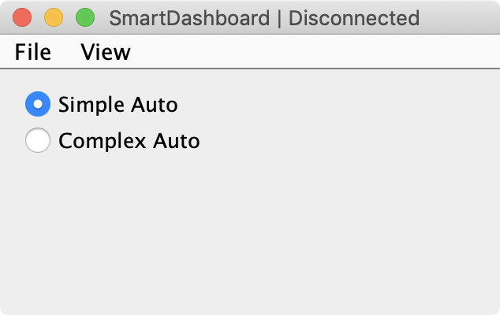
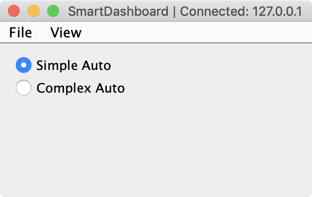
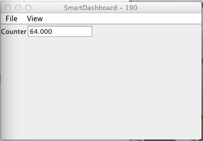
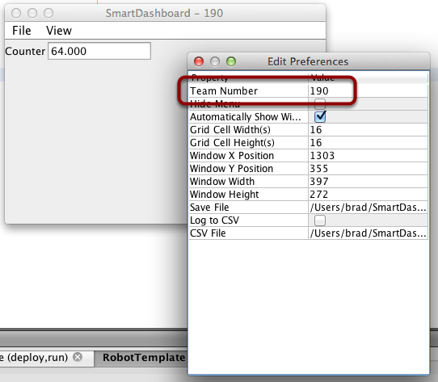

Verifying SmartDashboard is working
===================================

Connection Indicator
--------------------

SmartDashboard will automatically include the connection status and IP address of the NetworkTables source in the title of the window.

Connection Indicator Widget
---------------------------

SmartDashboard includes a connection indicator widget which will turn red or green depending on the connection to NetworkTables, usually provided by the roboRIO. For instructions to add this widget, look at :ref:`Adding a Connection Indicator <docs/software/dashboards/smartdashboard/smartdashboard-intro:Adding a Connection Indicator>` in the SmartDashboard Intro.

Robot Program Example
---------------------

.. tabs::

  .. code-tab:: java

      public class Robot extends TimedRobot {
        double counter = 0.0;

        public void teleopPeriodic() {
          SmartDashboard.putNumber("Counter", counter++);
        }
      }

  .. code-tab:: c++

      #include "Robot.h"
      float counter = 0.0;

      void Robot::TeleopPeriodic() {
          frc::SmartDashboard::PutNumber("Counter", counter++);
      }

This is a minimal robot program that writes a value to the SmartDashboard. It simply increments a counter 50 times per second to verify that the connection is working. However, to minimize bandwidth usage, NetworkTables by default will throttle the updates to 10 times per second.

SmartDashboard Output for the Sample Program
--------------------------------------------

The SmartDashboard display should look like this after about 6 seconds of the robot being enabled in Teleop mode. If it doesn't, then you need to check that the connection is correctly set up.

Verifying the IP address in SmartDashboard
------------------------------------------

If the display of the value is not appearing, verify that the team number is correctly set as shown in this picture. The preferences dialog can be viewed by selecting ``File``, then ``Preferences``.

Verifying Program using OutlineViewer
-------------------------------------

You can verify that the robot program is generating SmartDashboard values by using the OutlineViewer program. This is a Java program, ``OutlineViewer.jar``, that is located in ``~/wpilib/YYYY/tools`` (where YYYY is the year and ~ is ``C:\Users\Public`` on Windows).

OutlineViewer is downloaded as part of the WPILib Offline Installer. For more information, see the :ref:`Windows/macOS/Linux installation guides <docs/zero-to-robot/step-2/wpilib-setup:WPILib Installation Guide>`. In Visual Studio Code, press :kbd:`Ctrl+Shift+P` and type "WPILib" or click the WPILib logo in the top right to launch the WPILib Command Palette.  Select :guilabel:`Start Tool`, and then select :guilabel:`OutlineViewer`.

In the "Server Location" box, enter your team number with no leading zeroes. Then, click ``Start``.

Look at the second row in the table, the value ``SmartDashboard/Counter`` is the variable written to the SmartDashboard via NetworkTables. As the program runs you should see the value increasing (``41.0`` in this case). If you don't see this variable in the OutlineViewer, look for something wrong with the robot program or the network configuration.

.. image:: /docs/software/wpilib-tools/outlineviewer/images/outlineviewer.png
  :alt: Using OutlineViewer to view the NetworkTables data used by the program.
