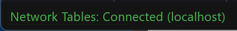

# Troubleshooting Dashboard Connectivity

This document will help explain how to recognize if the Dashboard is not connected to your robot, steps to troubleshoot this condition and a code modification you can make.

## Recognizing Glass Connectivity

.. image:: images/troubleshooting-dashboard-connectivity/glass-connection.png
   :alt: The titlebar of Glass showing a connection to 127.0.0.1

Glass indicates if it is connected or not in the title bar. It shows the IP address it is connected to. See this :ref:`page <docs/software/dashboards/glass/networktables-connection:Establishing NetworkTables Connections>` for more on configuring the connection.

## Recognizing AdvantageScope Connectivity

.. image:: images/troubleshooting-dashboard-connectivity/advantagescope-connection.png
   :alt: The titlebar of AdvantageScope showing a connection to 172.22.11.2

AdvantageScope indicates if it is connected or not in the title bar. It shows the IP address it is connected to, or else the IP address it is attempting to connect to. See the [AdvantageScope Documentation](https://docs.advantagescope.org/getting-started/connect-live) for more on configuring the connection.

## Recognizing Elastic Connectivity

Elastic indicates if it is connected or not in the lower left corner. It shows what it is connected to. See the [Elastic Documentation](https://frc-elastic.gitbook.io/docs/getting-started/connecting-to-your-robot) for more on configuring the connection.

## Troubleshooting Connectivity

If the Dashboard does not connect to the Robot (after the Driver Station has connected to the robot) the recommended troubleshooting steps are:

1. Restart the Dashboard (there is no need to restart the Driver Station software)

2. If that doesn't work, restart the Robot Code using the Restart Robot Code button on the Diagnostics tab of the Driver Station

3. If it still doesn't connect, verify that the Team Number / Server is set properly in the Dashboard and that your Robot Code writes a value during initialization or disabled
