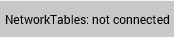

Troubleshooting Dashboard Connectivity
======================================

This document will help explain how to recognize if the Dashboard is not connected to your robot, steps to troubleshoot this condition and a code modification you can make.

Recognizing LabVIEW Dashboard Connectivity
------------------------------------------

The LabVIEW Dashboard has a NetworkTables Connection indicator on the front panel.

On the Variables tab of the Dashboard, the variables are shown with a black diamond when they are not synced with the robot. Once the Dashboard connects to the robot and these variables are synced, the diamond will disappear.

Recognizing SmartDashboard Connectivity
---------------------------------------

SmartDashboard indicates if it is connected or not in the title bar. It shows the IP address it is connected to. See :ref:`this page <docs/software/dashboards/smartdashboard/smartdashboard-intro:Configuring the Team Number>` for more on configuring the connection.

.. image:: images/troubleshooting-dashboard-connectivity/connection-indicator.png
   :alt: Click "View" then "Add..." then Connection indicator to place one on the SmartDashboard.

For more visibility, you can also add a Connection Indicator widget. The connection indicator can be moved or re-sized if the Editable checkbox is checked.

Recognizing Shuffleboard Connectivity
-------------------------------------

Shuffleboard indicates if it is connected or not in the bottom right corner of the application as shown in the image above. See :ref:`page <docs/software/dashboards/shuffleboard/getting-started/shuffleboard-preferences:Setting the Team Number>` for more on configuring the connection.

Recognizing Glass Connectivity
------------------------------

Glass indicates if it is connected or not in the title bar. It shows the IP address it is connected to. See this :ref:`page <docs/software/dashboards/glass/networktables-connection:Establishing NetworkTables Connections>` for more on configuring the connection.

Recognizing AdvantageScope Connectivity
---------------------------------------

AdvantageScope indicates if it is connected or not in the title bar. It shows the IP address it is connected to, or else the IP address it is attempting to connect to. See the `AdvantageScope Documentation <https://github.com/Mechanical-Advantage/AdvantageScope/blob/main/docs/OPEN-LIVE.md>`__ for more on configuring the connection.

Troubleshooting Connectivity
----------------------------

If the Dashboard does not connect to the Robot (after the Driver Station has connected to the robot) the recommended troubleshooting steps are:

1. Restart the Dashboard (there is no need to restart the Driver Station software)

2. If that doesn't work, restart the Robot Code using the Restart Robot Code button on the Diagnostics tab of the Driver Station

3. If it still doesn't connect, verify that the Team Number / Server is set properly in the Dashboard and that your Robot Code writes a value during initialization or disabled
