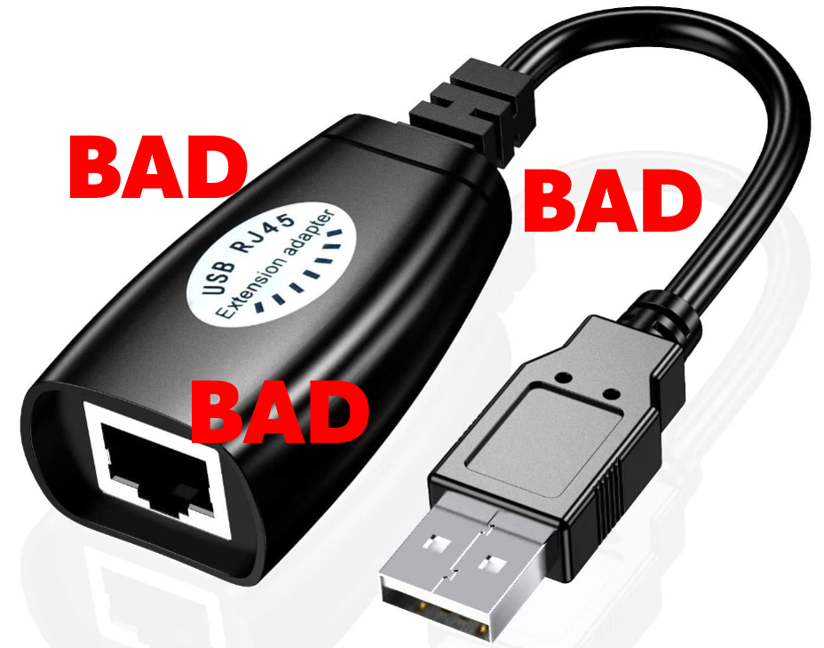

.. include:: <isonum.txt>

# Driver Station (Operator Console) Best Practices

Want to ensure the driver station isn't a stopper for your team at the FIRST Robotics Competition (FRC) field? Building and configuring a solid driver station laptop and peripherals is an easy project. Read on to find lessons learned by many teams over thousands of matches.

## Selecting hardware

Dedicate a laptop to be used solely for driving. Many teams do. A dedicated machine allows you manage the configuration for one goal – being ready to compete at the field. Dedicated means no other software except the FRC-provided Driver Station software and associated Dashboard installed or running.

Use a business-class laptop for your driver station. Why? They're much more durable than the $300 Black Friday special at Best Buy. They'll survive being banged around at the competition. Business-class laptops have higher quality device drivers, and the drivers are maintained for a longer period than consumer laptops. This makes your investment last longer. Lenovo ThinkPad T series and Dell Latitude are two popular business-class brands you'll commonly see at competitions.

Consider used laptops rather than new. The FRC\ |reg| Driver Station and dashboard software uses very few system resources, so you don't need to buy a new laptop -- instead, buy a cheap 4-5 year old used one.  There are thousands for sale every day on eBay. You might even get one donated by a used computer store.

### Laptop recommended features

1.  8GB of RAM or greater
#.  A display size of 14" or greater, with 1080p minimum resolution
#.  Ports

    a. A built-in Ethernet port is highly preferred. Ensure that it's a full-sized port. The hinged Ethernet ports don't hold up to repeated use.
    #. If the Ethernet port on your laptop is dodgy, either replace the laptop (recommended) or buy a USB Ethernet dongle from a reputable brand.  See `Recommended USB Ethernet adapters`_ for a list. Many teams find that USB Ethernet is less reliable than built-in Ethernet, primarily due to cheap hardware and bad drivers. The dongles given to rookies in the KOP have a reputation for working well.
    #. 2 USB ports minimum.  These can be USB-A or USB-C ports, depending on the peripherals you're using.

#.  A keyboard. It’s hard to quickly do troubleshooting on touch-only computers at the field.
#.  A solid-state disk (SSD), 256 GB or larger. If the laptop has a rotating disk, spend $50 and replace it with an SSD.
#.  Supports Windows 11.  Given that it is at end of life, don't plan on driver station support for Windows 10 beyond the 2026 competition year.
#.  AMD or Intel CPU. The Driver Station software does not work on machines with ARM CPUs.
#.  Desired Wi-Fi hardware varies a bit based on whether you're buying an inexpensive used machine for a driver station, or something new.  6GHz Wi-Fi can be used in some of the practice driving configurations, but is not required for the recommended configuration.   See `recommended practice configuration <https://frc-radio.vivid-hosting.net/overview/practicing-at-home>`__ for details.

    a. For used machines, you'll want a 2.4 and 5 GHz Wi-Fi radio, with 6GHz (Wi-Fi 6e) optional.
    #. If you're spending money to buy a new machine to dedicate as a driver station, you'll want to ensure that 6GHz (Wi-Fi 6e) is supported.

## Building your driver station

It's best if you combine your driver station laptop and all needed peripherals into a `single unit <https://www.chiefdelphi.com/t/show-me-your-operator-station-driver-station/435030>`__.

Use an Ethernet port saver to make your Ethernet connection. This extends the life of the port on the laptop. This is particularly important if you have a consumer-grade laptop with a hinged Ethernet port.

Put hook tape on the bottom of the driver station.  The Game Manual has details on the correct location of the tape.

When fastening down peripherals, it's best to use hook and loop tape.  This allows quick changes at the field when needed.

Ensure that the USB ports on the laptop are accessible.

## Setting up the laptop

Once you've acquired your laptop, here's a list of things to do.

#. If you're buying used, ensure you're starting from a fresh Windows install.
#. Create one account to use both for software installation and driving.  This account must be a member of the Administrator group.
#. Remove any 3rd party antivirus or antimalware software. Instead, use Windows Defender. Since you're only connecting to the internet for Windows and FRC software updating, the risk is low.
#. Only install software on your driver station that's needed for driving. Your goal here is to eliminate variables that might interfere with proper operation. Don't use the driver station as the programming laptop.  Remove any unneeded preinstalled software ("bloatware") that came with the machine. Don't use the laptop for gaming back at the hotel the night before the event.
#. Avoid managed Windows 10 or 11 installations from the school's IT department. These deployments are built for the school environment and often come with unwanted software that interferes with your robot's operation.
#. Make these power settings for both the Plugged in and On battery profiles, by navigating to Start -> Settings -> System -> Power and battery

   a. Set "Make my device sleep after" to Never for both Plugged in and On battery
   #. Turn off Energy Saver
   #. Set Power Mode to Best Performance
   #. Ensure the laptop battery can hold a charge for at least an hour after making the changes above. This allows plenty of time for the robot and drive team to go through the queue and reach the alliance station without mains power.

## Prior to leaving for the competition

Items in this section require internet connectivity and should be done prior to arriving at the event.

1. Install all Windows updates, then test the driver station with your robot. Keep running Windows Update until no updates show as pending.
#. Pause updates. Navigate to Start -> Settings -> Windows Update, then set Pause updates to cover the time of the competition.
#. Change "Active Hours" for Windows Updates to prevent updates from installing during competition hours. This helps if you forget to pause updates.  Navigate to Start -> Settings -> Windows Update -> Advanced options, then select Active Hours. Be sure to take timezone differences at your competition location into account.
#. Bring a trusted USB and Ethernet cable for use connecting to the roboRIO.

## At The Competition

1. Turn off Windows firewall using :ref:`these instructions <docs/networking/networking-introduction/windows-firewall-configuration:Disabling Windows Firewall>`.
#. Turn off the Wi-Fi adapter, either using the dedicated hardware Wi-Fi switch or by using the Wi-Fi control in Quick Settings.
#. Charge the driver station when it’s in the pit.
#. Ensure everyone on the drive team knows the password. You'd be surprised at how often drivers arrive at the field without knowing the password for the laptop.
#. LabVIEW users: Ensure your LabVIEW code is deployed permanently and set to "run as startup", using the instructions in the LabVIEW Tutorial. If you must deploy code every time you turn the robot on, you’re doing it wrong.
#. Limit web browsing to FRC related web sites. This minimizes the chance of getting malware during the competition.
#. Don't plan on using internet access at the event to make software updates. There likely won't be any in the venue, and hotel Wi-Fi varies widely in quality. If you do need updates, contact a Control System Advisor in the pit.

## Before Each Match

1. Make sure the laptop is on and logged in prior to the end of the match before yours.
#. Close programs that aren’t needed during the match.
#. Bring your laptop charger to the field. Power is provided in each player station.  Why?  Windows is less aggressive about power management when the laptop is plugged in, which means the driver station application behaves more predictably.
#. Fasten your laptop with hook-and-loop tape to the player station shelf. You never know when your alliance partner will have an autonomous programming issue and blast the wall.
#. Ensure joysticks and controllers are functioning.

   a. In the USB tab in the FRC Driver Station software, drag and drop to assign joysticks as needed.
   #. Verify that buttons are working and joysticks return to zero position.
   #. Use the rescan button (F1) if joysticks / controllers do not appear green.
   #. Use the rescan button (F1) during competition if joystick or controllers become unplugged and then are plugged back in or otherwise turn gray during competition.

#. Ensure your :doc:`Dashboard is connected to the robot </docs/software/dashboards/troubleshooting-dashboard-connectivity>` after your driver station connects to the robot.
#. Ensure driver station is fully visible and in focus during the match to avoid Windows depriortizing it, and to ease troubleshooting.

## Recommended USB Ethernet adapters

Members of the FRC community report good results with these USB Ethernet adapters.

* Henrety USB C to Ethernet Adapter
* Siig SuperSpeed USB 3.0 LAN Hub
* TP-Link UE330
* uni USB to Ethernet Adapter with hub (both USB-A and USB-C styles)

Don't be confused and use a USB RJ-45 extender.  These are reported to fry USB ports.

## Credits

The source document for this page was created by Steve Peterson, with contributions from Juan Chong, James Cole-Henry, Rick Kosbab, Greg McKaskle, Chris Picone, Chris Roadfeldt, Joe Ross, and Ryan Sjostrand. The original post and follow-up posts can be found [here](https://www.chiefdelphi.com/t/paper-driver-station-best-practices/164429).
