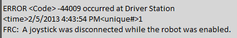
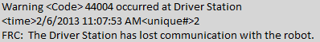
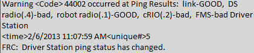
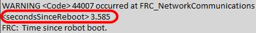
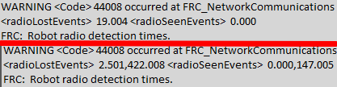

Driver Station Errors/Warnings
==============================

In an effort to provide both Teams and Volunteers (FTAs/CSAs/etc.) more information to use when diagnosing robot problems, a number of Warning and Error messages have been added to the Driver Station. These messages are displayed in the DS diagnostics tab when they occur and are also included in the DS Log Files that can be viewed with the Log File Viewer. This document discusses the messages produced by the DS (messages produced by WPILib can also appear in this box and the DS Logs).

Joystick Unplugged
------------------

This error is triggered when a Joystick is unplugged. Contrary to the message text this error will be printed even if the robot is not enabled, or even connected to the DS. You will see a single instance of this message occur each time the Driver Station is started, even if Joysticks are properly connected and functioning.

Lost Communication
------------------

This Warning message is printed whenever the Driver Station loses communication with the robot (Communications indicator changing from green to red). A single instance of this message is printed when the DS starts up, before communication is established.

Ping Status
-----------

A Ping Status warning is generated each time the Ping Status to a device changes while the DS is not in communication with the roboRIO. As communications is being established when the DS starts up, a few of these warnings will appear as the Ethernet link comes up, then the connection to the robot radio, then the roboRIO (with FMS mixed in if applicable). If communications are later lost, the ping status change may help identify at which component the communication chain broke.

Time Since Robot Boot
---------------------

This message is printed each time the DS begins communicating with the roboRIO. The message indicates the up-time, in seconds, of the roboRIO and can be used to determine if a loss of communication was due to a roboRIO Reboot.

Radio Detection Times
---------------------

This message may be printed when the DS begins communicating with the roboRIO and indicates the time, in seconds, since the last time the radio was lost and seen. In the first example image above the message indicates that the roboRIO's connection to the radio was lost 19 seconds before the message was printed and the radio was seen again right when the message was printed. If multiple radioLost or radioSeen events have occurred since the roboRIO booted, up to 2 events of each type will be included, separated by commas as seen in the second example image.

No Robot Code
-------------

.. image:: images/driver-station-errors-warnings/no-robot-code.png

This message is printed when the DS begins communicating with the roboRIO, but detects no robot code running. A single instance of this message will be printed if the Driver Station is open and running while the roboRIO is booting as the DS will begin communication with the roboRIO before the robot code finishes loading.
